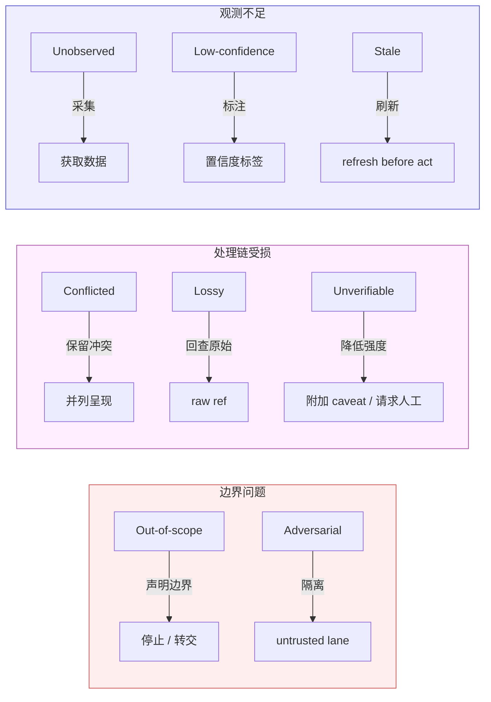

# Agent Epistemics

> **Evidence Status** — synthesized. 从 Representation、World State、Verification、Security 等模块中归纳的共性需求。Agent 认识论是一个相对理论化的方向，但直接影响输出质量和安全性。

## 1. 核心问题

Agent 的多数严重错误不是”给错答案”，而是对自身知识边界没有表示。生产系统需要把”未知”变成运行时可表示、可传递、可验证的一等对象。

```text
Unknown is not a mood. Unknown is a state in the runtime.
```

## 2. 未知类型

| 类型 | 说明 | 处理方式 |
|---|---|---|
| Unobserved | 系统从未观察过 | 获取数据或说明缺口 |
| Low-confidence | 观察存在但置信度低 | 标注置信度，避免升级为事实 |
| Stale | 曾经观察过但可能过期 | refresh before act |
| Conflicted | 多个来源冲突 | 保留冲突，不静默合并 |
| Lossy | 转换链有损 | 回查 raw ref |
| Unverifiable | 没有验证通道 | 降低结论强度或请求人工 |
| Out-of-scope | 工具/权限/接口不可达 | 明确边界，不伪装完成 |
| Adversarial | 输入可能有攻击意图 | 放入 untrusted lane |

这八种类型按"信息缺失的原因"分类：前三种（Unobserved / Low-confidence / Stale）是**观测不足**——没看到、看不清、看过但过期；中间三种（Conflicted / Lossy / Unverifiable）是**处理链受损**——源头矛盾、转换有损、无法校验；后两种（Out-of-scope / Adversarial）是**边界问题**——能力外和信任外。三组之间存在处置优先级差异：边界问题应最先判断（不该碰的不碰），处理链问题次之（能修就修），观测不足最后（能补就补，补不了就降级）。



## 3. 认识论对象

| 对象 | 运行时语义 | 对应的未知类型 |
|---|---|---|
| EvidenceRef | 将 claim 绑定到可追溯的来源 | Unobserved, Lossy |
| Confidence | 量化表示或推断的可靠度 | Low-confidence |
| Freshness | 标记状态的观测时间和有效期 | Stale |
| TrustLane | 区分"可作为指令"与"只能作为数据" | Adversarial |
| ConflictRecord | 记录多源冲突而非静默取一 | Conflicted |
| UnknownRecord | 显式记录不可知缺口 | Unverifiable, Out-of-scope |
| VerificationResult | 记录验证动作及其结果 | Unverifiable |

## 4. 输出原则

| 情况 | 输出方式 |
|---|---|
| 证据充分 | 直接结论 + 必要证据 |
| 证据不足 | 结论降级 + 缺口说明 |
| 来源冲突 | 并列冲突 + 不强行合并 |
| 状态过期 | 先刷新；不能刷新则声明过期 |
| 无验证通道 | 说“已执行”之前必须改成“已请求执行/未能验证” |
| 用户要求过度确定 | 拒绝虚假确定性，提供可验证路径 |

## 5. 设计检查

逐条过，任何一条答"否"都值得在设计阶段修正：

```text
1. 最终回答的每个关键 claim 是否绑定了 evidence_ref？
2. 低置信度字段是否被标注，而非静默当作事实？
3. 每个世界状态是否携带 observed_at 和 ttl？
4. 每个外部效果是否有 verification_status（而非默认"已完成"）？
5. Agent 是否维护了一份显式的 unknown 清单——哪些不可观察、不可验证、不可行动？
```
