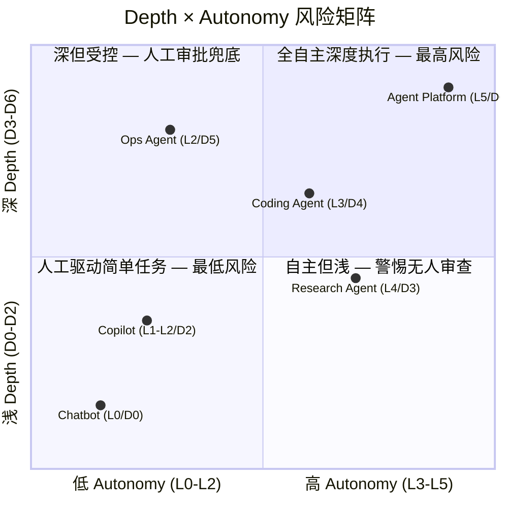

# Autonomy Levels

> **Evidence Status** — synthesized. 核心概念归纳与跨模块一致性整理。

> **完整版**见 `../design-space/methodology/autonomy-and-depth.md`。本文保留核心概念供快速查阅。

| 等级 | 名称 | Agent 行为 | 人类角色 | 典型产品 |
|---|---|---|---|---|
| L0 | Answer | 只解释、回答、总结 | 提问者 | Chatbot |
| L1 | Recommend | 给方案和建议 | 决策者 | Copilot |
| L2 | Draft | 生成可编辑草稿 | 编辑者 | Writing/Coding Copilot |
| L3 | Execute with Approval | 提出动作，审批后执行 | 审批者 | Coding Agent、Workflow Agent |
| L4 | Bounded Autonomy | 在规则内自动执行 | 监督者 | Research Agent、低风险企业流程 |
| L5 | Delegated Workflow | 长时自主推进，定期汇报 | 委托者 | 高成熟度 Agent Platform |

## 自主性不是越高越好

正确自主性取决于：

```text
动作风险 × 可逆性 × 用户信任 × 验证能力 × 失败成本
```

例如：搜索资料可以 L4，修改本地代码可以 L3/L4，删除生产数据应该 L1/L2。

## 与执行深度的区别

| 维度 | 问题 | 示例 |
|---|---|---|
| 自主性 | Agent 能不能自己做？ | 是否允许自动提交 PR |
| 执行深度 | Agent 要做到哪一步？ | 是否必须跑测试并修复失败 |

### Depth × Autonomy 交叉矩阵

两个维度正交组合产生四个象限，风险特征各不相同：

| | 低 Autonomy (L0-L2) | 高 Autonomy (L3-L5) |
|---|---|---|
| **浅 Depth (D0-D2)** | 人工驱动、简单任务。用户做决策，Agent 提供答案或草稿。风险最低。 | 自主但浅：快速回应、不深入验证。适合低风险批量任务，但要警惕错误无人审查。 |
| **深 Depth (D3-D6)** | 深但受控：每步需确认。适合高风险流程——深度执行保证质量，人工审批控制风险。 | 全自主深度执行：最高能力也是最高风险。要求完善的验证闭环、回滚机制和异常升级。 |



**实践建议**：从左下角（低 Autonomy、浅 Depth）开始，逐步向右下扩展。每次只移动一个维度：先提升 Depth（加深验证）再提升 Autonomy（减少审批），或者反过来。同时提升两个维度意味着风险成倍增加，需要更强的验证闭环和回滚能力。
