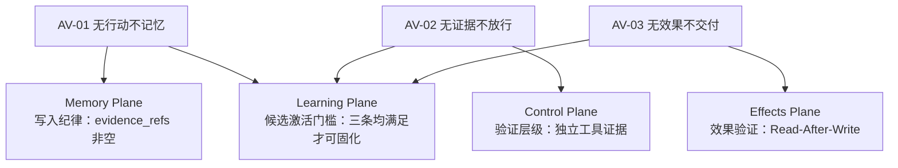

# 行动验证原则 -- 凡断言必有证据

> **Evidence Status** — grounded（GenericAgent "No Execution, No Memory" 公理；Codex Guardian "失败关闭"；Claude Code Effect Verification）

## 核心命题

Agent 的知识来源只有两种：模型参数中的先验知识，和工具执行返回的后验证据。先验知识可能过时、可能幻觉；后验证据虽然也可能有噪声，但至少经过了现实的检验。

因此：**凡是需要持久化的断言，必须有工具执行的证据支撑。**

这是有界理性（BR-01/BR-02）和意向立场（IS-02）的直接推论：既然 Agent 操作的是表示而非现实，既然工具成功不等于世界改变，那么唯一合理的默认立场就是：**没有证据，就没有事实**。

## 三条推论

### AV-01 — 无行动，不记忆（No Execution, No Memory）

> 写入长期记忆的信息必须源自工具调用结果。禁止将模型推测、未执行计划、未验证假设作为事实写入。

**来源**：GenericAgent `memory_management_sop`——只有经过工具执行确认的信息才允许写入 Memory。

**运行时义务**
- `MemoryRecord.source` **必须**关联至少一条 `ExecutionResult` 或 `EffectRecord`。
- 未执行的计划、推测性结论 **必须**标记为 `provisional`，不可写入长期存储。
- Memory 写入前 **必须**检查 `evidence_refs` 非空。

**主要 Plane**：Memory, State

---

### AV-02 — 无证据，不放行（No Evidence, No Approval）

> 验证结果必须来自独立的工具调用，不能是"代码看起来正确"。无工具证据的 PASS 等价于 SKIP。

**来源**：GenericAgent `verify_sop`；Codex Guardian 的失败关闭策略——当验证工具不可用或未执行时，默认结果为 FAIL 而非 PASS。

**运行时义务**
- `VerificationResult` **必须**关联独立的 `tool_call_id`，不可仅基于模型推理。
- 验证工具不可用时，**必须**将结果标记为 `skipped` 或 `blocked`，不可标记为 `verified`。
- `EffectRecord.verification_evidence` 为空时，`verification_status` **必须**为 `unverified`。

**主要 Plane**：Control, Effects

---

### AV-03 — 无效果，不交付（No Effect, No Delivery）

> 工具返回成功不等于外部世界真的改变。需要 Read-After-Write、截图验证等独立手段确认效果。

**来源**：Claude Code Effect Verification——写入文件后必须读回确认；ARCHITECTURE.md 核心命题"工具成功 =/= 世界改变"。

**运行时义务**
- 关键写操作 **必须**配套独立的验证行动（`read_after_write | test | screenshot | external_ack`）。
- `ToolCall.verification_method` 为 `none` 时，该行动的效果 **不可**作为后续决策的可信前提。
- 交付前 **必须**检查所有关键 `EffectRecord.verification_status` 均为 `verified`。

**主要 Plane**：Effects, Execution

## 对上层的影响

三条推论形成递进关系：AV-01 约束输入端（什么能写入记忆），AV-02 约束判断端（什么算通过验证），AV-03 约束输出端（什么算完成交付）。Learning Plane 的经验固化必须同时满足三条——只有经过执行（AV-01）、独立验证（AV-02）、效果确认（AV-03）的经验，才有资格成为可复用知识。

## 与其他原则的关系

- **IS-02**（工具成功 =/= 世界确认）是 AV-03 的理论基础
- **BDI-02**（验证是信念修正）是 AV-02 的认识论根基
- **MC-01**（显式不确定性）与 AV-01 互补：MC-01 要求不编造，AV-01 要求不虚记

## 延伸阅读

- 效果验证的工程实现：`../../architecture/planes/effects/`
- 记忆写入纪律：`../../architecture/planes/memory/`
- 验证方法清单：`../../architecture/runtime-data-model.md`（VerificationResult）
- 有界理性与 Harness 必然性：`./bounded-rationality.md`
- 意向立场与工具反馈：`./intentional-stance.md`
