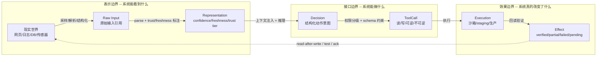
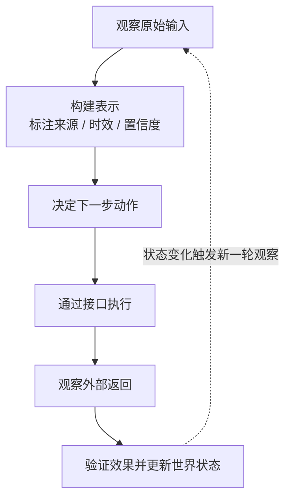
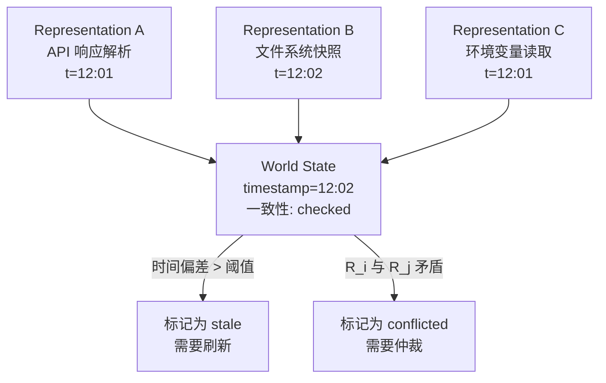

# 表示、接口与效果

> **Evidence Status** — synthesized. 跨项目观察归纳。


## 为什么从边界讲起

Agent 常被误解成"会思考的模型"——好像给模型加上工具就能操作现实。实际上，模型与现实之间隔着三道边界，每一道都可能出错，每一道都需要显式设计。

想象一个 Agent 要帮你在 CRM 系统里更新客户状态。它需要先**读到**客户记录（表示边界）、再**调用** API 写入新状态（接口边界）、最后**确认**状态确实变了（效果边界）。如果任何一道边界出了问题——读到了过期数据、API 超时但返回了 200、写入成功但另一个流程又把状态改回去了——Agent 都会得出错误的结论。

这是生产系统中最常见的失败模式。

## 三道连续边界

现实世界的信息要到达模型、模型的决策要影响现实，必须依次穿过三道边界：

```text
现实世界
  ↓ 采样 / 解析 / 结构化
[1] 表示边界：系统能看到什么？
  ↓ 推理 / 规划 / 选择动作
[2] 接口边界：系统能做什么？
  ↓ 执行 / 写入 / 通知
[3] 效果边界：系统真的改变了什么？
  ↓ 回读 / 观察 / 审核
验证闭环
```

### 三道连续边界可视化



### 1. 表示边界——系统能看到什么？

这道边界决定了模型的"视野"。关键问题：

- **原始输入是否保留？** 很多系统只给模型看摘要，原文已经丢了。当结论被质疑时，无法回查。
- **经过了哪些转换？** 一个网页经过抓取 → HTML 解析 → 截断 → 注入上下文，每一步都可能丢失信息。知道转换链，才能评估表示的可靠性。
- **信息是否新鲜？** 三天前的 CI 状态和刚刚的 CI 状态意义完全不同。
- **来源是否可信？** 用户输入、项目配置、外部网页、工具返回值的信任等级不同，不能混为一谈。

### 2. 接口边界——系统能做什么？

这道边界决定了 Agent 的"手脚"。关键问题：

- **读取接口**有哪些？能读文件、查数据库、还是只能搜索？
- **写入接口**有哪些？能修改代码、发邮件、调用外部 API？
- **权限如何分级？** 读文件和删文件的风险完全不同。
- **哪些动作可逆？** 编辑代码可以 git revert，发出去的邮件收不回来。
- **有没有安全网？** dry-run、沙箱、staging 环境能在正式行动前降低风险。

### 3. 效果边界——系统真的改变了什么？

这是最容易被忽视的一道。**工具返回 success 不等于现实改变成功。** 关键问题：

- API 返回 200，但数据库里的值变了吗？
- 点击了"提交"按钮，但页面真的提交了吗？
- 邮件发送成功，但对方收到了吗？
- 部署开始了，但健康检查通过了吗？

如何验证效果？

| 验证方法 | 适用场景 | 举例 |
|---|---|---|
| 回读（read-after-write） | 数据库、文件系统、Git、CRM | 写完后再查一次确认状态 |
| 测试 | 代码修改、配置变更 | 运行相关测试用例 |
| 外部确认（ack） | 邮件、消息队列、第三方 API | 检查送达回执或消息状态 |
| 人工确认 | 不可感知的业务变化、线下操作 | 请用户确认结果 |

## 最小现实闭环

把三道边界串起来，形成一个完整的现实闭环：



要支撑这个闭环，一个成熟的 Agent 至少需要显式建模五类对象：

| 对象 | 作用 | 举例 |
|---|---|---|
| 原始输入（Raw Input） | 外部世界的未加工切片 | 网页 HTML、日志文件、数据库查询结果、截图 |
| 表示（Representation） | 经过解析和结构化的可处理信息 | 解析后的代码 AST、提取的实体关系、格式化的测试报告 |
| 世界状态（World State） | 对外部对象当前状态的快照 | 当前分支名、CRM 客户状态、CI 构建结果 |
| 动作与效果（Action / Effect） | 对外部对象的读写及其预期结果 | "将 ticket 状态改为 resolved，期望回读确认" |
| 证据（Evidence） | 支撑最终结论或完成声明的依据 | 测试通过截图、diff 审查记录、API 回读结果 |

### Representation 与 World State 的界限

五类对象中，Representation 和 World State 最容易混淆。两者的核心区别：

| 维度 | Representation | World State |
|---|---|---|
| 粒度 | 单条信息经过解析和结构化后的可处理形式 | 多个 Representation 在某时间点的聚合快照 |
| 举例 | 一个 API 响应的解析结果、一条日志的结构化提取 | 文件系统状态、环境变量集合、CRM 全部客户状态 |
| 时间语义 | 无时间戳保证——可能来自不同时刻的不同调用 | 有时间戳和一致性保证——是"某一刻的世界长什么样" |
| 一致性 | 不保证——两个 Representation 可能反映不同时刻的状态 | 要求——快照内各字段应来自同一时间窗口或标注偏差 |

关系：World State 由多个 Representation 组成，但 World State 额外承诺了时间戳和一致性。将多个 Representation 聚合为 World State 时，必须处理时间偏差（不同 Representation 的采集时间不同）和冲突检测（两个 Representation 对同一实体给出矛盾描述）。



## 设计启发

把三道边界当作检查清单，常见的 Agent 设计原则可以逐条落地：

- **多模态扩大了可表示的世界**：图像让 Agent 能感知 UI 状态，音频让它能处理会议内容。
- **工具调用的实质是模型生成动作意图**，由执行器在受控环境中落实，而非模型直接操作现实。
- **Agent 的价值不在于替代模型**，而在于把模型嵌入一个可验证的现实闭环。
- **评估 Agent 不能只看答案质量**，还要看表示质量、接口约束、效果验证和故障恢复。

## 延伸阅读

- 输入如何进入系统：`../architecture/planes/interface/overview.md`、`../architecture/planes/representation/overview.md`
- 动作与效果闭环：`../architecture/planes/tools/overview.md`、`../architecture/planes/effects/overview.md`
- 状态与恢复：`../architecture/planes/state/overview.md`、`../architecture/planes/world-state/overview.md`
- 安全与信任边界：`../architecture/planes/security/overview.md`
