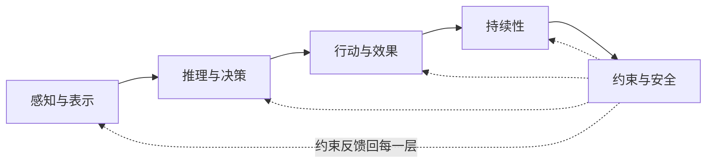

# 什么是 Agent

> **Evidence Status** — synthesized. 跨项目观察归纳。


## 一句话

Agent 是一个在目标、权限和安全策略的约束下自主选择下一步动作、通过受控接口执行、并回读外部状态以验证效果的系统。

## 定义

很多人把 Agent 理解成"更聪明的聊天机器人"。但真正区分 Agent 与聊天机器人的，不是模型更大或提示词更长，而是四件事的组合：

**Agent = 模型 + Harness + 接口 + 验证**

- **模型**提供理解、推理和生成能力——但模型本身既没有记忆，也无法直接操作文件或调用 API。
- **Harness**（运行时外壳）把模型的能力组织成可持续运行的系统：管理上下文、记忆、工具调用、权限控制、状态恢复。
- **接口**让系统接触外部世界：用户输入、文件系统、数据库、网页、传感器等。
- **验证**让系统不只是"说做了"，而是能证明"确实做成了"。

把这四者串起来，就形成了 Agent 的核心闭环：

```text
观察 → 构建表示 → 决策 → 行动 → 验证效果 → 继续或停止
```

一个只能聊天的系统停在"决策"就结束了；一个 Agent 必须走完"行动"和"验证"，才算完成一次有效循环。

## 一个常被忽略的事实

模型并不直接接触现实。

打开一个代码文件，模型看到的不是磁盘上的字节流，而是经过读取、截断、编码后进入上下文窗口的一段文本。调用一个 API，模型拿到的不是 HTTP 连接本身，而是 Harness 返回的结构化结果。

换句话说，**模型处理的永远是现实的表示（representation），不是现实本身**。现实要进入 Agent，必须先经过采样、解析、压缩、结构化；Agent 要影响现实，也必须通过受控接口、执行环境和效果验证。

这意味着一个 Agent 的真实能力边界，由三件事决定：

1. **它能获得什么样的表示**——能看到多少、看到的是否准确、是否过期。
2. **它能通过什么接口行动**——有哪些工具、工具的权限和风险如何。
3. **它能否验证外部效果**——工具返回"成功"不等于现实真的改变了。

举个例子：一个 Coding Agent 调用 `git commit` 后收到 exit code 0，但如果它不回读 `git log` 确认 commit 确实存在，就无法区分"成功提交"和"命令执行了但仓库状态异常"。表示、接口和验证，三者缺一不可。

更深入的讨论见 `representation-and-effects.md`。

## Agent 与其他形态的区别

不是所有用 LLM 的系统都是 Agent。区分的关键在于：**谁决定下一步做什么？**

| 形态 | 决策权 | 循环特征 | 与现实的关系 |
|---|---|---|---|
| 聊天机器人 | 无 | 单轮问答 | 只生成文本，不触碰外部系统 |
| 工作流自动化 | 预设路径 | 固定流程 | 按脚本操作，遇到异常就停 |
| Copilot | 人主导 | 人驱动循环 | 人决定何时采纳建议、何时行动 |
| **Agent** | 自主决策 | 自驱动循环 | 自己决定下一步、调用接口、验证结果 |

Copilot 像一个给你递工具的助手——你说"帮我查一下"，它查完递给你，等你下一条指示。Agent 更像一个你派出去独立完成任务的人——它需要自己判断该做什么、遇到问题该怎么调整、什么时候该回来汇报。

这四种形态不是非此即彼。很多系统从 Copilot 起步，随着信任建立和能力验证，逐步向 Agent 演进。

## Agent 的五项核心能力

五项能力之间存在单向依赖：感知提供推理的输入，推理产出行动意图，行动产生需要持续跟踪的状态，而越高的自主性越需要约束来兜底。



### 1. 感知与表示

Agent 需要把外部世界的片段变成可处理的信息：读文件、查数据库、抓取网页、解析日志。关键不只是"能读"，还要标记每条信息的来源、时效和置信度——一条三个月前的日志和一条刚刚产生的错误信息，可靠性完全不同。

### 2. 推理与决策

理解目标和约束，把复杂任务拆解成可执行的步骤，识别风险与不确定性。不只是"想出答案"，还包括判断"现在该继续做还是该停下来问用户"。

### 3. 行动与效果

通过工具调用、代码执行、API 请求等方式改变外部世界。但行动不等于完成——Agent 需要在行动后验证效果：运行测试、回读状态、检查结果。"调用成功"和"确实改变了外部世界"是两码事。

### 4. 持续性

Agent 不只是处理当前这一轮对话。它需要：

- **工作记忆**：当前正在处理的任务上下文。
- **会话记忆**：本次任务的完整历史。
- **长期记忆**：跨会话积累的知识、偏好和技能。
- **Checkpoint**：让长任务在中断后能从断点恢复，而不必从头再来。

### 5. 约束与安全

越高的自主性越需要约束：权限分级、审批流程、沙箱隔离、循环检测、不可信内容过滤。没有约束的自主性不是能力，是风险。

## 什么样的 Agent 算"有效"

一个有效的 Agent 至少满足六个条件：

1. **目标明确**——知道什么算完成，什么算失败。
2. **表示可靠**——关键输入有来源、有时效、有质量说明，不是一股脑塞进上下文就完事。
3. **接口可用**——有足够的工具和执行环境来完成必要的动作。
4. **效果可证**——能区分"工具执行成功"和"现实状态真的改变了"。
5. **状态连续**——中断后能恢复，不用从头再来。
6. **边界清楚**——高风险动作、敏感数据、不可信内容都被显式处理，而不是混在一起。

如果一个系统只满足前三条，它是一个不错的工具助手；满足全部六条，才是一个可以被信任去独立完成任务的 Agent。

## LLM 作为 Agent 核心：优势与局限

LLM 带来了三件过去需要分别硬编码的能力：理解非结构化输入、少样本适应陌生任务、在一个决策循环里整合文本 / 代码 / 表格等异构信息。

但 LLM 本身有几个根本局限：

- **无持久记忆**：上下文窗口关了就什么都忘了。
- **无执行能力**：不能直接运行代码或调用 API。
- **只能处理进入上下文的东西**：没被送进来的信息就像不存在。
- **无法区分摘要与事实**：工具输出、检索片段、之前的总结一旦进入上下文，对模型来说和一手事实没有标记区别。
- **上下文有限**：窗口满了以后推理质量会下降。

**这些局限恰恰就是 Harness 存在的理由。** 记忆系统弥补遗忘，工具系统赋予执行力，表示层保证信息质量，控制层防止失控。模型能力决定 Agent 的下限；Harness 设计决定 Agent 的上限。

关于 Harness 工程的深入讨论，见 `../design-space/methodology/harness-engineering.md`。
