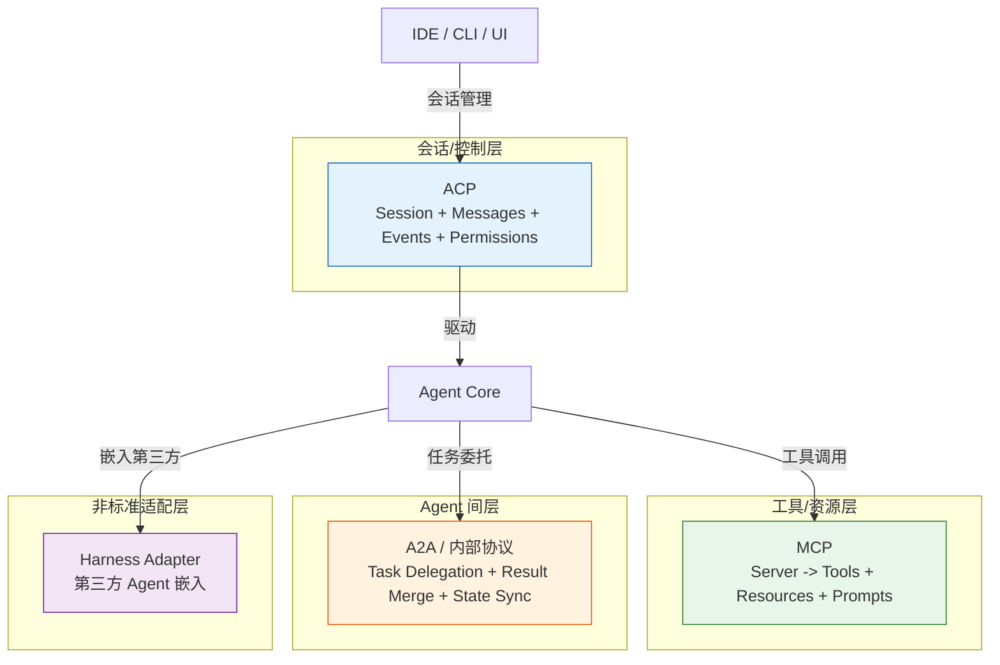

# Agent 通信协议

> **Evidence Status** -- mixed. MCP 部分基于多个生产项目的实际使用（grounded）；ACP 基于 OpenCode 单一实现（synthesized）；Agent-to-Agent 协议部分基于趋势观察（speculative）。

## 问题

Agent 系统中存在三类通信需求，各自侧重不同：

```text
Agent <-> Tool/Resource    Agent 如何发现和调用外部能力
Agent <-> IDE/CLI/UI       IDE 或前端如何与 Agent 交互、管理会话和权限
Agent <-> Agent            Agent 之间如何委托任务、同步状态、归并结果
```

目前没有一个协议能覆盖全部三类。实际项目中，Claude Code、Codex、Warp 选择了 MCP 解决第一类；OpenCode 选择了 ACP 解决第二类；第三类尚无成熟标准。

## 两大协议族

### MCP (Model Context Protocol) -- 工具/资源层协议

MCP 解决的核心问题：Agent 如何以标准化方式发现和调用外部工具。

**核心抽象**：

```text
MCP Server
├── Tools        可调用的函数（读文件、查数据库、执行命令）
├── Resources    可读取的数据源（文件内容、数据库记录）
└── Prompts      预定义的提示模板
```

**通信模型**：Client-Server。Agent 作为 Client 连接多个 MCP Server，每个 Server 暴露一组 Tools/Resources/Prompts。Server 之间相互独立，不感知彼此。

**实战使用情况**：

| 项目 | MCP 角色 | 具体用法 |
|------|---------|---------|
| Claude Code | 工具扩展 | 通过 MCP Server 接入第三方工具，与内置工具统一调度 |
| Codex | 工具扩展 | 沙箱环境内的 MCP Server 访问受安全策略约束 |
| Warp | 多 Agent 工具层 | Harness 容器为所有嵌入的第三方 Agent 管理 MCP 权限 |
| OpenCode | 工具扩展 | MCP Server 作为内置工具的补充，权限纳入 Permission Ruleset |

**关键设计决策**：

- 无状态调用：每次 Tool Call 独立，Server 不维护会话。这降低了复杂度，但也意味着需要在 Agent 侧管理上下文。
- 能力声明式发现：Client 启动时获取 Server 的全部 Tool/Resource 列表，动态决定使用哪些。
- 数据与指令分离：Tool 返回的是数据，不是可执行指令。这是 Prompt Injection 防御的基础假设之一（见 `design-space/patterns/mcp-trust-boundary.md`）。

### ACP (Agent Client Protocol) -- 会话/控制层协议

ACP 解决的核心问题：IDE 或 CLI 如何以标准化方式与 Agent 进行会话管理。

**核心抽象**：

```text
ACP Session
├── Messages     用户输入和 Agent 回复（含结构化部分：text, tool_call, reasoning 等）
├── Events       会话生命周期事件（状态变更、进度、错误）
└── Permissions  权限请求和授予（工具执行需要用户批准）
```

**通信模型**：Session-Based。IDE/CLI 创建 Session，通过 Session 发送消息、接收事件流、响应权限请求。

**实战使用情况**：

目前只有 OpenCode 实现了 ACP。其实现展示了 ACP 的价值：

- 会话状态机（idle -> busy -> retry -> idle）通过 ACP 事件暴露给 UI
- 权限请求（工具调用审批、Doom Loop 干预）通过 ACP 的 Permission 机制标准化
- 子 Agent 的 Task 创建和结果回传通过 ACP 的嵌套 Session 表达

**与 MCP 的关键区别**：

| 维度 | MCP | ACP |
|------|-----|-----|
| 面向 | Agent -> Tool | IDE/CLI -> Agent |
| 核心对象 | Tool Call | Session |
| 状态 | 无状态 | 有状态（Session 生命周期） |
| 方向 | Agent 主动调用 | IDE 主动发起，Agent 也可推送事件 |
| 权限 | Server 级能力分段 | 调用级用户审批 |

## 协议层级



## 协议选择矩阵

| 场景 | 推荐协议 | 原因 |
|------|---------|------|
| Agent 调用外部工具 | MCP | 标准化工具发现和调用，多项目已验证 |
| IDE/CLI 嵌入 Agent | ACP | 标准化会话管理和权限，但采用率仍低 |
| Agent 嵌入第三方 Agent | Harness（非标准） | Warp 的实践表明可行，但尚无通用标准 |
| Agent 间协调 | 无成熟标准 | A2A 协议仍在演化，各项目用内部方案 |

## 实战观察

### MCP 已成为工具层事实标准

2025-2026 年，MCP 在 coding agent 领域快速普及。Claude Code、Codex、Warp、OpenCode、Cursor 都支持 MCP Server。这意味着：

- 工具开发者只需写一次 MCP Server，就能被多个 Agent 使用
- 但 MCP Server 的信任问题随之放大（见 `design-space/patterns/mcp-trust-boundary.md`）
- 不同 Agent 对 MCP 的权限管理粒度差异显著：Warp 有三层权限检查，OpenCode 有 Permission Ruleset，有些项目几乎不做限制

### ACP 尚未广泛采用

OpenCode 的 ACP 实现展示了会话级协议的价值（统一的状态机、权限模型、事件流），但目前只有单一实现。其他项目用各自的内部协议完成类似功能：

- Claude Code 用内部的 message/tool-result 循环
- Codex 用 guardian 拦截 + 审批流
- Warp 用 RequestInput/ResponseOutput 结构

这些内部协议能否收敛到 ACP 或类似标准，取决于标准本身是否足够灵活以覆盖不同项目的权限模型差异。目前没有明确的收敛趋势。

### Agent-to-Agent 通信缺乏标准

各项目用不同方式处理 Agent 间协调：

| 项目 | Agent 间通信方式 | 特点 |
|------|----------------|------|
| Claude Code | 内部消息传递 | 父子 Agent 共享上下文窗口的子集 |
| OpenCode | Task Tool + 嵌套 Session | parentID 关联，递归调用 SessionPrompt |
| Hermes | 线程委托 | 多平台消息路由 |
| Warp | Harness 容器 | 第三方 Agent 作为外部进程执行 |

Google 提出的 A2A 协议试图标准化这一层，但在 coding agent 领域的实际采用尚未观察到。

### Harness 是一种实用的非标准适配

Warp 的 Harness Container 模式（见 `design-space/patterns/harness-container.md`）展示了一种务实方案：不要求第三方 Agent 实现特定协议，而是通过标准化的运行容器和 Skill Provider 抽象来适配。

这种方式的前提是平台对执行环境有控制权。对于远程 Agent 或跨组织协作场景，Harness 模式不适用。

## 与知识库的关系

| 协议 | 对应 Plane / Pattern |
|------|---------------------|
| MCP | `architecture/planes/tools/` -- 工具发现与调用<br/>`architecture/planes/interface/` -- 外部能力接口<br/>`design-space/patterns/mcp-trust-boundary.md` -- 信任边界 |
| ACP | `architecture/planes/interaction/` -- 用户交互模型<br/>`architecture/planes/control/` -- 权限与状态控制 |
| Harness | `design-space/patterns/harness-container.md` -- 运行容器模式 |
| A2A | `design-space/patterns/subagent.md` -- 子 Agent 编排<br/>`design-space/patterns/worker-orchestration.md` -- 工作者编排 |

## 与 agent-protocols-and-boundaries.md 的关系

本文聚焦于具体协议的技术对比和实战使用情况。`agent-protocols-and-boundaries.md` 从更高层讨论了四类边界（Repo-to-Agent、Agent-to-Tool、Agent-to-Agent、Hosted Runtime）的区分。两者互补：先读 boundaries 理解边界分类，再读本文了解各边界上的具体协议选择。

## 仍未收敛的问题

- **MCP 的会话化**：当前 MCP 是无状态的。如果 Tool 需要跨调用保持状态（如数据库事务），是扩展 MCP 还是在 Agent 侧管理？目前没有共识。
- **权限模型的统一**：MCP 的能力分段、ACP 的调用级审批、Warp 的三层权限，这些能否统一成一个跨协议的权限模型？目前各自独立演化。
- **Agent-to-Agent 的发现**：MCP 有能力发现机制（Client 查询 Server 的 Tool 列表）。Agent-to-Agent 层是否也需要类似的能力发现？A2A 协议提出了 Agent Card，但实际部署案例不足。
- **性能与延迟**：MCP 的 JSON-RPC 通信在高频工具调用场景下的性能开销是否会成为瓶颈？目前未见系统性的性能评测数据。

## 参考来源

- `../../projects/coding-agents/opencode/orchestration.md` -- ACP 会话模型和子 Agent 执行
- `../../projects/coding-agents/warp/agent-architecture.md` -- Harness 容器和多 Agent 适配
- `../../projects/coding-agents/claude-code/tool-orchestration.md` -- MCP 工具调度
- `../../design-space/patterns/mcp-trust-boundary.md` -- MCP 信任边界
- `../../design-space/patterns/harness-container.md` -- Harness Container 模式
- `../../design-space/frontier/agent-protocols-and-boundaries.md` -- 四类边界框架
