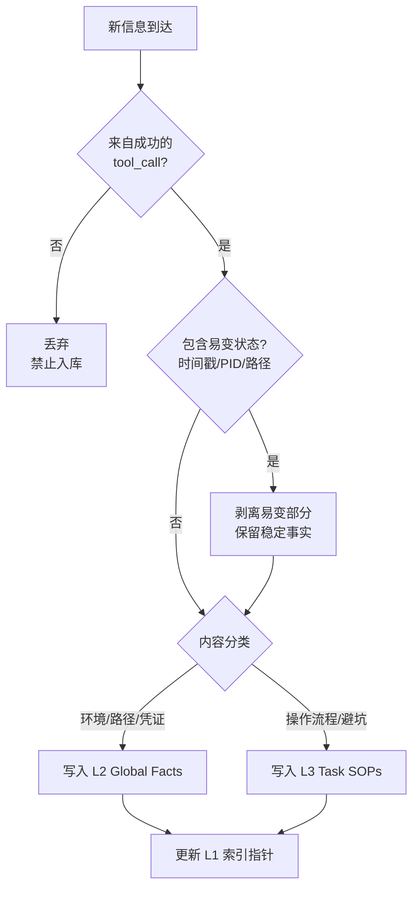

# Action-Verified Memory（行动验证记忆）

> **Evidence Status** -- grounded. 来自 GenericAgent 的记忆三公理和 L1-L4 分级架构，经实际部署验证。

Agent 的长期记忆最危险的不是"记太少"，而是"记错了"。一旦把推测、未验证的假设或过时信息写入长期记忆，后续所有基于这条记忆做出的决策都建立在错误基础上。这比没记忆更糟，因为 Agent 会带着确信犯错。Action-Verified Memory 的核心立场：**只有经过执行验证的信息才有资格进入记忆系统**。

## 三公理

### 公理 1：Action-Verified Only

```
NO Execution -> NO Memory
```

Agent 不能仅凭推理就往记忆写入"这个 API 的超时是 30 秒"。必须实际调用过、观察到返回结果后才能记录。同理，Agent 从文档或搜索结果中读到的信息也不直接写入——需要通过行动确认后才能存储。

禁止写入的内容：
- 未执行的计划和策略
- 基于推理的假设（"应该是..."、"可能因为..."）
- 从外部文档直接抄录但未验证的事实
- 其他 Agent 传递但未独立确认的信息

### 公理 2：Sanctity of Verified Data

已验证数据可以被压缩、迁移、重新组织，但**绝不能在这些过程中丢失准确性**。压缩的目标是减少 token，不是改变语义。

```python
# 合法的压缩
before = "在 2025-01-15 执行 curl https://api.example.com/v2/users 返回 200，响应包含 pagination，每页 50 条"
after  = "api.example.com/v2/users: 200, paginated, 50/page"

# 非法的压缩——丢失了版本信息
bad    = "api.example.com/users: 200, paginated"  # v2 被丢弃
```

### 公理 3：No Volatile State

禁止存储时间戳、Session ID、PID、绝对路径等易变状态。这些信息在下一次会话中几乎必然失效，存储它们不仅浪费空间，还会误导 Agent 使用过期引用。

```python
# 错误：存储易变状态
"当前 session: abc-123, PID: 45678, 日志在 /tmp/agent_20250115_143022.log"

# 正确：只存可复现的信息
"日志路径规则: /tmp/agent_{date}_{time}.log; 通过 ps aux | grep agent 获取 PID"
```

## 四层分级记忆

三公理定义了"什么能记"，分级架构定义了"记在哪里"。

```
L1  Insight Index   <= 30 行, < 1K tokens    始终注入上下文
L2  Global Facts    按需读取                  环境事实库
L3  Task SOPs       按需加载                  可复用操作规程
L4  Session Archive 仅回溯时搜索              历史会话压缩存档
```

| 层级 | 内容类型 | 写入条件 | 读取时机 | 膨胀风险 |
|------|---------|---------|---------|---------|
| L1 | 高频场景的 key->value 索引 + 压缩避坑规则 | L2/L3 新增时同步 | 每轮对话 | 高：必须定期精简 |
| L2 | 环境特异事实（路径、凭证、配置、ID） | 行动验证后 | Agent 判断需要时 | 中：按 section 组织 |
| L3 | 操作规程（SOP）和可复用脚本 | 复杂任务完成且总结提炼后 | 匹配到相关任务时 | 低：有准入门槛 |
| L4 | 原始会话日志的压缩存档 | 会话结束自动归档 | 显式回溯搜索时 | 低：自动按月归档 |

### 信息分类决策树



```python
def decide_layer(info):
    if is_environment_specific(info):   # IP、路径、凭证、API 密钥
        return "L2"
    if is_generic_principle(info):      # 全局避坑指南
        return "L1 [RULES]"            # 压缩为 1 句
    if is_task_specific_expertise(info):# 经过艰难尝试且长期有用
        return "L3 SOP/Script"
    return None                         # 通用常识不存储
```

### L1 同步机制

L1 是整个系统的枢纽。写入 L2/L3 时必须同步决定 L1 的更新策略：

- **高频场景**：直接在 L1 写入 `key -> value` 定位信息（一步到达）
- **低频场景**：仅列关键词，提示 Agent 去 L2/L3 查详情
- **避坑规律**：压缩为一句写入 `[RULES]` 区域

L1 有 30 行硬上限。超限时必须把低频条目降级或合并，否则 L1 从"索引"退化为"又一个全量注入"。

## 适用场景

- 需要跨会话积累经验的长期运行 Agent
- Agent 操作的环境有大量特异性配置（路径、凭证、API 差异）
- 记忆污染的代价高于记忆缺失的代价

## 反模式

| 反模式 | 表现 | 修复 |
|--------|------|------|
| 推测入库 | Agent 把"我认为这个接口需要 OAuth"写入记忆 | 执行验证后再写 |
| L1 膨胀 | L1 从 30 行涨到 200 行，每轮消耗大量 token | 定期审计，低频条目降级到 L2 |
| 易变锚定 | 存储了绝对路径，下次会话路径变了导致一连串错误 | 存储路径生成规则，不存储具体路径 |
| 压缩失真 | 压缩过程丢失了关键限定条件（如 API 版本） | 压缩前后做语义等价检查 |

## 参考来源

- `../../projects/general-agents/generic-agent/memory-layers.md`
- `layered-memory.md` -- 本 pattern 是 Layered Memory 的"写入纪律"维度的深化
