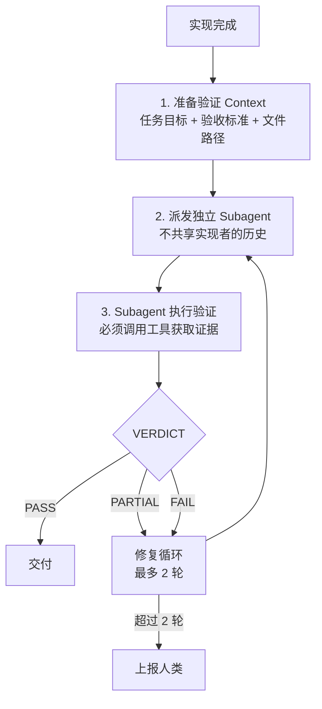

# Adversarial Verification（对抗性验证）

> **Evidence Status** — grounded. 来自 GenericAgent 的 verify_sop 实现，辅以独立验证和红队测试的通用实践。

Self-Verification 的局限在于：实现者验证自己的工作天然存在确认偏误。Adversarial Verification 要求验证由**独立 subagent 执行**，且验证的目标是"找到失败的方法"。

核心规则：**无工具证据的 PASS = SKIP**。验证者如果没有运行任何工具就声称通过，等同于跳过验证。

## 四步流程



## 验证 Subagent 的约束

```yaml
verification_subagent:
  context:
    - task_objective        # 要验证什么
    - acceptance_criteria   # 怎样算通过
    - file_paths            # 在哪里验证
    # 不包含：实现者的推理过程、调试历史、中间尝试

  rules:
    - must_use_tools: true          # 必须调用至少一个工具
    - tool_evidence_required: true  # PASS 必须附带工具输出证据
    - mindset: adversarial          # 目标是找到失败，不是确认成功

  output:
    verdict: PASS | FAIL | PARTIAL
    evidence: list[tool_output]     # 支撑判断的工具输出
    failures: list[string]          # 发现的具体问题
    suggestions: list[string]       # 修复建议
```

## "找到失败的方法"

验证者应主动尝试破坏实现，而非沿着实现者的预期路径检查：

- 代码修改：不仅运行修改文件的测试，还运行相邻模块的测试，检查是否引入回归
- API 变更：用边界值和异常输入调用，而非只用 happy path
- 配置变更：检查是否有未处理的环境差异（dev vs prod）
- 文档声明：交叉检查声称的行为与实际代码是否一致

## VERDICT 语义

| 判定 | 含义 | 后续动作 |
|---|---|---|
| PASS | 所有验收标准都有工具证据支撑 | 交付 |
| FAIL | 至少一个关键标准未满足 | 进入修复循环 |
| PARTIAL | 非关键项未满足或证据不充分 | 进入修复循环（优先级低于 FAIL） |

修复循环最多 2 轮。超过后不再自动重试，上报人类决策，避免 Agent 在错误方向上持续消耗。

## 适用场景

- 多步任务的最终验收
- 关键代码修改（安全、支付、权限相关）
- 跨模块重构
- 任何"错了代价很高"的操作

不适用于简单的单文件修改或纯文本生成，这些场景用 `self-verification.md` 的轻量检查即可。

## 与现有模式的关系

| 现有模式 | Adversarial Verification 的区别 |
|---|---|
| `self-verification.md` | Self 是自检；Adversarial 是独立第三方检验 |
| `subagent.md` | Subagent 是通用隔离机制；Adversarial Verification 是特化的验证用法 |
| `guardian-review-agent.md` | Guardian 审核操作安全性；Adversarial 验证功能正确性 |

## 参考实现

- GenericAgent verify_sop
- `../../projects/coding-agents/claude-code/orchestration-layer.md`（子代理验证）
