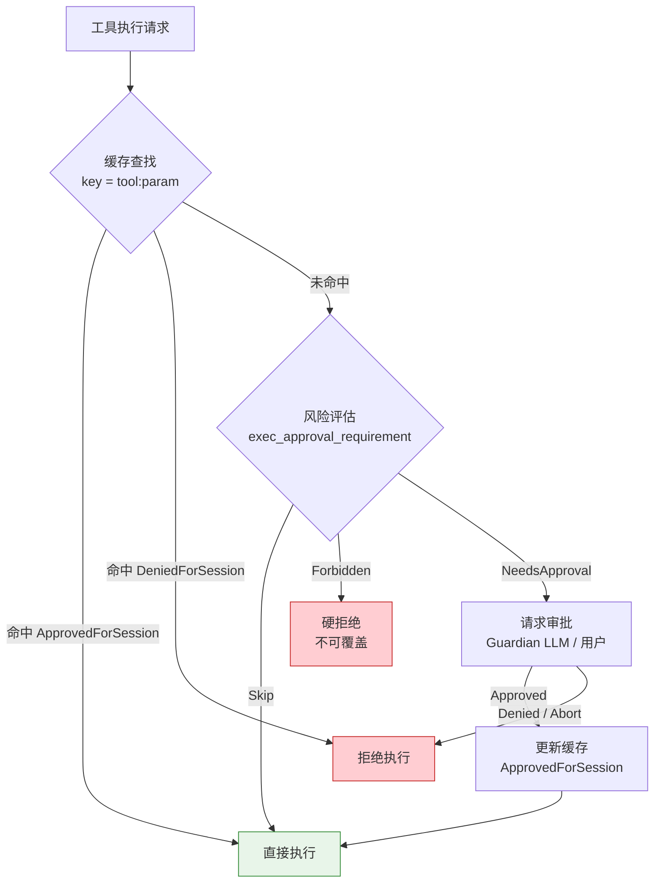

# Approval Cache（审批缓存）

> **Evidence Status** -- grounded. 来自 Codex 的 ToolOrchestrator 审批流程和 Guardian 系统，辅以 Warp 的权限 Profile 实现。

Agent 每次执行工具都请求用户审批会导致交互瘫痪——用户变成了 approval-only 交互的瓶颈。但完全跳过审批又不安全。Approval Cache 的方案是：**按具体参数键缓存审批决策，让同类操作在首次审批后自动放行**。

## 核心机制

### 缓存键设计

审批缓存的关键设计：**不是按工具名缓存，而是按具体参数键缓存**。

```
错误: cache_key = "Bash"                    -- 一旦批准 Bash，所有命令都放行
正确: cache_key = "Bash:python:test_*.py"   -- 只批准 python 前缀的测试命令
```

缓存键的粒度决定了安全性和便利性的平衡。Codex 的做法是按文件路径、命令前缀等具体参数构建键：

```rust
// 文件操作：按路径缓存
key = format!("{}:{}", tool_name, file_path);
// "Write:src/main.rs" 的审批不等于 "Write:/etc/passwd" 的审批

// 命令执行：按命令前缀缓存
key = format!("{}:{}", tool_name, command_prefix);
// "Bash:python" 的审批不等于 "Bash:rm" 的审批
```

### 四种决策级别

```rust
enum ApprovalDecision {
    ApprovedForSession,   // 本次会话内同类操作自动放行
    ApprovedOnce,         // 仅本次放行，下次同类操作仍需审批
    Denied,               // 拒绝本次操作
    DeniedForSession,     // 本次会话内同类操作自动拒绝
}
```

`ApprovedForSession` 是最常用的决策：用户批准 `Write:src/` 后，后续对 `src/` 下所有文件的写操作都自动放行，直到会话结束。这把 N 次审批压缩为 1 次。

### 审批决策流程



### 审批流程与 Agent 循环解耦

Codex 的 Guardian 审批系统独立于 Agent 主循环运行。审批请求异步发出，Agent 不阻塞等待：

```rust
// Orchestrator 中的审批阶段
let requirement = tool.exec_approval_requirement(req)
    .unwrap_or_else(|| default_requirement(approval_policy));

match requirement {
    ExecApprovalRequirement::Skip => {
        // 缓存命中或低风险：直接执行
    }
    ExecApprovalRequirement::Forbidden { reason } => {
        // 硬拒绝：不可覆盖
        return Err(ToolError::Rejected(reason));
    }
    ExecApprovalRequirement::NeedsApproval { reason } => {
        // 请求审批（可路由到 Guardian LLM 或用户）
        let decision = tool.start_approval_async(req, ctx).await;
        match decision {
            ReviewDecision::Approved => { /* 更新缓存 */ }
            ReviewDecision::Denied | ReviewDecision::Abort => {
                return Err(ToolError::Rejected("rejected"));
            }
            ReviewDecision::NetworkPolicyAmendment { amendment } => {
                // 动态修改网络策略
            }
        }
    }
}
```

审批决策的来源可以是用户，也可以是 Guardian LLM——两者共用同一决策路径，调用方不需要区分。

### 沙箱拒绝的升级路径

当操作被沙箱拒绝时，审批系统提供升级路径而非直接失败：

```
首次执行（带沙箱）
    |
    +-- 成功 -> 返回结果
    |
    +-- 沙箱拒绝 -> 检查 escalate_on_failure()
                     |
                     +-- 否 -> 返回错误
                     +-- 是 -> 请求用户确认 -> 无沙箱重试
```

这把安全策略从"阻止"变成了"分级放行"：默认在沙箱内执行，失败时提示用户确认，确认后提权重试。审批记录保留完整的升级链路供审计。

### 规则建议

当 Agent 反复请求某类操作的审批时，系统可以向用户建议新规则：

```
检测到您已批准 5 次 "python test_*.py" 命令。
建议添加规则：allow "python" 前缀命令？
[是] [否] [仅本次会话]
```

这把运行时的审批经验沉淀为持久化的策略规则，减少后续会话的审批负担。

## 适用场景

- 用户与 Agent 的交互会话较长，同类操作反复出现
- 安全要求不允许全自动执行，但逐一审批不可接受
- 需要区分"风险等级"而非二元的"允许/拒绝"

## 权衡

**收益**：大幅减少审批次数（N 次 -> 1 次）；保留了对新类型操作的审批门控；审批决策可审计。

**成本**：缓存键设计需要领域知识（粒度太粗不安全，太细没效果）；会话级缓存在长会话中可能积累过多放行规则；用户可能对 `ApprovedForSession` 的范围产生误解。

**关键约束**：缓存的作用域必须严格限定在会话内。跨会话的审批放行应该走策略配置（如 allowlist），不应该自动继承。

## 反模式

| 反模式 | 表现 | 修复 |
|--------|------|------|
| 工具级缓存 | 批准 "Bash" 后所有命令自动执行 | 按参数键（命令前缀、文件路径）缓存 |
| 永久缓存 | 会话结束后审批决策仍然生效 | 缓存严格绑定会话生命周期 |
| 审批疲劳 | 连续弹出 20 次确认框，用户开始盲目点"是" | 在第 3-5 次后建议 ForSession 规则 |
| 无升级路径 | 沙箱拒绝就直接失败，用户无法干预 | 提供"确认后提权重试"选项 |

## 与现有模式的关系

| 现有模式 | Approval Cache 的区别 |
|----------|---------------------|
| `guardian-review-agent.md` | Guardian 做风险评估决策；Approval Cache 做决策的缓存和复用 |
| `hook-system.md` | PreToolUse Hook 是审批逻辑的挂载点；Cache 是 Hook 内部的效率优化 |
| `isolation-gradient.md` | 隔离梯度决定执行环境；审批缓存决定是否允许执行 |

## 参考来源

- `../../projects/coding-agents/codex/orchestrator.md`
- `../../projects/coding-agents/codex/guardian-policy.md`
- `../../projects/coding-agents/warp/agent-controller.md` -- 权限 Profile 的 `temporary_file_permissions`
