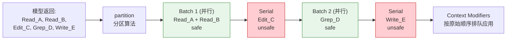

# Concurrent Tool Partition（工具并发分区）

> **Evidence Status** -- grounded. 来自 Claude Code 的 `toolOrchestration.ts` 实现，生产环境验证。

当 Agent 一次请求中产生多个工具调用时，串行执行安全但慢，全部并行快但可能产生竞态。Concurrent Tool Partition 的方案是：**让每个工具声明自己的并发安全性，运行时自动将连续的安全调用合并为并行批次，不安全调用隔离为串行块**。

## 核心机制

### 工具声明并发安全性

每个工具实现 `isConcurrencySafe()` 方法，基于自身类型和当前输入参数判断是否可并发：

```typescript
interface Tool {
  name: string;
  isConcurrencySafe(input: ParsedInput): boolean;
}
```

判断逻辑不是静态标签，而是**基于输入参数的动态判定**。同一个工具在不同参数下可能有不同的并发安全性：

| 工具 | isConcurrencySafe | 判定依据 |
|------|-------------------|---------|
| Read | true | 只读操作 |
| Glob | true | 只读操作 |
| Grep | true | 只读操作 |
| Write | false | 修改文件 |
| Edit | false | 修改文件 |
| Bash | 取决于命令 | `ls` 可以并发，`rm` 不行 |

判断函数抛异常时，保守处理为不可并发。

### 分区算法

`partitionToolCalls()` 遍历工具调用序列，将相邻的并发安全调用合并为一个批次：

```typescript
type Batch = { isConcurrencySafe: boolean; blocks: ToolUseBlock[] }

function partitionToolCalls(toolUses: ToolUseBlock[], ctx: ToolUseContext): Batch[] {
  return toolUses.reduce((batches, toolUse) => {
    const safe = tool.isConcurrencySafe(parsedInput);
    // 当前安全 且 上一批也安全 -> 合并
    if (safe && batches.at(-1)?.isConcurrencySafe) {
      batches.at(-1)!.blocks.push(toolUse);
    } else {
      // 否则新建批次
      batches.push({ isConcurrencySafe: safe, blocks: [toolUse] });
    }
    return batches;
  }, []);
}
```

示例分区结果：

```
输入序列: [Read, Grep, Read, Write, Read, Glob]
分区结果:
  Batch 1 (并发): [Read, Grep, Read]    -- 3 个只读并行
  Batch 2 (串行): [Write]               -- 写操作单独执行
  Batch 3 (并发): [Read, Glob]          -- 又一批只读并行
```

### 分区执行时间线



### 上下文修改器排队

工具执行后可能修改上下文（如更新文件列表、刷新 git 状态）。并发批次内，这些修改器（`contextModifier`）不能立即应用——否则并发执行的其他工具可能看到不一致的中间状态。

```typescript
// 并发批次：收集修改器，执行完后按原始顺序统一应用
const queuedModifiers: Record<string, ((ctx: Context) => Context)[]> = {};

for await (const update of runConcurrently(batch.blocks, ...)) {
  if (update.contextModifier) {
    queuedModifiers[update.toolUseID] ??= [];
    queuedModifiers[update.toolUseID].push(update.modifyContext);
  }
}

// 按工具调用的原始顺序应用修改
for (const block of batch.blocks) {
  for (const modifier of queuedModifiers[block.id] ?? []) {
    currentContext = modifier(currentContext);
  }
}
```

串行批次则不需要排队，修改器立即应用。

### 并发度限制

最大并发度可通过环境变量配置，默认 10：

```typescript
const maxConcurrency = parseInt(
  process.env.CLAUDE_CODE_MAX_TOOL_USE_CONCURRENCY || '', 10
) || 10;
```

## 适用场景

- Agent 单轮产生多个工具调用（如同时搜索多个文件、并行读取多个路径）
- 工具集中有明确的读写区分
- 延迟敏感，需要最大化吞吐

## 权衡

**收益**：对于读密集型工作（代码搜索、文件分析），并发分区可以将延迟从 N * 单工具时间降到接近单工具时间。

**成本**：工具需要额外实现 `isConcurrencySafe()` 方法；上下文修改器排队增加了运行时复杂度；判定错误（把不安全标记为安全）可能导致数据竞态。

**关键约束**：分区算法只合并**相邻**的安全调用。如果 Agent 的调用序列是 `[Read, Write, Read]`，两个 Read 不会合并——它们被 Write 隔开了。这意味着 Agent 的调用顺序会影响并发效率。

## 反模式

| 反模式 | 表现 | 修复 |
|--------|------|------|
| 全标记安全 | 所有工具都声明 safe，Write 和 Edit 也并发 | 写操作必须标记为不安全 |
| 忽略上下文排队 | 并发批次内直接应用 contextModifier | 收集后按顺序统一应用 |
| 全标记不安全 | 保守起见全部串行，失去并发收益 | 至少把只读工具标记为安全 |
| 无并发上限 | 100 个只读工具同时执行，耗尽系统资源 | 设置 maxConcurrency |

## 参考来源

- `../../projects/coding-agents/claude-code/tool-orchestration.md`
