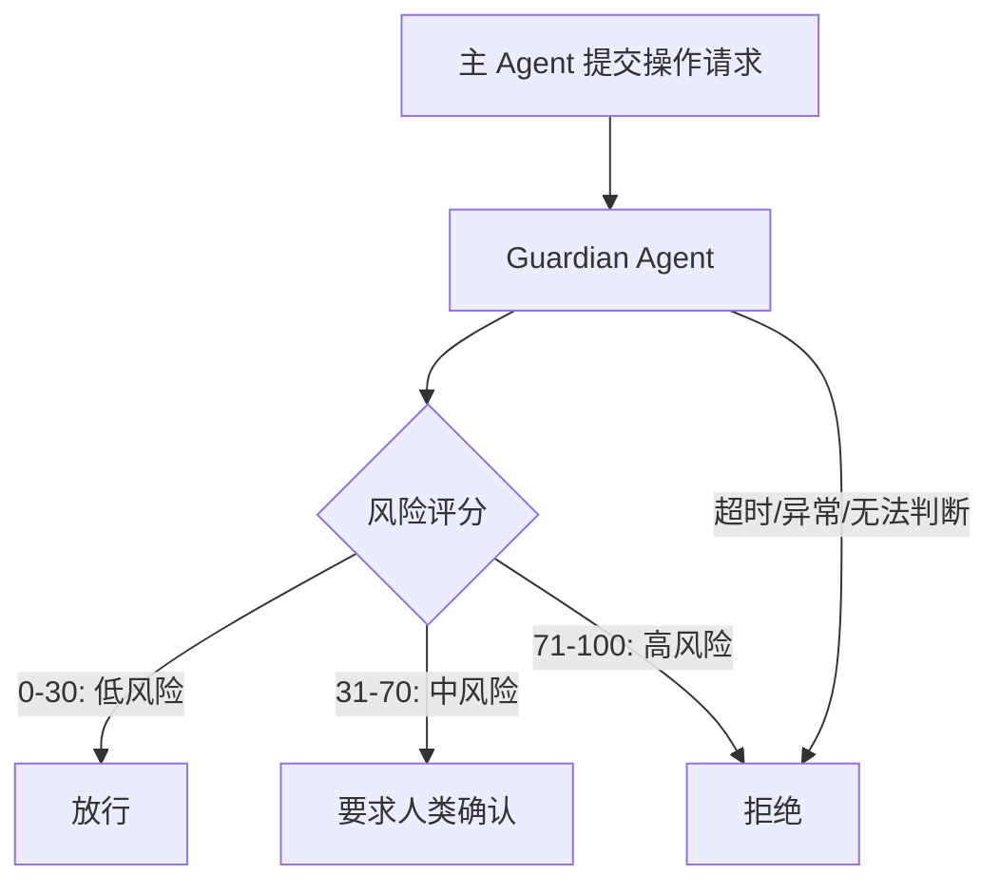

# Guardian Review Agent（Guardian 独立审核）

> **Evidence Status** — grounded. 来自 Codex guardian 实现，辅以通用安全审核和 fail-closed 策略实践。

Agent 执行高风险操作（删除、外部发送、金钱操作）时，自身判断不可信，因为它既是执行者又是审核者，存在利益冲突。Guardian 模式引入一个**完全独立的 LLM 实例**做安全审核，与主 agent 的模型和会话隔离。

## 核心设计



Guardian 的三个隔离保证：
1. **模型隔离**：Guardian 可以用不同模型、不同参数，避免与主 agent 共享同一套偏见
2. **会话隔离**：Guardian 不接收主 agent 的完整历史，只接收审核所需的最小上下文
3. **决策隔离**：Guardian 的判断不可被主 agent 覆盖

## 审核上下文限制

Guardian 接收的上下文有严格预算，防止信息溢出导致审核质量下降或被注入攻击：

```yaml
guardian_context:
  message_budget: 10_000 tokens    # 最近的对话片段
  tool_call_budget: 10_000 tokens  # 待审核的工具调用详情
  system_prompt: guardian_policy   # 独立的审核策略，不含主 agent 的指令
  total_cap: 25_000 tokens         # 硬上限
```

上下文超限时截断最旧的消息，保留最近的操作和待审核的工具调用。

## 风险评分

Guardian 输出结构化的审核结果：

```yaml
review_result:
  risk_score: 0-100
  verdict: allow | require_confirmation | deny
  reason: string           # 人类可读的理由
  evidence:                # 支撑判断的具体证据
    - "操作涉及 rm -rf，匹配高风险规则"
    - "目标路径在项目目录外"
```

阈值可按场景配置：内部开发环境可以宽松，生产环境必须严格。

## 失败关闭原则

Guardian 的默认立场是拒绝：

| 异常情况 | 处理 |
|---|---|
| Guardian 超时 | 拒绝 |
| Guardian 返回格式异常 | 拒绝 |
| Guardian 无法判断（置信度低） | 拒绝 |
| Guardian 服务不可用 | 拒绝并告警 |

这与防火墙的 fail-closed 原则一致：安全机制失效时，应阻断而非放行。

## 适用场景

- 文件/数据删除操作
- 向外部发送邮件、消息、API 调用
- 涉及金钱的操作（支付、转账、订阅）
- 修改权限、凭证、安全配置
- 生产环境的任何写操作

## 与现有模式的关系

| 现有模式 | Guardian 的区别 |
|---|---|
| `guard-model.md` | Guard Model 是分层防御体系；Guardian 是其中"独立 LLM 审核"层的具体实现 |
| `self-verification.md` | Self-Verification 是 agent 验证自己的工作；Guardian 是外部独立审核 |
| `untrusted-context-boundary.md` | 边界隔离防注入；Guardian 防 agent 自身的错误决策 |

## 反模式

| 反模式 | 表现 | 修复 |
|---|---|---|
| Guardian 与主 agent 共享上下文 | 同一轮注入同时污染两者 | 严格会话隔离 |
| Guardian 可被主 agent 覆盖 | 主 agent 多次重试直到 Guardian 放行 | 限制重试次数，记录审计日志 |
| 审核所有操作 | 低风险操作也走 Guardian 导致延迟激增 | 用确定性规则快速放行低风险操作 |

## 参考来源

- `../../projects/coding-agents/codex/guardian-policy.md`
