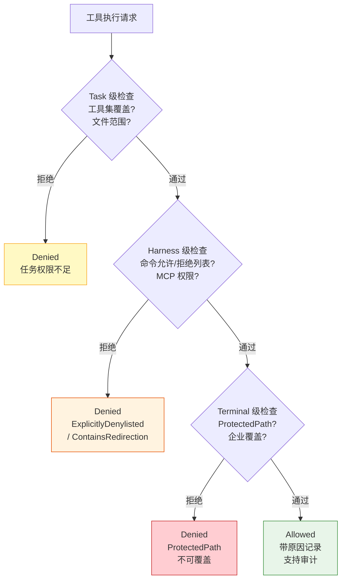

# Harness Container（Agent 运行容器）

> **Evidence Status** -- grounded. 来自 Warp 的多 Agent 平台架构，包括 10 种 SkillProvider 兼容、AgentHarness feature flag 和 BlocklistAIController 的多模型路由。

当一个平台需要集成多种第三方 Agent（Claude Code、Codex、Gemini CLI、OpenCode 等）时，为每个 Agent 写定制集成代码是不可持续的。Harness Container 模式的核心思想：**平台提供标准化的运行容器，第三方 Agent 作为可插拔的执行后端，通过统一的接口协议通信**。

## 结构

```
                    ┌─────────────────────────┐
                    │   Harness Container     │
                    │   (Warp Terminal)       │
                    │                         │
                    │  ┌───────────────────┐  │
                    │  │  Controller       │  │
                    │  │  (编排 + 路由)    │  │
                    │  └────────┬──────────┘  │
                    │           │              │
                    │  ┌────────▼──────────┐  │
                    │  │  Harness Adapter  │  │
                    │  │  (标准化接口)     │  │
                    │  └────────┬──────────┘  │
                    │           │              │
                    │  ┌────────▼──────────┐  │
                    │  │  Terminal Driver  │  │
                    │  │  (执行环境抽象)   │  │
                    │  └────────┬──────────┘  │
                    └───────────┼──────────────┘
                                │
              ┌─────────────────┼─────────────────┐
              │                 │                   │
        ┌─────▼─────┐   ┌──────▼──────┐   ┌───────▼───────┐
        │ Claude Code│   │ Codex CLI   │   │ Gemini CLI    │
        │ (外部进程) │   │ (外部进程)  │   │ (外部进程)    │
        └───────────┘   └─────────────┘   └───────────────┘
```

### Provider 枚举

Warp 通过 SkillProvider 枚举适配 10 种外部 Agent 的 skill 目录：

```rust
pub enum SkillProvider {
    Agents,     // .agents/skills/  (最高优先级)
    Warp,       // .warp/skills/
    Claude,     // .claude/skills/
    Codex,      // .codex/skills/
    Cursor,     // .cursor/skills/
    Gemini,     // .gemini/skills/
    Copilot,    // .copilot/skills/
    Droid,      // .factory/skills/
    Github,     // .github/skills/
    OpenCode,   // .opencode/skills/
}
```

优先级由定义顺序决定：同名 skill 取 provider rank 最小（优先级最高）的版本。这意味着 `.agents/skills/review-pr` 会覆盖 `.claude/skills/review-pr`。

### 统一执行环境

Controller 为所有 Agent 提供统一的请求输入结构：

```rust
pub struct RequestInput {
    pub conversation_id: AIConversationId,
    pub input_messages: HashMap<TaskId, Vec<AIAgentInput>>,  // 多任务并行
    pub model_id: LLMId,                    // 主模型
    pub coding_model_id: LLMId,             // 编码模型
    pub cli_agent_model_id: LLMId,          // CLI agent 模型
    pub computer_use_model_id: LLMId,       // Computer Use 模型
    pub supported_tools_override: Option<Vec<ToolType>>,
}
```

关键设计：一个请求可以指定四种不同场景的模型，容器根据任务类型路由到合适的模型。

### 权限三层分离



```
Task 级：单次任务的权限（工具集覆盖、文件访问范围）
Harness 级：Agent 类型的权限（命令允许/拒绝列表、MCP 权限）
Terminal 级：全局安全硬限制（ProtectedPath、企业覆盖）
```

```rust
pub enum CommandExecutionPermission {
    Allowed(AllowedReason),   // 带原因的允许
    Denied(DeniedReason),     // 带原因的拒绝
}

pub enum DeniedReason {
    AutonomyForceDisabled,    // 自治被强制禁用
    ExplicitlyDenylisted,     // 在拒绝列表中
    ContainsRedirection,      // 包含重定向（安全风险）
    ProtectedPath,            // 系统保护路径（不可覆盖）
    AgentDecided,             // Agent 自主决定拒绝
}
```

权限枚举带原因，支持审计和遥测。`ProtectedPath` 是硬限制，即使用户设置允许也不可写。

### Skill 发现与去重

容器自动扫描所有 provider 的 skill 目录，用容错解析处理不同格式：

```rust
fn parse_skill(path: &Path) -> Result<ParsedSkill> {
    // 自动检测 provider 类型
    let provider = get_provider_for_path(path).unwrap_or(SkillProvider::Agents);
    // 没有 frontmatter 也能从路径和内容推导 name/description
    // description 有 512 字符限制
}

fn unique_skills(skills: Vec<SkillDescriptor>) -> Vec<SkillDescriptor> {
    // 同名 skill 按 provider rank 去重，保留优先级最高的
}
```

## 适用场景

- IDE/终端类产品需要集成多种 Agent 后端
- 团队中不同成员使用不同的 Agent 工具，需要统一的 skill 共享
- 平台需要对第三方 Agent 的执行施加安全约束

## 权衡

**收益**：一套权限/审计/UI 基础设施服务所有 Agent；用户不需要在多个 Agent CLI 之间切换；skill 文件在不同 Agent 间天然共享。

**成本**：需要维护 N 种 Agent 的适配层；不同 Agent 的能力差异可能导致同一 skill 在不同后端表现不一致；provider 优先级逻辑增加了调试复杂度。

**关键约束**：容器的权限模型必须是所有 Agent 权限模型的超集。如果某个 Agent 有容器无法表达的权限粒度（如 Codex 的沙箱策略），要么降级处理，要么扩展容器的权限模型。

## 反模式

| 反模式 | 表现 | 修复 |
|--------|------|------|
| 最小公分母 | 容器只暴露所有 Agent 共有的功能 | 支持 `supported_tools_override` 按 Agent 扩展 |
| 权限穿透 | 第三方 Agent 绕过容器直接执行系统命令 | Terminal 级硬限制不可覆盖 |
| Skill 冲突忽略 | 多个 provider 的同名 skill 无序加载 | 明确优先级排序 + 去重 |
| 全量适配 | 为每个 Agent 写完整的通信协议实现 | 标准化 skill 格式，让 Agent 适配容器而非反过来 |

## 参考来源

- `../../projects/coding-agents/warp/agent-architecture.md`
- `../../projects/coding-agents/warp/skill-system.md`
- `../../projects/coding-agents/warp/agent-controller.md`

## Multi-Platform Harness (Trellis)

> **Evidence**: Trellis — 14 AI Coding Platform 支持

Warp 的 Harness Container 聚焦"一个平台托管多个 Agent"。Trellis 走了另一条路："一套规范适配多个平台"。

**14 平台分类**：
| 分类 | 平台 | 能力 |
|------|------|------|
| Hook + Agent | Claude Code, Cursor, Codex, Gemini, Kiro, Qoder, CodeBuddy, Copilot, Droid, Pi, OpenCode | 完整工作流 |
| 仅 Workflow | Kilo, Antigravity, Windsurf | 无 sub-agent |

**Registry-Driven Configurator**：
- `AI_TOOLS` 单一真值源定义所有平台的 configDir / cliFlag / templateContext / hasPythonHooks
- 每个 configurator 从 registry 查询参数，自动生成 skills / agents / hooks / settings
- 新增平台只需在 AI_TOOLS 中添加一行，其余代码自动适配

**Template Placeholder Neutralization**：
- 多平台共享 skill（如 trellis-brainstorm）用中立占位符 `{{CMD_REF:start}}` → `"start (Trellis command)"`
- 避免 Codex 和 Gemini 同时写入同一个 SKILL.md 时的 last-writer-wins 冲突

**与 Warp Harness 的对比**：
| 维度 | Warp Harness Container | Trellis Multi-Platform |
|------|----------------------|----------------------|
| 方向 | 一个平台托管多 Agent | 一套规范适配多平台 |
| 平台数 | 1（Warp 自身） | 14 |
| Agent 来源 | 10+ 第三方 Harness | 4 个内置 sub-agent |
| 配置驱动 | SkillProvider 枚举 | AI_TOOLS Registry |
| 隔离 | 容器 / PTY | 各平台原生隔离 |

## Sandbox Backend Selection (OpenClaw)

> **Evidence**: OpenClaw — 4 种沙箱后端

OpenClaw 提供 per-session 可配置的沙箱后端选择：

**后端**：
- **Local** — 直接在用户设备执行（主 session 默认）
- **Docker** — 容器隔离（非 main session 默认）
- **SSH** — 远程执行（node-host 场景）
- **OpenShell** — 终端隔离（macOS/Linux）

**选择策略**：
- `agents.defaults.sandbox.mode: "non-main"` — 非 main session 自动沙箱化
- 默认允许：bash, process, read, write, edit, sessions_*
- 默认拒绝：browser, canvas, nodes, cron, discord, gateway

**与 Codex 沙箱的对比**：Codex 用跨平台内核沙箱（Seatbelt/Landlock/Restricted Token）做进程级隔离；OpenClaw 用 Docker/SSH 做环境级隔离，颗粒度更粗但部署更灵活。
