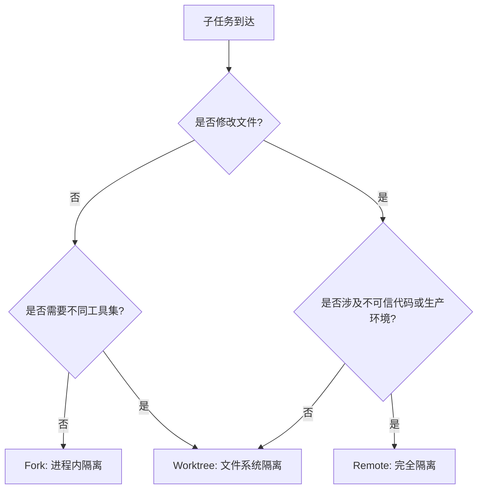

# Isolation Gradient（隔离梯度）

> **Evidence Status** — grounded. 来自 Claude Code 的 fork/worktree 子代理隔离实现，辅以通用进程隔离和远程执行实践。

Agent 在派生子任务时，需要在性能和安全之间做选择。隔离太轻，子任务的副作用可能污染主上下文或文件系统；隔离太重，延迟和成本急剧上升。Isolation Gradient 的核心思想：**隔离级别应与操作风险匹配，而非一刀切**。

## 三层梯度


| 层级 | 隔离边界 | 延迟 | 成本 | 安全性 | 适用场景 |
|---|---|---|---|---|---|
| Fork | 进程内分支上下文 | 低（ms 级） | 最低 | 低：共享文件系统 | 只读分析、搜索、代码理解 |
| Worktree | 独立工作目录（git worktree） | 中（s 级） | 中等 | 中：文件隔离，共享网络 | 代码修改、编译测试、并行实验 |
| Remote | 独立容器/沙箱 | 高（10s+ 级） | 最高 | 高：完全隔离 | 不可信代码执行、生产操作、安全审计 |

## Cache 兼容性：Fork 层的关键约束

Claude Code 的 fork 子代理有一个核心设计约束：**子代理必须产生字节相同的 API 请求前缀，以最大化 prompt cache 命中**。

```text
主 Agent 上下文:  [system prompt][tool defs][history...]
                  ^^^^^^^^^^^^^^^^^^^^^^^^^^^^^^^^^^^^^^^^
                  这段前缀必须字节相同

Fork 子代理:      [system prompt][tool defs][history...][子任务指令]
                  ^^^^^^^^^^^^^^^^^^^^^^^^^^^^^^^^^^^^^^^^
                  复用 cache，只有尾部是新增内容
```

这意味着 fork 子代理的 system prompt、工具定义、早期历史都不能被修改，否则 cache 失效，成本回到全量计算。这个约束反过来限制了 fork 层能做的事情——任何需要不同 system prompt 或不同工具集的子任务，应升级到 worktree 或 remote。

## 选择决策



## 反模式

| 反模式 | 表现 | 修复 |
|---|---|---|
| 一律最重隔离 | 所有子代理都用容器，搜索任务也要等 10s | 只读任务用 fork |
| 一律最轻隔离 | 代码修改类子任务共享工作目录，互相覆盖 | 文件修改类任务至少用 worktree |
| Cache 破坏 | Fork 子代理修改了 system prompt 导致 cache 失效 | 保持请求前缀字节相同 |
| 隔离层混用 | 同一任务的不同步骤在不同隔离层间反复切换 | 按任务整体风险选择一个层级 |

## 参考实现

- `../../projects/coding-agents/claude-code/orchestration-layer.md`
