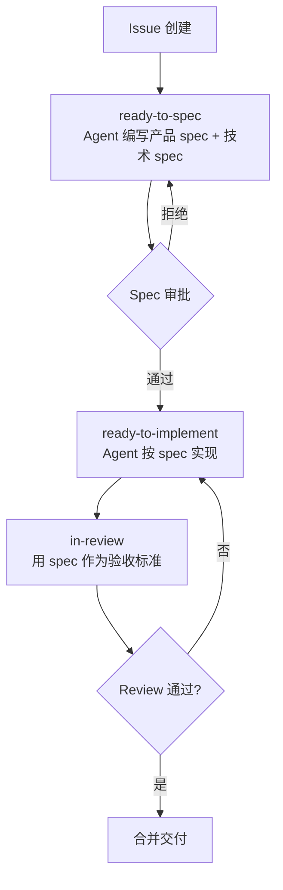

# Spec-Driven Development（Spec 驱动开发）

> **Evidence Status** — grounded. 来自 Warp 的 Agent-as-Contributor 工作流实现。

大多数 Agent 的工作流是"接到任务 → 直接写代码"。这在简单任务上高效，但在复杂功能开发中会导致：方向偏离、返工频繁、验收标准不明。Spec-Driven Development 要求 Agent **先写 spec，再写代码**，用 spec 作为验收标准和沟通契约。

## 核心流程



## 两层 Spec

**产品 Spec**：回答"做什么、为什么做、用户看到什么"。

```markdown
## 目标
解决用户在大文件上传时进度不可见的问题

## 用户故事
作为上传者，我希望看到上传进度百分比和预估剩余时间

## 验收标准
- [ ] 上传 >10MB 文件时显示进度条
- [ ] 进度百分比每秒更新
- [ ] 显示预估剩余时间
- [ ] 上传失败时显示错误信息和重试按钮

## 不做
- 不修改上传 API 的后端逻辑
- 不支持断点续传（后续迭代）
```

**技术 Spec**：回答"怎么做、影响什么、风险在哪"。

```markdown
## 方案
使用 XMLHttpRequest.upload.onprogress 事件获取进度

## 影响范围
- 修改: src/components/Upload.tsx
- 新增: src/hooks/useUploadProgress.ts
- 测试: tests/upload-progress.test.ts

## 风险
- 跨域请求可能不触发 progress 事件（需要 CORS 配置）
```

## Issue 标记流程

| 状态 | 含义 | 谁负责 |
|---|---|---|
| `ready-to-spec` | Issue 已 triage，等待 spec | Agent 编写 spec |
| `spec-review` | Spec 提交，等待审批 | 人类审批 |
| `ready-to-implement` | Spec 通过，可以实现 | Agent 实现 |
| `in-review` | 实现完成，等待 review | 人类/Agent review |

## Agent-as-Contributor 模式

Agent 作为"项目贡献者"，拥有明确的角色和权限边界：

```yaml
agent_contributor:
  can:
    - 创建和修改 spec
    - 提交 PR
    - 回应 review 意见
    - 运行测试
  cannot:
    - 合并 PR（需要人类审批）
    - 修改 CI/CD 配置
    - 创建新的 repo 或修改权限
  must:
    - 所有代码修改都关联到 spec
    - PR 描述引用 spec 中的验收标准
    - 实现范围不超出 spec 的"影响范围"
```

这种模式让 Agent 融入现有团队工作流，而非要求团队适应 Agent。

## 适用场景

- 团队协作中的功能开发（Agent 产出需要人类 review）
- 复杂功能需要设计讨论和方向对齐
- 需要审计轨迹的合规场景
- 多 Agent 协作（spec 作为 Agent 间的契约）

不适用于 hotfix、简单 bug 修复、探索性原型，这些场景 spec 的开销大于收益。

## 与现有模式的关系

| 现有模式 | Spec-Driven 的区别 |
|---|---|
| `contract-agent.md` | Contract 是运行时的任务契约；Spec 是开发流程的设计契约 |
| `milestone-gated-execution.md` | Milestone 是执行过程的检查点；Spec 是执行前的设计审批 |
| `adversarial-verification.md` | Adversarial 验证实现正确性；Spec 定义"正确"的标准 |

## 参考来源

- Warp Agent-as-Contributor 工作流
- `../../projects/coding-agents/warp/` 相关文档

## Spec Curation Gate (Trellis)

> **Evidence**: Trellis — Phase 1.3 人工策展

Trellis 的 spec-driven development 有一个关键区别：spec 注入是人工策展的，而非自动生成。

**implement.jsonl / check.jsonl**：
- 每行一条 JSON：`{"file": "<spec路径>", "reason": "<为什么需要>"}`
- 主 agent 在 Phase 1.3 手动策展（删除 seed 行，添加真实 spec）
- implement.jsonl 供 Phase 2.1 的 implement sub-agent 使用
- check.jsonl 供 Phase 2.2 的 check sub-agent 使用

**为什么不自动生成**：
- 自动 glob + rank 会匹配错误的 spec（false positives）
- "为什么选择这个 spec" 的 reason 字段是知识转移的关键
- 人工判断确保 sub-agent 接收到最相关的约束

**与自动化 Spec 注入的权衡**：人工策展更精准但有额外成本。适合团队规模的项目（spec 文件数十个），不适合 spec 很少或非常多的场景。
