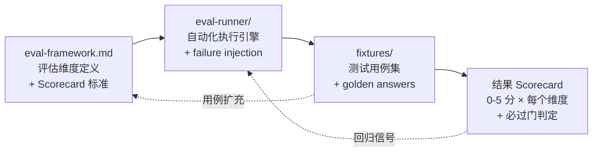

# Evaluation

> **Evidence Status** — synthesized. coding、workflow、memory、research、browser 场景中对任务完成、验证、恢复、证据与回归的共同需求；this repository 对 Agent 评估维度和运行方式的统一抽象。

> **定位**：Evaluation 是横跨所有 Plane 的反馈层（feedback layer / gate），而非第 26 个 Plane。
> 三级评估：L1 Harness Smoke（fixture 验证）→ L2 Real Trace Replay（轨迹回放）→ L3 World Effect Eval（外部效果验证）。

评估（Evaluation）是 Agent 系统质量的度量基础，也是改进可回归的前提。

Agent 评估覆盖六个维度：任务完成、表示可靠性、外部效果、可控性、失败恢复、上线回归。这六个维度构成一条有依赖关系的链路：表示不可靠会导致后续所有判断失效，外部效果无法验证会让任务完成判定变成幻觉验证。上游维度失败时，下游维度的高分没有意义。

Agent 评估覆盖的具体维度：

- 任务是否真实完成；
- 表示是否可靠；
- 外部效果是否被验证；
- 过程是否可控；
- 失败是否可恢复；
- 上线升级是否会回归；
- 成本与质量是否可量化对比；

以上维度通过一条从定义到执行到用例再到评分的流水线落地：

[`eval-framework.md`](./eval-framework.md) 定义"评什么、怎么打分"；[`eval-runner/`](./eval-runner/) 提供自动化执行能力和 failure injection；[`fixtures/`](./fixtures/) 存放可复用的测试用例和 golden answer；最终产出 Scorecard，其中必过门失败会直接阻断发布。Scorecard 中发现的盲区反馈回 fixtures 扩充用例，回归信号驱动 runner 持续执行。

| 文件 | 作用 |
|---|---|
| [`eval-framework.md`](./eval-framework.md) | 通用评估框架、Eval Case 格式、Scorecard |
| [`eval-runner-spec.md`](./eval-runner-spec.md) | 评测运行器、fixture、failure injection、回归门禁 |
| [`fixtures/README.md`](./fixtures/README.md) | fixture 目录约定与样例说明 |
| [`failure-taxonomy.md`](./failure-taxonomy.md) | 失败模式分类（含表示、效果、安全、运维） |
| [`representation-evals.md`](./representation-evals.md) | 表示层专项评估 |
| [`effect-evals.md`](./effect-evals.md) | 外部效果与回读验证专项评估 |
| [`security-evals.md`](./security-evals.md) | prompt injection、tool output injection、memory poisoning 等安全评估 |
| [`human-in-the-loop-evals.md`](./human-in-the-loop-evals.md) | 审批疲劳、升级、人工兜底评估 |
| [`execution-depth-evals.md`](./execution-depth-evals.md) | 执行深度专项评估 |
| [`coding-agent-evals.md`](./coding-agent-evals.md) | Coding Agent 评估场景 |
| [`research-agent-evals.md`](./research-agent-evals.md) | Research Agent 的 citation / conflict / freshness 评估 |
| [`cost-evals.md`](./cost-evals.md) | 成本与质量曲线评估 |
| [`memory-evals.md`](./memory-evals.md) | Memory Agent 评估场景 |
| [`tool-use-evals.md`](./tool-use-evals.md) | Tool Use 评估场景 |

| [`trajectory-evaluation.md`](./trajectory-evaluation.md) | 轨迹评估：六维指标、多 Agent 轨迹、参考轨迹构造 |

推荐配合 `../meta/templates/eval-case-template.yaml` 一起使用。

## 可执行评估入口

- [`eval-runner/README.md`](./eval-runner/README.md)：最小可执行 eval runner。
- `eval-runner/tests/`：对 runner 的基础回归测试。
- [`testability-design.md`](./testability-design.md)：mock world、trace replay、property-based testing、shadow mode。
- `.github/workflows/skill-checks.yml`：示例 CI 入口。

## 品类 × 评估维度

> 从"我做的是什么品类"到"应该评估什么、怎么评估"的映射。典型深度参考 `../design-space/methodology/autonomy-and-depth.md` 的 D0-D6 定义。

| 品类 | 典型深度 | 核心评估指标 | 推荐 Eval 方式 | 相关评估文件 |
|---|---|---|---|---|
| Coding Agent | D4-D5 | test pass rate, diff minimality, 回归率, 验证覆盖率 | trace replay + test gate + diff review | [`coding-agent-evals.md`](./coding-agent-evals.md), [`effect-evals.md`](./effect-evals.md), [`tool-use-evals.md`](./tool-use-evals.md) |
| Research Agent | D3-D5 | citation 准确率, 覆盖率, 事实一致性, conflict 透明度, freshness | human eval + citation chain check + freshness audit | [`research-agent-evals.md`](./research-agent-evals.md), [`representation-evals.md`](./representation-evals.md) |
| Browser/Desktop Agent | D3-D5 | 任务完成率, 步骤效率, DOM/截图一致性, 恢复成功率 | trace replay + screenshot diff + effect readback | [`effect-evals.md`](./effect-evals.md), [`tool-use-evals.md`](./tool-use-evals.md), [`execution-depth-evals.md`](./execution-depth-evals.md) |
| Security Agent | D4-D5 | 误报率/漏报率, 证据链完整性, 响应时效, 自身安全性 | red team + failure injection + audit trail review | [`security-evals.md`](./security-evals.md), [`effect-evals.md`](./effect-evals.md) |
| Companion Agent | D2-D4 | 人格一致性, 用户满意度, 关系健康度, 边界守护率 | subjective eval + 长期一致性追踪 | [`subjective-eval.md`](./subjective-eval.md), [`memory-evals.md`](./memory-evals.md) |
| Data/BI Agent | D3-D5 | SQL 正确率, 语义准确率, 数据溯源完整性, 查询效率 | golden query 对比 + semantic layer 验证 + cost eval | [`representation-evals.md`](./representation-evals.md), [`cost-evals.md`](./cost-evals.md), [`tool-use-evals.md`](./tool-use-evals.md) |
| Ops/SRE Agent | D5-D6 | 根因定位准确率, MTTR 改善, 误操作率, 回滚成功率 | incident replay + failure injection + runbook coverage | [`effect-evals.md`](./effect-evals.md), [`execution-depth-evals.md`](./execution-depth-evals.md), [`cost-evals.md`](./cost-evals.md) |
| Enterprise Workflow | D4-D5 | 流程完成率, 审计完整性, SLA 达标率, 越权率 | trace replay + audit trail + approval chain replay | [`effect-evals.md`](./effect-evals.md), [`human-in-the-loop-evals.md`](./human-in-the-loop-evals.md), [`security-evals.md`](./security-evals.md) |
| Creative Agent | D2-D5 | 风格一致性, 用户满意度, 品牌合规率, 版权安全 | subjective eval + style consistency check + 抽样质检 | [`subjective-eval.md`](./subjective-eval.md), [`representation-evals.md`](./representation-evals.md) |
| Education Agent | D2-D4 | 教学准确率, 难度适配度, 学习效果(前后测), 动机维持 | 学习效果测试 + subjective eval + 错误概念检测 | [`subjective-eval.md`](./subjective-eval.md), [`representation-evals.md`](./representation-evals.md) |
| Financial Agent | D5-D6 | 执行准确率, 滑点控制, 合规违规率, 风险度量误差, 资金安全 | trace replay + 回测对比 + 合规审计 + stress testing | [`effect-evals.md`](./effect-evals.md), [`cost-evals.md`](./cost-evals.md), [`security-evals.md`](./security-evals.md) |
| Embodied Robot Agent | D5-D6 | 任务完成率, 物理安全(零伤害), 感知准确度, Sim-to-Real gap | 仿真评估 + 真机验证 + safety boundary testing | [`effect-evals.md`](./effect-evals.md), [`execution-depth-evals.md`](./execution-depth-evals.md), [`subjective-eval.md`](./subjective-eval.md) |
| Personal Memory Agent | D3-D4 | 记忆准确率, 检索召回率, 冲突解决率, 隐私合规 | golden memory 对比 + retrieval benchmark + privacy audit | [`memory-evals.md`](./memory-evals.md), [`security-evals.md`](./security-evals.md) |
| Agent Platform | D5-D6 | 租户隔离, 回归率, 延迟P99, 插件安全, 评估覆盖率 | shadow mode + canary + 回归门禁 + red team | [`security-evals.md`](./security-evals.md), [`cost-evals.md`](./cost-evals.md), [`execution-depth-evals.md`](./execution-depth-evals.md) |

### 评估维度选择指南

上表列出了 14 个品类各自的核心指标和推荐方式，但实际搭建评估时不需要一次性覆盖所有维度。以下 7 条规则按优先级排列，帮助确定"先评什么"：

1. **所有品类**都应有基础 trace 和 [`tool-use-evals.md`](./tool-use-evals.md) 覆盖。
2. **有外部写动作的品类**（Coding, Browser, Ops/SRE, Enterprise, Financial, Embodied）必须覆盖 [`effect-evals.md`](./effect-evals.md)。
3. **面向终端用户的品类**（Companion, Education, Creative）需要 [`subjective-eval.md`](./subjective-eval.md) 覆盖主观性维度。
4. **涉及安全/合规的品类**（Security, Financial, Enterprise, Agent Platform）必须覆盖 [`security-evals.md`](./security-evals.md)。
5. **有长期记忆的品类**（Companion, Personal Memory, Education）需要 [`memory-evals.md`](./memory-evals.md)。
6. **有成本敏感度的品类**（Research, Data/BI, Ops/SRE, Financial, Agent Platform）需要 [`cost-evals.md`](./cost-evals.md)。
7. **评估结果应可回归**——任何评估都应产出可复用的 fixture（参考 [`fixtures/README.md`](./fixtures/README.md)）。

规则 1-2 是底线——没有 trace 就无法定位问题，没有 effect 验证就无法判断任务是否真正完成。规则 3-6 根据品类特征按需叠加。规则 7 确保评估本身可持续：一次评估如果不产出 fixture，下次还是从零开始。
