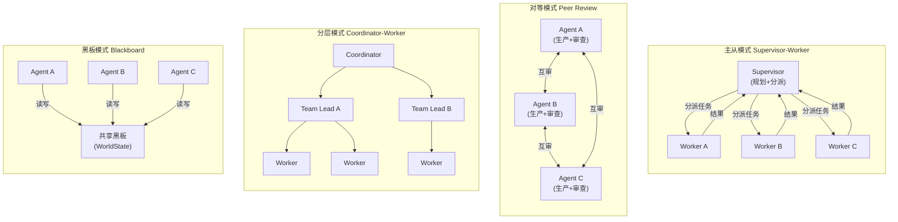

# Collaboration Paradigms

> **Evidence Status** — grounded. `architecture/planes/orchestration/`、Claude Code 子代理、Codex orchestrator、Augment worker 编排、OpenCode agent registry 的项目观察。


## 协作范式

| 范式 | 核心机制 | 适合 | 风险 |
|---|---|---|---|
| Single Agent + Tools | 一个主循环直接调用工具 | 绝大多数低到中复杂度任务 | 上下文过载、任务串行 |
| Subagent / Isolated Context | 主 Agent 派生隔离上下文处理子任务 | 需要不同角色或独立证据收集 | 结果合并失真 |
| Coordinator-Worker | 协调者拆分任务，worker 并行执行 | 可并行、输出可合并的任务 | shared state 冲突、协调成本 |
| Peer Collaboration | 多 Agent 对等协商或互审 | 需要多视角、辩论、审查 | 协议复杂、责任不清 |
| Blackboard / Shared World Model | 多 Agent 读写共享对象和冲突记录 | 长流程、跨角色、需要一致状态 | 写冲突、stale state |
| Event-driven Agents | 事件触发、异步处理、租约和 heartbeat | 持续任务、监控、企业流程 | 取消传播、重复处理 |
| Human-in-the-loop | 人类作为审批者、教师、仲裁者、监督者 | 高风险、模糊、用户信任未建立 | 交互过载、审批疲劳 |

## 选择矩阵

| 场景特征 | 推荐协作范式 | 必备机制 |
|---|---|---|
| 单人短任务 | Single Agent + Tools | 明确 stop gate |
| 需要隔离上下文做研究或审查 | Subagent | OutputContract、source refs |
| 多个独立文件/模块可并行分析 | Coordinator-Worker | branch budget、merge strategy |
| 需要 reviewer 独立挑错 | Peer / Critic Agent | conflict policy、rubric |
| 跨系统长流程 | Blackboard / Shared World Model | object refs、state refresh、arbitration |
| 监控或持续运营 | Event-driven | lease、heartbeat、idempotency、incident response |
| 高风险写动作 | Human-in-the-loop | approval gate、explainable diff、rollback plan |

## 协作的最小协议

```yaml
agent_message:
  message_id: string
  from: agent_id
  to: agent_id | group
  task_ref: string
  intent: request | result | evidence | conflict | cancel | heartbeat
  payload: object
  evidence_refs: []
  world_state_refs: []
  deadline_or_lease: string | null
  merge_hint: append | override | conflict_review
```

Worker 输出必须结构化：

```yaml
worker_output:
  worker_id: string
  status: complete | partial | failed
  summary: string
  artifacts: []
  evidence_refs: []
  decisions_made: []
  open_questions: []
  conflicts: []
```

## 合并策略

| 策略 | 使用条件 | 风险 |
|---|---|---|
| Append | 输出独立，如多来源摘要 | 重复、冗余 |
| Priority | 有明确权威来源或角色优先级 | 低优先级证据被忽略 |
| Synthesis | 多个输出需要综合 | 模型可能抹平冲突 |
| Conflict Review | 输出互相矛盾 | 成本上升 |
| Human Arbitration | 影响高或冲突无法自动解决 | 人类成为瓶颈 |

## 设计原则

```text
并行只适合“可分解 + 可合并”的任务。
隔离上下文适合“需要不同证据视角”的任务。
多 Agent 不等于更智能；没有协议、状态和合并策略，只会制造更多不一致。
```

实施检查：

```text
[ ] 子任务是否真的独立？
[ ] 每个 worker 是否有明确 OutputContract？
[ ] 共享 world state 的刷新和锁定策略是什么？
[ ] 冲突如何记录、仲裁、回滚？
[ ] 取消、超时、失败是否会传播？
[ ] 人类在哪些节点介入，介入时看到什么证据？
```

## 扩展协作模式（Multi-Agent Design Patterns）

来自汽车 AI、企业工作流和科研系统的实践补充：

| 模式 | 核心 | 适用 |
|---|---|---|
| Diamond | 主 Agent→专家 Agents→统一后处理（Rephraser/Mixer） | 需要一致输出风格或安全过滤 |
| Response Mixer | 多专家生成→mixer 选取最优部分合并 | 复杂问题需要多视角最佳组合 |
| Adaptive Loop | 迭代搜索/生成→评估→改进查询 | 初始结果不满足时渐进式优化 |
| Contract-based (Contractor) | Agent 接收结构化契约，可协商、可拆分子契约 | 高 stakes 复杂任务、需要明确验收标准 |
| Digital Assembly Line | 人类监督→协调 Agent→多专家 Agent (A2A) | 端到端企业流程自动化 |

### 模式详解

**Diamond Pattern**：主 Agent 将用户请求分发给多个专家 Agent（如搜索专家、数据库专家、知识库专家），各专家独立生成结果，最后由统一的 Rephraser/Mixer 将多源结果整合为一致风格的输出。Rephraser 还承担安全过滤和格式统一职责。适合需要多源信息但对外呈现统一口径的场景。

**Response Mixer**：与 Diamond 类似但更精细。Mixer 从各专家输出中选取最优片段重新组合，评估标准可以是置信度、信息密度或与用户意图的匹配度。代价是 Mixer 本身需要足够的推理能力来判断"哪段更好"。

**Adaptive Loop**：迭代式协作。初始 Agent 生成结果 → Evaluator 评估不满足标准 → 反馈改进方向 → Agent 重新生成。循环直到满足标准或达到轮次上限。关键是 Evaluator 的反馈必须是可操作的（指出具体不足），而非笼统的"不够好"。

**Peer-to-Peer 自纠错**：两个或多个 Agent 互为 Reviewer，交替生成和审查。Agent A 生成 → Agent B 审查并标注问题 → Agent A 修正 → Agent B 复审。与 Critic 模式的区别在于角色对称：每个 Agent 既是生产者也是审查者，减少单一视角盲区。适合需要高准确性但无权威裁判的场景。

详见：
- `../design-space/patterns/contract-agent.md`
- `../design-space/patterns/contract-pattern.md`
- `../design-space/frontier/agentic-commerce-and-protocols.md`

## 跨组织协作协议

当多 Agent 跨越组织边界时，需要标准化协议：

| 协议 | 层级 | 解决什么 |
|---|---|---|
| MCP | Agent-to-Tool | 工具能力声明、参数、调用 |
| A2A | Agent-to-Agent | 任务委派、结果流式、取消/中断 |
| AP2 | Agent-to-Commerce | 购买授权、金额限制、欺诈防护 |

相关文件：`../architecture/planes/orchestration/overview.md`、`../architecture/planes/orchestration/communication.md`、`../architecture/planes/orchestration/shared-world-model.md`、`../design-space/patterns/worker-orchestration.md`、`../design-space/patterns/subagent.md`。


## 多 Agent 协作拓扑

下图展示四种核心协作拓扑的结构对比:



## 决策树速用

```text
单 Agent 可完成 → Single Agent + Tools
需要隔离证据或角色 → Subagent
任务可并行且可合并 → Coordinator-Worker
需要独立审查/辩论 → Peer / Critic Agent
共享外部对象 → Shared World Model + arbitration
持续运行 → Event-driven + heartbeat + idempotency
高风险或歧义 → Human-in-the-loop
去中心化 + 能力重叠 → Market-Based Coordination [研究前沿]
需要对抗性推理验证 → Debate-Based Convergence [研究前沿]
Agent 数量大 + 低耦合 → Stigmergic Communication [研究前沿]
高可靠性 + 成本可接受 → Ensemble / Voting
```

完整跨范式决策树见 `decision-trees.md`。


---

## 去中心化协作形态

前面的范式都假设存在某个角色知道全局任务结构。下面四种形态放弃这个假设的不同部分，换来不同的可扩展性和鲁棒性。它们与 `agent-typology.md` 中的"涌现协作型"对应。

### 研究前沿模式

> 以下三种模式目前处于研究探索阶段，尚无规模化生产验证。

| 模式 | 核心机制 | 适用场景 | 主要风险 | 成熟度 |
|---|---|---|---|---|
| **Market-Based** | 任务拍卖：Agent 根据能力和负载竞标，Settlement 记录反哺价格信号。密封拍卖 + 事后质量审计防止价格操纵 | 任务可独立完成、输出可事后评估、多 Agent 能力重叠（如多模型 API 路由） | 冷启动盲拍；博弈导致价格失真 | theoretical |
| **Debate-Based** | 对抗性推理：独立推理 → 附证据陈述 → 交叉质询 → 裁决。裁决分层：规则初筛 → Agent 复裁 → 高冲突升级人类 | 需要多角度深度分析、结论需可辩护 | 辩论循环不收敛（需硬性轮次上限）；裁决者偏见 | theoretical |
| **Stigmergy** | 间接通信：Agent 在共享环境中留下带衰减的信号（标记），通信成本 O(n) vs 直接通信 O(n²) | Agent 数量大且动态变化、任务低耦合、通信基础设施不可靠 | 收敛性难保证；调试几乎不可能；信号冲突需额外处理 | theoretical |

关于 Stigmergy 的工程类比：Git 的 commit/pull/CI 徽章机制具有 Stigmergy 的部分特征（间接通信、信号衰减），但 Git 有明确的冲突解决协议和版本历史，不属于严格意义上的 Stigmergy 系统。

### Ensemble / Voting

N 个 Agent 独立处理同一任务，通过投票聚合结果。

核心对象：**Candidate**（各 Agent 的独立输出）、**VotingRule**（majority / 加权 / Borda count）、**Aggregator**（执行投票）。

关键约束：

- **独立性前提不成立**：同族模型错误高度相关。提高有效性的方式：跨模型族（GPT + Claude + Gemini）、跨 prompt 策略（CoT / direct / few-shot）、输入侧随机扰动。
- **成本线性增长**：N 个 Agent = N 倍 token 消耗，只适合高可靠性要求且单次成本可接受的场景（安全分类、关键事实判断）。
- **与 Debate 的区别**：Ensemble 中 Agent 互不可见，外部聚合，更快更浅；Debate 中 Agent 交互式改进，更慢更深。

### 去中心化形态的选择指引

```text
任务可独立完成 + 多 Agent 能力重叠 → Market-Based
需要多角度深度分析 + 结论可辩护 → Debate-Based
Agent 数量大 + 动态变化 + 低耦合 → Stigmergy
高可靠性 + 单次成本可接受 → Ensemble / Voting
```

四种形态不互斥，可在不同层级组合使用。选择依据是每一层协作的通信成本和收敛保证是否匹配场景需求。
