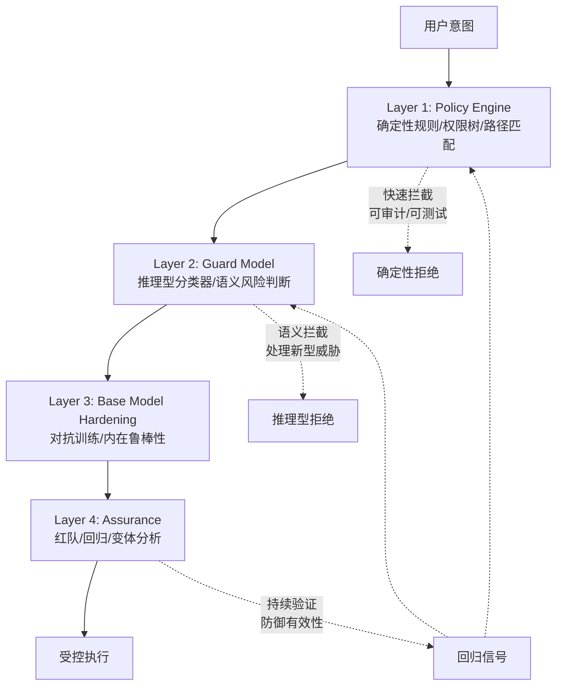

# Control Paradigms

> **Evidence Status** — grounded. Claude Code hook / permission tree、Codex guardian / sandbox、OpenCode deny > ask > allow、企业工作流审批和本知识库 control/security/effects/operations plane。


## 控制范式

| 范式 | 核心机制 | 擅长 | 盲点 |
|---|---|---|---|
| Rule / Permission Tree | 基于工具、路径、动作、风险的规则判断 | 快、可审计、确定性强 | 处理语义风险弱 |
| LLM-as-Judge / Guardian | 模型审查动作、输出或风险 | 处理语义、上下文、模糊判断 | 不稳定、需独立证据和校准 |
| Hook / AOP | 在生命周期事件上注入策略 | 灵活、可扩展、适合项目约定 | 过多 hook 会难以推理 |
| Sandbox Isolation | 在隔离环境执行工具/代码 | 限制外部破坏、可回滚 | 不能证明业务效果达成 |
| Verification Gate | done 前必须通过测试、回读、外部确认 | 防止假完成 | 需要可观察 postcondition |
| Approval Gate | 高风险动作前请求用户确认 | 信任升级、风险控制 | 审批疲劳、阻塞自动化 |
| Canary / Shadow Mode | 生产前灰度、影子评估、回归 | 上线稳定性 | 需要 trace 和 eval 基础设施 |

## 混合纵深防御 (Hybrid Defense-in-Depth)

Google Secure AI Framework 2.0 (2025) 确认的成熟安全架构：

```text
Layer 1: Policy Engine (确定性规则) — 速度快、可审计、可测试
Layer 2: Guard Model (推理型分类器) — 处理语义风险和新型威胁
Layer 3: Base Model Hardening (对抗训练) — 提高模型内在鲁棒性
Layer 4: Assurance (红队/回归/变体分析) — 持续验证防御有效性
```

攻击者必须**同时**绕过确定性层和推理层，这显著提高了攻击门槛。

### 纵深防御层级图



三大安全原则：
1. Agent 必须有明确的**人类控制者**（identity + consent）
2. Agent 权限必须**动态受限**（不允许自我提权）
3. Agent 动作和规划必须**可观测**（audit + trace）

详见 `../design-space/patterns/guard-model.md`。

## 风险选择矩阵

| 风险场景 | 推荐控制组合 |
|---|---|
| 只读分析 | rule + output trust boundary |
| 本地文件修改 | rule + sandbox/working tree + diff verification |
| shell 命令 | permission tree + sandbox + command classifier + timeout |
| 外部 API 写入 | rule + approval + read-after-write + audit log |
| 生产操作 | dry-run + approval + canary + rollback + incident plan |
| 不可信网页/日志/issue 输入 | lane separation + sanitizer + guard model + prompt injection eval |
| 模糊安全风险 | guard model + deterministic policy + human escalation |
| 长时自治 | budget gate + heartbeat + observability + kill switch |
| Agent 金融交易 | spending cap + delegation proof + double confirmation + AP2 |

## HITL vs HOTL 选择矩阵

人类参与 Agent 控制有两种基本模式，选择依据不同：

| 维度 | HITL (Human-in-the-Loop) | HOTL (Human-on-the-Loop) |
|---|---|---|
| 定义 | 人类在关键节点主动审批/决策，Agent 暂停等待 | 人类持续监控但不阻塞执行，异常时介入 |
| 执行流 | 同步——Agent 暂停 → 等待人类 → 继续 | 异步——Agent 持续执行，人类异步审查 |
| 延迟影响 | 高——每次审批引入人类响应延迟 | 低——Agent 不被阻塞 |
| 风险兜底 | 前置拦截——错误动作不会发生 | 后置纠正——错误动作可能已执行 |

**选择因素**：

| 因素 | 倾向 HITL | 倾向 HOTL |
|---|---|---|
| 操作风险 | 不可逆、高影响（删除生产数据、金融交易） | 可逆、低影响（信息查询、草稿生成） |
| 吞吐要求 | 低频、高价值任务 | 高频、批量处理 |
| 专业度 | 需要领域专家判断 | Agent 能力已充分验证 |
| 信任度 | 新 Agent、新场景、未经验证 | 经过充分 eval 和灰度验证 |

**渐进策略**：实践中通常从 HITL 起步，随信任积累逐步过渡到 HOTL。过渡条件：pass^k 达标 + 连续 N 个任务无人工修正 + 回滚机制就位。

## 控制不是只在行动前

控制应分布在闭环中：

```text
Observe:    标注来源、trust tier、是否不可信
Represent:  分 lane，防止 data 变 instruction
Decide:     约束 action candidates，检查 autonomy/depth
Act:        permission、approval、sandbox、timeout、idempotency
Verify:     postcondition、read-after-write、independent verifier
Update:     trace、effect ledger、memory write gate、regression signal
```

## Rule 与 LLM Judge 的组合

| 决策类型 | 首选 | 说明 |
|---|---|---|
| 明确禁止动作，如删除生产数据 | Rule | 确定性规则优先 |
| 路径、权限、工具风险 | Rule | 可审计、可测试 |
| 输出是否充分回答问题 | LLM Judge + rubric | 需校准，最好有 gold/reference |
| 安全语义风险 | LLM Judge + Rule + Human | 不允许单点失败 |
| 是否完成业务效果 | Verification Gate | 优先外部证据，不优先模型判断 |

## Hook 使用规则

Hook 适合注入局部策略，但不要让 Hook 变成隐形主循环。

```text
好的 Hook：pre_tool_check、post_tool_normalize、before_memory_write、after_effect_verify
坏的 Hook：任意改变任务目标、吞掉失败、绕过权限、无 trace 修改 world state
```

每个 Hook 至少声明：

```yaml
event: pre_tool_call | post_tool_call | before_memory_write | before_final_answer
scope: global | project | tool | user
can_block: boolean
can_mutate: none | args | observation | context | memory_candidate
risk: low | medium | high
trace_required: true
```

## 常见失败

| 失败 | 表现 | 修复 |
|---|---|---|
| Approval-only Control | 什么都问用户，用户疲劳 | graduated trust、批量授权、risk-based gate |
| Sandbox Illusion | 沙箱内成功，但真实系统没变 | effect verification、external ack |
| Judge Drift | LLM reviewer 前后不一致 | rubric、golden cases、calibration |
| Hidden Hook | hook 改变行为但不可见 | trace、config fingerprint |
| Policy Bypass | 工具直接执行，绕开 control | central policy engine |

相关文件：`../architecture/planes/control/overview.md`、`../architecture/planes/security/overview.md`、`../architecture/planes/effects/overview.md`、`../architecture/planes/operations/overview.md`、`../evaluation/security-evals.md`。


## 决策树速用

```text
确定性规则能判定 → Rule / Permission Tree
语义风险需判断 → LLM Judge + rubric
工具/代码会执行 → Sandbox + timeout
外部写动作 → Verification Gate + EffectRecord
不可逆/高影响 → Approval + rollback/compensation
生产上线 → Shadow/Canary + incident path
长期自治 → budget gate + heartbeat + kill switch
```

完整跨范式决策树见 `decision-trees.md`。
