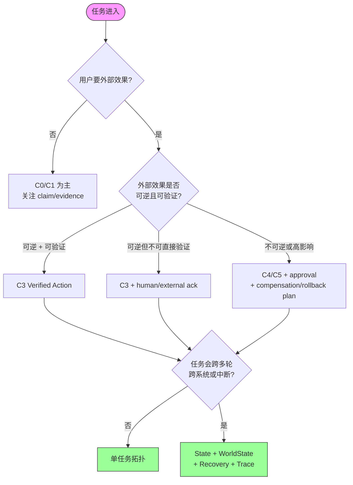
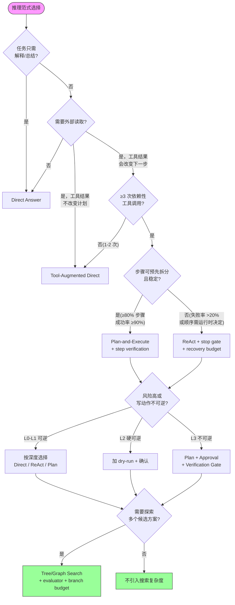
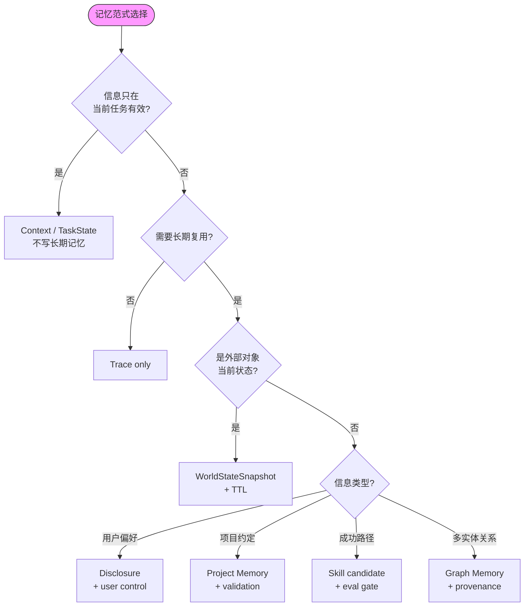
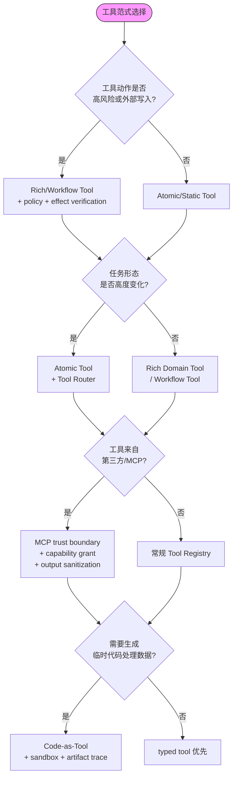
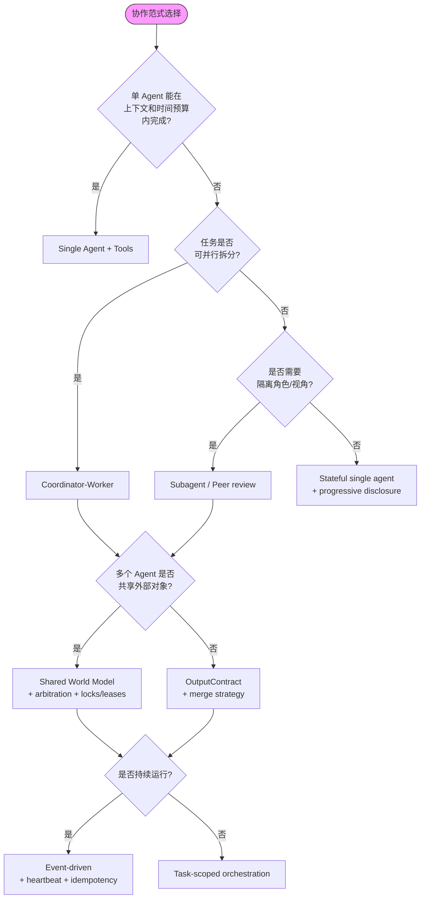
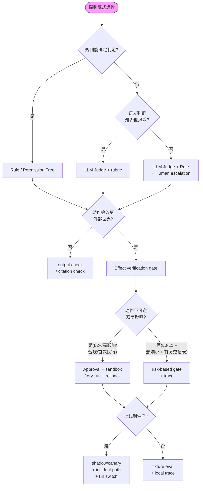

# Paradigm Decision Trees

> **Evidence Status** — synthesized. reasoning、memory、tool、collaboration、control 五类范式的选择矩阵综合；用于把“列出范式”升级为可操作的选择过程。

## 0. 总入口

```text
用户要外部效果吗？
  ├─ 否：以 C0/C1 为主，关注 claim/evidence
  └─ 是：进入 effect risk 判断

外部效果是否可逆且可验证？
  ├─ 可逆 + 可验证：C3 Verified Action
  ├─ 可逆但不可直接验证：C3 + human/external ack
  └─ 不可逆或高影响：C4/C5 + approval + compensation/rollback plan

任务是否会跨多轮、跨系统或中断？
  │  > 判定"环境会在执行中变化"：
  │  >   若依赖的外部状态 TTL <任务预估耗时 → 环境会变化。
  │  >   或：原型运行中 ≥20% 的执行出现"步骤前提失效"（如资源被他人修改、
  │  >   API 返回值与预期不一致）→ drift 频率过高，需要 World State 刷新。
  │  >   实用简判：任务涉及 ≥2 个外部系统，且预估耗时 >30 秒 → 按"会变化"处理。
  ├─ 否：单任务拓扑
  └─ 是：State + World State + Recovery + Trace
```

下图展示总入口的三级判定流程:



## 1. 推理范式

```text
任务只需要解释/总结吗？
  ├─ 是 → Direct Answer
  └─ 否 → 需要外部读取吗？
       ├─ 是，但工具结果不改变计划 → Tool-Augmented Direct
       └─ 是，工具结果会改变下一步 → ReAct / ORDA-VU micro-loop
            > 判定"多步"：若完成任务需要 ≥3 次独立工具调用，且后续调用依赖前序结果 → 多步。
            > 1-2 次独立查询 → Tool-Augmented Direct 即可。
            > ≥5 次且有分支 → 考虑 Plan-and-Execute。

任务可预先拆成稳定步骤吗？
  │  > 判定方法：人工拆分为 N 步后做原型运行（≥10 次）。
  │  > 若 ≥80% 步骤的单次成功率 ≥90% → "稳定" → Plan-and-Execute。
  │  > 若任一步骤失败率 >20%，或步骤顺序需运行时决定 → "不稳定" → ReAct。
  ├─ 是 → Plan-and-Execute + step verification
  └─ 否 → ReAct with stop gate and recovery budget

风险高或写动作不可逆吗？
  │  > "可逆"分级：
  │  >   L0 纯读 — 无副作用，始终安全。
  │  >   L1 软可逆 — 可通过 API/undo 在 <5 min 回滚（如撤销 git commit、删除草稿）。
  │  >   L2 硬可逆 — 可回滚但需人工介入或耗时 >5 min（如数据库恢复、工单状态回退）。
  │  >   L3 不可逆 — 无法回滚（如发送邮件、物理动作、资金转账、删除无备份数据）。
  │  > L0-L1 → 按深度选择；L2 → 加 dry-run + 确认；L3 → 必须 Plan + Approval + Verification。
  ├─ 是 → Plan + Approval + Verification Gate
  └─ 否 → 按深度选择 Direct / ReAct / Plan

需要探索多个候选方案吗？
  ├─ 是 → Tree/Graph Search + evaluator + branch budget
  └─ 否 → 不引入搜索复杂度
```

下图展示推理范式的四级选择流程:



## 2. 记忆范式

```text
信息只在当前任务有效吗？
  ├─ 是 → Context / TaskState，不写长期记忆
  └─ 否 → 是否需要长期复用？
       ├─ 否 → Trace only
       └─ 是 → 进入记忆类型判断

是外部对象当前状态吗？
  ├─ 是 → WorldStateSnapshot + TTL
  └─ 否 → 是用户偏好/项目约定/技能/关系吗？
       ├─ 用户偏好 → Disclosure + user control
       ├─ 项目约定 → Project Memory + validation
       ├─ 成功路径 → Skill candidate + eval gate
       └─ 多实体关系 → Graph Memory + provenance
```

下图展示记忆范式的选择流程:



## 3. 工具范式

```text
工具动作是否高风险或外部写入？
  ├─ 是 → Rich/Workflow Tool + policy + effect verification
  └─ 否 → Atomic/Static Tool 可接受

任务形态是否高度变化？
  ├─ 是 → Atomic Tool + Tool Router
  └─ 否 → Rich Domain Tool 或 Workflow Tool

工具来自第三方协议/MCP 吗？
  ├─ 是 → MCP trust boundary + capability grant + output sanitization
  └─ 否 → 常规 Tool Registry

需要生成临时代码处理数据吗？
  ├─ 是 → Code-as-Tool + sandbox + artifact trace
  └─ 否 → typed tool 优先
```

下图展示工具范式的四条判定链:



## 4. 协作范式

```text
单 Agent 能在上下文和时间预算内完成吗？
  ├─ 是 → Single Agent + Tools
  └─ 否 → 任务是否可并行拆分？
       ├─ 是 → Coordinator-Worker
       └─ 否 → 是否需要隔离角色/视角？
            ├─ 是 → Subagent / Peer review
            └─ 否 → Stateful single agent + progressive disclosure

多个 Agent 是否共享外部对象？
  ├─ 是 → Shared World Model + arbitration + locks/leases
  └─ 否 → OutputContract + merge strategy

是否持续运行？
  ├─ 是 → Event-driven + heartbeat + idempotency
  └─ 否 → Task-scoped orchestration
```

下图展示协作范式的三级判定流程:



## 5. 控制范式

```text
规则能确定判定吗？
  ├─ 是 → Rule / Permission Tree
  └─ 否 → 语义判断是否低风险？
       ├─ 是 → LLM Judge + rubric
       └─ 否 → LLM Judge + Rule + Human escalation

动作会改变外部世界吗？
  ├─ 否 → output check / citation check
  └─ 是 → Effect verification gate

动作是否不可逆或高影响？
  │  > 触发人工审批的条件（满足任一即需审批）：
  │  >   1. 可逆性 ≥ L2（硬可逆或不可逆）。
  │  >   2. 影响范围：涉及 >100 条记录、>$100 金额、或影响外部用户可见状态。
  │  >   3. 合规要求：SOX/GDPR/HIPAA 等法规明确要求人工签核的动作。
  │  >   4. 首次执行：该动作模板在生产环境首次运行（无历史成功记录）。
  │  > 不需审批：L0-L1 可逆 + 影响范围小 + 有历史成功记录 → 自动执行 + trace。
  ├─ 是 → Approval + sandbox/dry-run + rollback/compensation
  └─ 否 → risk-based gate + trace

上线到生产了吗？
  ├─ 是 → shadow/canary + incident path + kill switch
  └─ 否 → fixture eval + local trace
```

下图展示控制范式的四级判定流程:



## 6. 最终输出

范式选择的输出不应只是一个名字，而应形成结构化设计：

```yaml
paradigm_selection:
  reasoning: direct | tool_augmented | react | plan_execute | orda_vu | tree_search
  memory: none | context | rag | disclosure | layered | graph | world_state
  tools: static | atomic | rich_domain | workflow | mcp | code_as_tool
  collaboration: single | subagent | coordinator_worker | peer | event_driven | human_in_loop
  control: rule | judge | hook | sandbox | approval | verification | canary
  complexity_level: C0 | C1 | C2 | C3 | C4 | C5 | C6
  required_planes: []
  stop_gates: []
  eval_fixtures: []
```

相关文件：`reasoning-paradigms.md`、`memory-paradigms.md`、`tool-paradigms.md`、`collaboration-paradigms.md`、`control-paradigms.md`、`../architecture/complexity-levels.md`。
