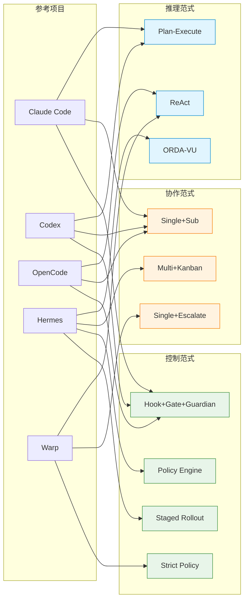

# 范式采纳矩阵

> **Evidence Status** — synthesized. 从品类架构、参考项目和范式决策树综合。

## 定位

回答：**某个品类应该选什么范式组合，为什么。**

范式维度来自 `reasoning-paradigms.md`、`memory-paradigms.md`、`tool-paradigms.md`、`collaboration-paradigms.md`、`control-paradigms.md`。品类列表来自 `../index/category-module-map.md`。

## A. 矩阵主表

| 品类 | 推理 | 记忆 | 工具 | 协作 | 控制 | 核心理由 |
|---|---|---|---|---|---|---|
| Coding Agent | Plan-Execute | Project+Skill | Rich+Dynamic | Single+Sub | Hook+Gate+Guardian | 代码修改不可逆，需完整闭环 |
| Research Agent | ORDA-VU | Layered+Citation | Search+Read | Single | Progressive Disclosure | 长任务闭环，引用链是交付物 |
| Browser/Desktop | ReAct+Vision | Session+WorldState | GUI Action | Single | Dual-Channel Verify | 视觉驱动，截图验证效果 |
| Companion Agent | Direct+Reflect | Long-term+Soul | Minimal | Single | Trust-based | 低延迟，人格一致性优先 |
| Workflow/Ops | Plan-Execute | Project+Convention | API+Shell | Multi+Kanban | Policy Engine | 多步编排，部分交付关键 |
| Security Agent | ORDA-VU | Evidence+Audit | Scan+Analyze | Single+Sub | Strict Policy | 高风险，审计链必须 |
| Creative Agent | Direct+Brainstorm | Inspiration+Style | Generative | Single | Minimal | 过度控制抑制创造 |
| Data/BI Agent | Plan-Execute | Schema+Cache | SQL+Viz | Single | Query Guard | 防注入，语义歧义需确认 |
| Ops/SRE Agent | ORDA-VU | Runbook+Incident | Shell+Monitor | Single+Escalate | Staged Rollout | 物理后果，分级回滚 |
| Education Agent | Direct+Scaffold | Learner+Curriculum | Content+Quiz | Single | Adaptive Pace | 难度匹配，学习动力优先 |
| Financial Agent | Plan+Approval | Ledger+Audit | Trade+Risk API | Single+Sub | Multi-Gate+Limit | 资金不可逆，合规强制 |
| Embodied Robot | ReAct+Safety | Spatial+Motor | Sensor+Actuator | Single | Emergency Stop | 物理伤害风险最高 |
| Personal Memory | Direct | Layered+Graph | Minimal+Search | Single | Privacy Gate | 隐私优先，写入需验证 |
| Agent Platform | Plan-Execute | Tenant+Registry | Plugin+MCP | Multi+Marketplace | Sandbox+Quota | 多租户，插件安全关键 |

## B. 范式维度说明

### 推理范式

| 可选项 | 一句话 |
|---|---|
| Direct | 单轮回答，不调工具 |
| ReAct | 观察→思考→行动循环 |
| Plan-Execute | 先拆计划再逐步执行 |
| ORDA-VU | 完整六阶段闭环 |
| Direct+Reflect | 回答后自检修正 |
| Direct+Brainstorm | 发散探索再收敛 |
| Direct+Scaffold | 渐进引导式推理 |
| Plan+Approval | 计划需人工批准 |

### 记忆范式

| 可选项 | 一句话 |
|---|---|
| Project+Skill | 项目约定 + 成功路径复用 |
| Layered+Citation | 分层存储 + 引用溯源 |
| Session+WorldState | 会话态 + 外部状态快照 |
| Long-term+Soul | 长期关系 + 人格内核 |
| Evidence+Audit | 证据链 + 审计日志 |
| Ledger+Audit | 交易账本 + 合规审计 |
| Spatial+Motor | 空间地图 + 运动记忆 |
| Layered+Graph | 分层 + 实体关系图 |

### 工具范式

| 可选项 | 一句话 |
|---|---|
| Rich+Dynamic | 大工具集 + 运行时发现 |
| Search+Read | 检索 + 阅读为主 |
| GUI Action | 点击/输入/截图 |
| Minimal | 极少工具，对话为主 |
| API+Shell | 系统 API + 命令行 |
| Scan+Analyze | 扫描 + 分析报告 |
| Generative | 生成类工具（文/图/音） |
| SQL+Viz | 查询 + 可视化 |
| Plugin+MCP | 插件注册 + MCP 协议 |

### 协作范式

| 可选项 | 一句话 |
|---|---|
| Single | 单 agent 完成 |
| Single+Sub | 主 agent + 受限子 agent |
| Single+Escalate | 单 agent + 人工升级 |
| Multi+Kanban | 多 agent 看板协作 |
| Multi+Marketplace | 多 agent + 插件市场 |

### 控制范式

| 可选项 | 一句话 |
|---|---|
| Hook+Gate+Guardian | 钩子 + 验证门 + 守护进程 |
| Progressive Disclosure | 渐进披露，按需加深 |
| Dual-Channel Verify | 双通道交叉验证 |
| Trust-based | 基于信任等级的放行 |
| Policy Engine | 策略引擎驱动 |
| Strict Policy | 严格策略 + 零容忍 |
| Minimal | 最少控制，人工兜底 |
| Query Guard | 查询安全 + 结果校验 |
| Staged Rollout | 分级发布 + 逐步回滚 |
| Multi-Gate+Limit | 多重审批 + 限额 |
| Emergency Stop | 紧急停止优先 |
| Privacy Gate | 隐私门控 |
| Sandbox+Quota | 沙箱隔离 + 配额限制 |
| Adaptive Pace | 自适应节奏控制 |

## C. 参考实现

| 品类 | 参考项目 | 关键范式来源 |
|---|---|---|
| Coding Agent | Claude Code, Codex, OpenCode | CC: hooks, CX: guardian, OC: Effect DI |
| Research Agent | — | ORDA-VU 闭环 + citation chain |
| Browser/Desktop | Warp (部分) | skill 元工具 + readiness label |
| Companion Agent | NagaAgent | 人格一致 + 关系演进 |
| Workflow/Ops | Hermes | 170+ 工具 + 三层审批 + 网关 |
| Security Agent | nocturne (审计部分) | 审计链 + 证据快照 |
| Creative Agent | — | 参考 Generative AI 实践 |
| Data/BI Agent | — | 参考 Text-to-SQL 实践 |
| Ops/SRE Agent | Hermes (运维部分) | runbook + 分级回滚 |
| Education Agent | — | 参考 ITS 自适应学习 |
| Financial Agent | — | 参考合规交易系统 |
| Embodied Robot | — | 参考 ROS + safety 实践 |
| Personal Memory | mempalace | 三层记忆 + 自动提取 |
| Agent Platform | VCPToolBox | 插件 manifest + 多运行时 |

## D. 范式采用聚类

下图展示参考项目与范式组合的采用关系（同色节点属于同一范式维度）:



## E. 使用方式

```text
1. 在主表中找到你的品类行
2. 每列是一个范式维度的推荐选项
3. 用 B 节查看该选项的含义
4. 用 C 节找到参考项目深入学习
5. 如需调整，回到 decision-trees.md 走完整决策流程
```
