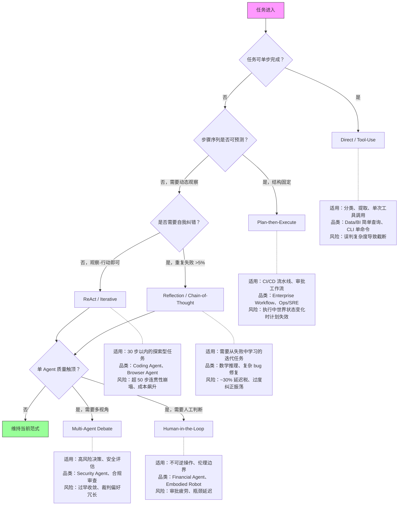
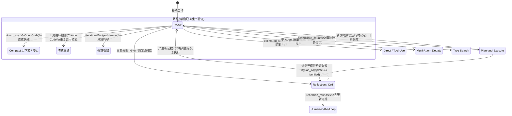

# Paradigm Routing

> **Evidence Status** — mixed. 设计时范式选择和运行时降级触发条件有生产证据（Claude Code doom-loop 检测、Hermes iteration budget、OpenCode compact 降级）；八大规范模式分类学和 RouteLLM (ICLR 2025) 提供阈值与模型路由定量依据。但完整的运行时范式路由器（含状态迁移协议、组合约束验证）**尚无生产系统显式实现**，相关内容为理论框架。

> 认知需求如何驱动范式选择，见 [认知→范式路由](../cognitive-architecture/cognitive-to-paradigm-routing.md)。

> **定位**：本文讨论设计时如何选择主范式，以及运行时在何种条件下降级或升级策略。注意：当前生产系统实现的是"降级/熔断"而非"自由切换"。启动时范式选择见 [reasoning-paradigms.md](reasoning-paradigms.md) 和 [decision-trees.md](decision-trees.md)。

## 0. 范式选择决策树

启动时选择主范式的 if-then 流程。实际生产系统通常从最简单的分支开始，只在观测到具体失败信号后才沿箭头升级。



下图展示范式升降级的状态迁移路径（实线为已有生产验证，虚线为理论路径）:



### 为什么生产系统几乎不使用单一范式

决策树展示的是启动时选择，但真正上线的 Agent 几乎都是范式组合体。Claude Code 是一个典型案例：它在任务开始时做 Plan（规划修改范围），执行阶段进入 ReAct 循环（读文件→改代码→跑测试→观察结果），遇到连续失败时触发 Reflection（分析失败原因后调整策略），而底层每一步都是 Tool-Use。范式组合源于任务本身的需求：一个真实任务通常包含可预测和不可预测的阶段、需要纠错和不需要纠错的步骤，单一范式只能覆盖其中一部分。第 5 节的组合约束规定了哪些范式可以嵌套、嵌套深度不超过 2 层。第 9.4 节的基线栈给出了升级纪律：从 ReAct 基线开始，只在可测量的质量维度触顶时才叠加下一个范式。

## 1. 问题

静态范式选择假设任务在启动时就能确定最佳推理策略。但生产中 Agent 确实需要在运行时调整策略。当前实践表明，这种调整更多是**降级/熔断**而非**自由切换**：

**已有生产验证的运行时调整**：
- OpenCode: 连续失败 >= DOOM_LOOP_THRESHOLD(3) → 触发 compact 或停止
- Hermes: IterationBudget 耗尽 → 强制收敛
- Claude Code: 工具循环检测 → 切断重试

**理论上可行但尚无生产验证的调整**：
- 运行时从 ReAct 切换到 Plan-and-Execute
- 运行时从 Reflection 切换到 Tree Search
- 完整的状态迁移协议

当前 `reasoning-paradigms.md` 和 `decision-trees.md` 提供了设计时选择矩阵，本文补充运行时降级策略和理论层面的切换框架。

## 2. 范式路由模型（理论框架，尚无生产验证）

> 以下路由模型是基于已观察到的降级行为的理论泛化。当前没有生产系统实现了完整的 ParadigmRouter。

```text
ParadigmRouter = f(TaskSignal, ExecutionState, FailureHistory) → ActiveParadigm

TaskSignal:
  task_type_change    — 任务阶段变化（分析→规划→实现→验证）
  depth_change        — 执行深度升降级
  scope_change        — 目标范围扩大或缩小

ExecutionState:
  progress            — 当前完成度
  context_pressure    — 上下文窗口使用率
  tool_availability   — 当前可用工具集

FailureHistory:
  consecutive_failures — 连续失败次数
  failure_pattern      — 失败类型分布
  recovery_exhaustion  — 恢复策略是否用尽
```

## 3. 降级/调整触发条件

### 3.1 已有生产验证的降级条件

| 触发信号 | 来源项目 | 降级行为 | 触发阈值 |
|---|---|---|---|
| 连续工具调用失败（doom loop） | OpenCode | 触发 compact（压缩上下文）或停止 | consecutive_failures >= DOOM_LOOP_THRESHOLD(3) |
| 迭代预算耗尽 | Hermes | 强制收敛，返回当前最优结果 | iteration_count >= IterationBudget |
| 工具循环检测 | Claude Code | 切断重试，报告失败 | 检测到重复调用模式 |
| 上下文窗口压力 | OpenCode / Claude Code | 压缩上下文后继续 | context_pressure > 阈值 |

### 3.2 理论层面的切换条件（尚无生产验证）

| 触发信号 | 当前范式 | 切换目标 | 触发阈值 |
|---|---|---|---|
| 计划步骤全部完成但验证失败 | Plan-and-Execute | Reflection | plan_complete && !verified |
| Reflection 未产生新证据 | Reflection | Escalation / Human | reflection_rounds >= 2 && no_new_evidence |
| 任务从分析进入实现 | Direct | ReAct | task_phase == "implement" |
| 多个等价方案需要比较 | ReAct | Tree Search | candidate_count >= 2 |
| 单步任务，无需多轮 | ReAct | Tool-Augmented Direct | estimated_steps == 1 |
| 高风险不可逆操作 | 任意 | Plan + Approval | risk_level == "high" |

## 4. 状态迁移协议（理论框架）

> 以下协议是理论设计，当前生产系统在降级时通常采用更简单的策略（如直接压缩上下文、丢弃历史重试）。

如果实现完整的范式切换，应迁移关键状态而非重新开始：

### 4.1 保留的状态

| 状态 | 说明 |
|---|---|
| TaskEnvelope | 目标、成功标准不变 |
| EffectRecord[] | 已完成的效果记录保留 |
| WorldStateSnapshot[] | 最新快照保留（检查 TTL） |
| FailureRecord[] | 失败历史保留，供新范式参考 |
| MemoryRecord[] | 长期记忆不受范式切换影响 |

### 4.2 重置的状态

| 状态 | 说明 |
|---|---|
| 当前计划（Plan） | 切换到新范式时旧计划失效 |
| ReAct 循环计数器 | 重新计数 |
| Reflection 轮次 | 重新计数 |
| Branch 预算 | 按新范式重新分配 |

### 4.3 迁移伪代码

```text
function switch_paradigm(current, target, state):
    # 1. 快照当前进度
    checkpoint = create_checkpoint(state)

    # 2. 提取可迁移状态
    portable = {
        task:          state.task_envelope,
        effects:       state.effect_records,
        world:         state.world_snapshots.filter(fresh),
        failures:      state.failure_records,
        context_summary: compact(state.context),  # 压缩当前上下文
    }

    # 3. 初始化新范式
    new_state = target.init(portable)

    # 4. 记录切换事件
    trace.append(ParadigmSwitch(
        from=current.name,
        to=target.name,
        trigger=trigger_signal,
        carried_effects=len(portable.effects),
        discarded=["plan", "loop_counter"],
    ))

    return new_state
```

## 5. 混合范式组合约束

不是所有范式都能任意嵌套。以下是组合规则：

### 5.1 可嵌套组合

| 外层 | 内层 | 场景 |
|---|---|---|
| ORDA-VU | ReAct | Decide/Act 阶段使用 ReAct 做工具交互 |
| ORDA-VU | Reflection | Verify 阶段使用 Reflection 做失败诊断 |
| Plan-and-Execute | ReAct | 每个 step 用 ReAct 执行 |
| Plan-and-Execute | Direct | 简单 step 直接执行 |
| Tree Search | ReAct | 每个 branch 用 ReAct 评估 |

### 5.2 互斥组合

| 组合 | 问题 |
|---|---|
| ReAct 嵌套 Plan-and-Execute | 内层规划会和外层观察循环冲突 |
| Reflection 嵌套 Reflection | 无限自省，无法收敛 |
| Tree Search 嵌套 Tree Search | 指数爆炸 |

### 5.3 组合深度限制

```text
最大嵌套深度 = 2
外层：生命周期范式（ORDA-VU / Plan-and-Execute）
内层：执行策略（ReAct / Direct / Reflection / Tree Search）
```

超过两层嵌套通常意味着任务拆分不够，应改为多 Agent 协作。

## 6. 常见失败与修复

| 失败 | 表现 | 修复 |
|---|---|---|
| 切换震荡 | 在两个范式间反复切换 | 加 cooldown（切换后至少执行 N 步才能再切换） |
| 状态丢失 | 切换后丢失已完成的效果 | 迁移协议必须保留 EffectRecord |
| 过度切换 | 每一步都重新选择范式 | 设置切换阈值，避免微小信号触发切换 |
| 切换后重做 | 新范式从零开始，忽略已有进度 | 迁移时传递 context_summary |
| 不切换 | 明显失败但坚持原范式 | 设置强制切换条件（如连续失败阈值） |

## 7. 实施建议

以下按验证程度排序。优先实施已有生产验证的降级机制，再考虑理论层面的完整路由。

**已有生产验证，建议优先实施**：
```text
[P0] 连续失败 >= 3 次时触发降级（compact 上下文 / 停止）
[P0] 设置迭代预算上限，耗尽时强制收敛
[P0] 工具循环检测，检测到重复模式时切断重试
[P0] 记录降级事件到 trace（用于事后分析）
```

**理论框架，视需求决定是否实施**：
```text
[P2] 在 AgentLoop 中增加 ParadigmRouter 组件
[P2] 为每个范式定义可迁移状态和初始化接口
[P2] 设置切换冷却期（建议 >= 3 步）
[P2] 设置最大嵌套深度 = 2
[P2] 在 Eval 中增加范式切换场景的 fixture
```

## 8. 与本框架其他层的关系

| 层 | 关系 |
|---|---|
| `reasoning-paradigms.md` | 提供可选范式池；本文档定义运行时如何在池中切换 |
| `decision-trees.md` | 提供启动时选择；本文档补充运行时动态调整 |
| `architecture/lifecycle.md` | 范式切换是生命周期中的运行时事件 |
| `architecture/planes/state/` | 切换时的 checkpoint 保存/恢复 |
| `architecture/planes/context/` | 切换时的上下文压缩 |
| `architecture/planes/observability/` | ParadigmSwitch 作为 TraceEvent 记录 |
| `evaluation/` | 需要专门的范式切换评估 fixture |

## 9. 生产级范式切换数据（2026 更新）

### 9.1 八大规范模式适用域

2024-2026 年间 Agent 架构词汇围绕 **4 象限 x 8 模式** 稳定下来。以下是各模式的适用域、关键限制和生产阈值：

| 象限 | 模式 | 适用域 | 关键限制 | 生产阈值 |
|------|------|--------|---------|---------|
| 单 Agent | **ReAct** | 30 步以内的通用推理 + 工具调用 | 超 50 步连贯性崩塌；无自我纠错 | **硬上限 30 步**；超 50 步 prefix-cache 失效，成本飙升 5-10x |
| 单 Agent | **Reflexion** | 编码/数学中的重复失败模式 | ~30% 延迟税；过度纠正导致振荡 | 重复失败超 ~5% 时才启用 |
| 协作多 Agent | **Plan-and-Execute** | 结构可预测的工作流 | 执行中途世界变化时脆弱 | 规划可摊销时才有优势 |
| 协作多 Agent | **Supervisor-Worker** | 需要角色特化的多域任务 | 协调开销在简单任务上主导成本 | 仅在单 Agent 质量维度触顶时升级 |
| 对抗多 Agent | **Multi-Agent Debate** | 高风险决策、安全关键评估 | 过早收敛；裁判偏好冗长论证 | 需要视角多样性时使用 |
| 对抗多 Agent | **Verifier-Critic** | 高精度输出、合规性检查 | 同模型时生成-批评共谋 | 生成器和批评者应使用不同模型 |
| 编排拓扑 | **Graph Orchestration** | 需要 trace 级调试的生产系统 | 图复杂度增长快，边界情况激增 | LangGraph 模型；生产工作流首选 |
| 编排拓扑 | **Swarm/Blackboard** | 研究模式探索、对等 Agent | 目标漂移、协调死锁、调试困难 | **几乎不在生产中使用** |

### 9.2 关键阈值

| 阈值 | 值 | 含义 |
|------|-----|------|
| ReAct 步骤上限 | **30 步**（默认 20-30，硬上限 50） | 超过 50 步 prefix-cache 失效，成本飙升 5-10x |
| Re-anchor 检查点 | **~40 步** | 长时运行任务每 ~40 步加 re-anchor 防止目标漂移 |
| Reflexion 延迟税 | **~30%** | 每次迭代增加约 30% 延迟 |
| 多 Agent 错误放大（独立式） | **17.2x** | 独立多 Agent 系统相比单 Agent 基线放大错误 17.2 倍 |
| 多 Agent 错误放大（集中式） | **4.4x** | 集中式架构通过编排器验证将放大比降至 4.4 倍 |
| 多 Agent 协调开销 | **2-5x** | 多数团队在单 Agent 达到质量天花板前就过度工程化 |

### 9.3 层级 vs Swarm：生产中层级几乎总是胜出

**核心结论**："层级在生产中几乎总是胜过 Swarm。Supervisor 锚定目标对齐；Swarm 无此锚定会漂移。"

| 维度 | 层级 (Supervisor-Worker) | Swarm (Blackboard) |
|------|------------------------|-------------------|
| 目标对齐 | Supervisor 持续锚定 | 无锚定，漂移风险高 |
| 错误放大 | 4.4x（集中式编排） | 17.2x（独立式） |
| 调试 | 清晰的调用链 | 消息总线难以 trace |
| 生产采纳 | **图 + 层级 = 生产默认** | 仅用于研究探索 |
| 混合模式 | 常见：层级系统内叶级团队用 Mesh 协调 | Pipeline 某阶段启动 Swarm 并行采集 |

### 9.4 从单 Agent 开始的基线栈

**升级纪律**（先验证必要性，再增加复杂度）：

```text
Stage 0: ReAct 基线
  └─ 测量成功率、延迟、成本
  └─ 不满足？↓

Stage 1: + Reflexion
  └─ 触发条件：重复失败超过 ~5%
  └─ 代价：~30% 延迟税
  └─ 不满足？↓

Stage 2: + Re-anchor Checkpoint
  └─ 触发条件：任务超 ~40 步
  └─ 每 ~40 步检查目标对齐
  └─ 不满足？↓

Stage 3: → 多 Agent（仅当单 Agent 在可测量质量维度触顶）
  └─ 首选 Supervisor-Worker（层级）
  └─ 引入 2-5x 协调开销
  └─ 必须集中式编排器，否则错误放大 17.2x
```

**基线栈 = ReAct + Reflexion + checkpoint**。大多数生产任务不需要超越 Stage 2。

## 10. 推理模型对路由的影响

### 10.1 RouteLLM 数据（ICLR 2025）

RouteLLM 框架证明了模型路由的经济可行性：通过训练轻量级路由器，根据查询复杂度将请求分发到不同能力/成本的模型，在保持输出质量的同时**降低推理成本最高 85%**，且质量损失在统计上不显著。

**核心机制**：
- 轻量分类器（矩阵因子分解、BERT 等）评估查询难度
- 简单查询路由到低成本模型，复杂查询路由到高能力模型
- 阈值可调：更激进的路由比例 = 更低成本但更高质量风险

### 10.2 三层推理层级

| 层级 | 复杂度 | 推荐模型 | 典型场景 | 成本量级 |
|------|--------|---------|---------|---------|
| **L1 快速** | 简单查询、分类、提取 | Haiku / Gemini Flash | 意图分类、实体提取、简单问答 | $0.25-1/M tokens |
| **L2 平衡** | 中等推理、多步工具调用 | Sonnet / GPT-4o | ReAct 循环、代码生成、文档分析 | $3-15/M tokens |
| **L3 深度** | 复杂推理、长程规划、高风险决策 | Opus / o3-pro | 架构设计、数学证明、多 Agent 编排规划 | $15-60/M tokens |

### 10.3 推理层级对范式路由的影响

推理模型选择与范式选择正在耦合，不同范式对推理深度的需求不同：

| 范式 | 推理层级需求 | 路由策略 |
|------|------------|---------|
| Direct / Tool-Augmented Direct | L1 快速 | 简单任务无需深度推理 |
| ReAct | L2 平衡 | thought-action 循环需要中等推理 |
| Reflexion | L2-L3 | 自我批评需要更深推理；批评轮可用 L3 |
| Plan-and-Execute | L3 规划 + L1/L2 执行 | 规划阶段用高能力模型，执行阶段按步骤复杂度路由 |
| Multi-Agent Debate | L2-L3 混合 | 辩论者用 L2，裁判用 L3 |
| Supervisor-Worker | L3 Supervisor + L1/L2 Worker | Supervisor 决策用高能力模型，Worker 执行用低成本模型 |

### 10.4 实施建议

1. **默认 L2**：大多数 Agent 任务在 L2 层级（Sonnet/GPT-4o）即可完成
2. **L1 降级条件**：单步工具调用、分类/提取任务、已有明确模板
3. **L3 升级条件**：连续失败 ≥ 2 次、规划阶段、高风险决策、Reflection 轮次
4. **混合路由**：同一 Agent 的不同阶段可使用不同层级（如 Plan 用 L3、Execute 用 L2、简单步骤用 L1）
5. **成本监控**：设置每次运行的 token 预算上限，路由器在预算紧张时自动降级

## Evidence Status

mixed。分层说明：
- **grounded**：八大规范模式分类学、生产阈值数据（2026 多源复盘）、RouteLLM 成本数据（ICLR 2025）、三层推理层级（当前模型定价和能力分布）。
- **grounded**：降级触发条件——OpenCode doom-loop 检测（consecutive_failures >= 3 → compact/stop）、Hermes IterationBudget 耗尽 → 强制收敛、Claude Code 工具循环检测 → 切断重试。
- **theoretical**：完整的 ParadigmRouter（设计时选择 + 运行时自由切换）、状态迁移协议（4.1-4.3）、范式组合约束验证（5.1-5.3）——当前无生产系统显式实现。
