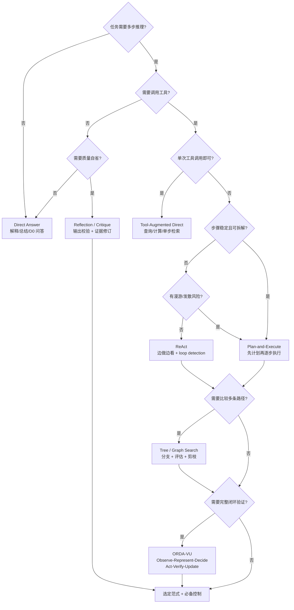

# Reasoning Paradigms

> **Evidence Status** — synthesized. `architecture/kernel/agent-loop.md`、`architecture/lifecycle.md`、`architecture/planes/prompting/overview.md` 与 coding agent 项目中循环、压缩、验证和恢复逻辑的抽象。

> 认知需求如何驱动范式选择，见 [认知→范式路由](../cognitive-architecture/cognitive-to-paradigm-routing.md)。

> 本文回答启动时的推理范式选择。运行时动态切换见 [paradigm-routing.md](paradigm-routing.md)。

## 范式定义

| 范式 | 核心循环 | 适合 | 不适合 |
|---|---|---|---|
| Direct Answer | input → answer | D0 问答、解释、低风险总结 | 需要真实行动或验证的任务 |
| Tool-Augmented Direct | input → one/few tool calls → answer | 查询、计算、单步检索 | 长任务、多阶段恢复 |
| ReAct / TAO | Thought → Action → Observation 循环 | 需要边做边看的工具任务 | 高风险写操作、需要全局计划的任务 |
| Plan-and-Execute | plan → step execution → result aggregation | 多步骤任务、可拆解工作流 | 环境变化快、计划很快过期的场景 |
| Reflection / Critique | output/trace → critique → revise | 需要质量提升、解释校验、失败诊断 | 无法获得新证据时的无限自省 |
| ORDA-VU | Observe → Represent → Decide → Act → Verify → Update | 生产级闭环、需要效果验证和状态更新 | 极简单的一次性回答 |
| Tree / Graph Search | branch → evaluate → prune/merge | 方案探索、复杂设计、代码修复候选比较 | 成本敏感、低延迟任务 |

## ORDA-VU 与其他范式的关系

```text
ORDA-VU 是外层生命周期；其他推理范式是内层策略。

Observe      接收输入、工具结果、外部状态
Represent    构造 Observation / ContextPack / WorldStateSnapshot
Decide       Direct / ReAct thought / Plan / Critique / Search policy
Act          ToolCall / code edit / API action / worker delegation
Verify       test / read-after-write / external ack / independent critic
Update       TaskState / Memory / EffectLedger / next ContextPack
```

使用建议：

- 低深度任务使用 Direct 或 Tool-Augmented Direct，不要强行上多轮循环。
- D3-D4 工具任务使用 ReAct，但必须有 retry budget 和 observation normalization。
- D4-D5 长任务使用 Plan-and-Execute + ORDA-VU；每个 step 都有 stop gate。
- 高风险任务把 Reflection 放在 Verify 阶段，而不是让模型无证据地“想一想”。
- 需要探索多个方案时，用 Tree / Graph Search，但要让 evaluator 依赖外部证据或明确 rubric。

## 范式选择矩阵

| 场景特征 | 推荐范式 | 必备控制 |
|---|---|---|
| 用户只要解释，不需要行动 | Direct Answer | claim caution、来源声明 |
| 需要查询最新或外部信息 | Tool-Augmented Direct | tool output trust boundary |
| 工具结果会改变下一步 | ReAct | structured observation、loop detection |
| 任务可拆解且步骤相对稳定 | Plan-and-Execute | plan checkpoint、step verification |
| 任务长、状态会变化、需要验证效果 | ORDA-VU | world state refresh、effect ledger、trace |
| 输出质量比延迟更重要 | Reflection / Critique | critique rubric、evidence-bound revision |
| 多种方案均可能有效 | Tree / Graph Search | branch budget、merge strategy、evaluator |
| 风险高且不可逆 | Plan + Human Approval + Verification | approval gate、sandbox、rollback plan |

## 与 PromptContract 的映射

| reasoning_mode | 推荐闭环 |
|---|---|
| `direct` | Direct Answer 或 Tool-Augmented Direct |
| `react` | Thought/Action/Observation 嵌入 ORDA-VU 的 Decide/Act |
| `plan_execute` | Plan-and-Execute，计划对象进入 TaskState |
| `reflection` | Verify/Update 阶段的失败诊断或质量修订 |
| `critique` | 独立 reviewer、LLM-as-judge 或 human review 前置摘要 |

## 常见失败与修复

| 失败 | 表现 | 修复 |
|---|---|---|
| ReAct 漫游 | 不断调用工具但没有收敛 | depth budget、stop gate、loop detection |
| 计划过期 | 计划和当前 world state 不一致 | 每步执行前 refresh 或 replan |
| 自我反思幻觉 | 没新证据却改写结论 | critique 必须绑定 evidence 或 rubric |
| 过度规划 | 简单任务被拆成复杂流程 | D0-D2 任务默认 direct |
| 只行动不验证 | 工具 success 被当成 done | Verify 阶段强制 effect check |

## 实施清单

```text
[ ] 给任务标注 Execution Depth 和 Autonomy Level
[ ] 选择一个外层生命周期：一次性 / ReAct / ORDA-VU
[ ] 为每个工具动作定义 observation schema
[ ] 为每个写动作定义 verification method
[ ] 为循环定义 retry budget、branch budget 和 stop gate
[ ] 对 reflection / critique 定义证据来源和修订边界
[ ] 把计划、检查点和失败原因写入 TaskState，而不是只放在上下文里
```

相关文件：`../architecture/lifecycle.md`、`../architecture/kernel/agent-loop.md`、`../architecture/planes/prompting/overview.md`、`../architecture/kernel/execution-depth-controller/overview.md`。


## 决策树速用

```text
只需解释 → Direct
需要少量读取 → Tool-Augmented Direct
需要边看边做 → ReAct + loop detection
步骤稳定且多阶段 → Plan-and-Execute + step verification
有写动作/长任务/效果验证 → ORDA-VU
需要比较多个候选 → Tree/Graph Search + evaluator
高风险不可逆 → Plan + Approval + Verification + Recovery
```

### 范式选择决策树



完整跨范式决策树见 `decision-trees.md`。
