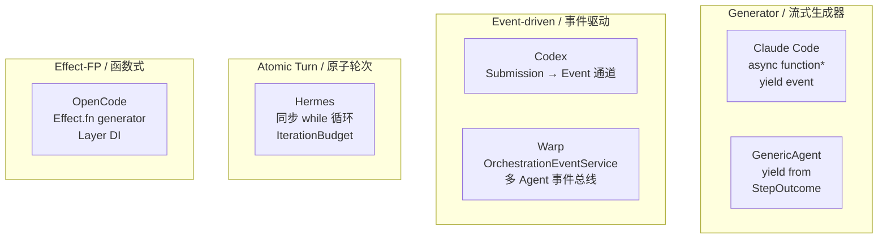
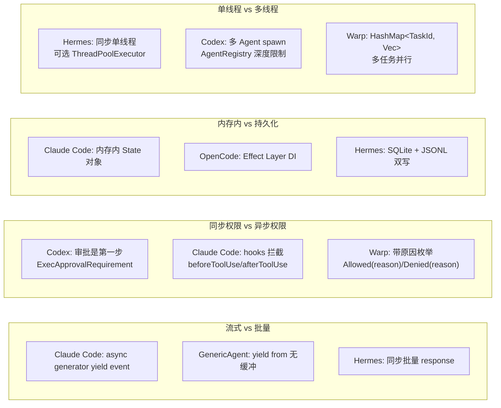
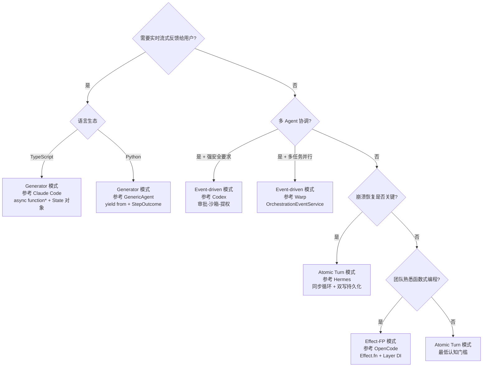

# Agent 主循环实现模式横向对比

> **Evidence Status** — grounded. 基于 Claude Code、Codex、OpenCode、GenericAgent、Hermes、Warp 六个项目的主循环源码分析横向提炼。

## 1. 概述

Agent 主循环是所有 Agent 系统中最核心的工程构件。它决定了系统如何驱动 LLM 推理、执行工具、管理状态和处理终止。但六个项目对"主循环该怎么写"给出了截然不同的答案。

本文横向对比六个项目的主循环实现，提炼四种工程模式，分析关键设计决策的分歧与共识，并给出模式选择信号。

| 项目 | 语言 | 循环入口 | LOC 量级 | 核心特征 |
|------|------|---------|---------|---------|
| Claude Code | TypeScript | `queryLoop()` (query.ts) | ~15K | Generator 流式、多层压缩、显式状态对象 |
| Codex | Rust | `ToolOrchestrator::run()` | ~12K | 审批-沙箱-提权三阶段、Event 通道 |
| OpenCode | TypeScript (Effect.js) | `SessionPrompt.loop()` | ~10K | Effect.fn generator、子任务优先级、Doom Loop 检测 |
| GenericAgent | Python | `agent_loop()` | ~2K | `yield from` 生成器链、`StepOutcome` 协变出口 |
| Hermes | Python | `run_agent()` | ~25K | 同步单线程、迭代预算 consume/refund、预算压力注入 |
| Warp | Rust | `BlocklistAIController` | ~20K | 多任务并行、多模型路由、Orchestration 事件系统 |

## 2. 四种模式分类

| 模式 | 代表项目 | 核心机制 | 状态模型 | 适用场景 |
|------|---------|---------|---------|---------|
| **Generator** | Claude Code, GenericAgent | `async function*` / `yield from`，每个 token/chunk 作为事件产出 | 内存内可变状态对象，每次迭代解构-重建 | 需要实时 UI 流式反馈、调用方可提前终止 |
| **Event-driven** | Codex, Warp | Submission 提交到 Event 通道，多路分发；Warp 额外有 `OrchestrationEventService` 跨 Agent 事件总线 | 事件队列 + 注册表（`AgentRegistry`）、`pending_events` / `awaiting_server_echo_events` | 高并发、多 Agent 协调、分布式追踪 |
| **Atomic Turn** | Hermes | 同步 `while` 循环，每轮完整 request-response，`IterationBudget` 控制边界 | 内存内 `messages` 列表，轮间可选持久化（SQLite/JSONL 双写） | 调试简单、崩溃恢复优先、多维预算控制 |
| **Effect-FP** | OpenCode | `Effect.fn` generator + Layer DI，`SessionStatus` 三状态机（idle/busy/retry） | 不可变状态容器，通过 `Effect.fn` yield 产出副作用 | 类型安全、可测试性、声明式组合 |

### 模式边界说明

模式之间不是完全互斥的：
- Claude Code 是 Generator 模式，但内部的 `state` 对象管理借鉴了原子轮次的思路（每轮解构-重建整个 state）。
- OpenCode 用 Effect.fn generator 语法，形式上像 Generator，但底层是 Effect.js 的代数效应系统，本质是函数式。
- Warp 的 `BlocklistAIController` 通过事件订阅驱动（Event-driven），但单次请求内部的 ResponseStream 处理是流式的。

## 3. 关键设计决策的分歧与共识

### 3.1 决策分歧总览

### 3.2 流式 vs 批量

| 维度 | 流式（Claude Code, GenericAgent, OpenCode） | 批量（Hermes） |
|------|---------------------------------------------|----------------|
| **UI 延迟** | 首 token 即可渲染 | 等完整响应 |
| **调试复杂度** | 高——需处理流中断、partial event | 低——每轮是完整对象 |
| **提前终止** | 原生支持（generator return） | 需要外部信号（budget flag） |
| **prompt caching** | 流式不影响缓存命中 | 同 |

**共识**：所有面向交互式用户的项目（Claude Code, OpenCode, GenericAgent）都选了流式；Hermes 选择批量是因为其主要场景是 gateway 后台任务（Telegram/Discord bot），不需要逐 token 展示。

### 3.3 同步权限 vs 异步权限

三种权限检查时机在项目中并存：

| 项目 | 权限检查时机 | 机制 | 特点 |
|------|-------------|------|------|
| Codex | 工具执行**前**（第一步） | `ExecApprovalRequirement` 三态（Skip/Forbidden/NeedsApproval） | 审批优先，沙箱拒绝后可提权重试 |
| Claude Code | 工具执行**前后**都可拦截 | hooks 系统（`beforeToolUse` / `afterToolUse`） | 灵活但需要工具开发者意识到 hook 存在 |
| Warp | 工具执行**前**，带原因枚举 | `CommandExecutionPermission::Allowed(reason)` / `Denied(reason)` | 审计友好——每个决策都有 reason |
| OpenCode | 循环内检测异常模式 | Doom Loop 检测触发权限询问 | 权限检查是**反应式**的，不是预防式的 |
| Hermes | 三层递进 | 正则检测 → 智能评估 → 用户确认 | 按成本递增排列 |

**共识**：所有项目都把权限嵌入主循环而非事后添加。没有任何项目把权限当作"可选插件"。

**分歧**：权限检查应该是预防式（Codex, Warp）还是反应式（OpenCode Doom Loop 检测）。Codex 选择预防式是因为沙箱环境下"先执行再问"的代价可控（沙箱会拦住）；OpenCode 选择反应式是因为它更信任模型的判断，只在检测到异常模式时才干预。

### 3.4 内存内状态 vs 持久化状态

| 项目 | 状态模型 | 持久化策略 | 崩溃恢复能力 |
|------|---------|-----------|-------------|
| Claude Code | 内存内 `State` 对象（`messages`, `toolUseContext`, `turnCount`...） | 无显式持久化 | 低——进程死亡即丢失 |
| OpenCode | Effect Layer DI + `SessionStatus`（idle/busy/retry） | 通过 Session 持久化 | 中——可从 Session 恢复 |
| Hermes | 内存内 `messages` 列表 | SQLite + JSONL 双写 | 高——可从任一存储恢复 |
| Codex | `AgentControl` + `AgentRegistry` | 沙箱快照 | 高——沙箱级恢复 |
| Warp | `BlocklistAIController` + `OrchestrationEventService` | 事件持久化 + 对话历史 | 高——事件可重放 |
| GenericAgent | `messages` 列表 + `StepOutcome` | 无 | 低——极简设计不考虑恢复 |

**共识**：所有生产系统（Hermes, Codex, Warp, OpenCode）都有某种形式的状态持久化。

**分歧**：Claude Code 作为生产系统却没有显式持久化。它依赖的是"对话本身就是状态"的设计思路，加上多层压缩确保上下文不溢出。这个设计在 CLI 场景下可行，但不适合需要跨进程恢复的场景。

### 3.5 单线程 vs 多线程

| 项目 | 并发模型 | 工具并发 | 多 Agent |
|------|---------|---------|---------|
| Claude Code | 单 generator 线程 | 工具串行执行 | 无原生子 Agent |
| Hermes | 同步单线程 | `_can_parallelize()` 条件并发，`ThreadPoolExecutor(max_workers=8)` | 子代理完全隔离（独立 toolset/prompt/session） |
| Codex | 多线程 | 沙箱内执行 | `AgentControl.spawn_agent()`，`AgentRegistry` 追踪深度限制 |
| OpenCode | Effect fiber 调度 | 通过 Task Tool 创建子会话 | `SessionPrompt.prompt()` 递归调用 |
| Warp | 多任务并行 | `HashMap<TaskId, Vec<AIAgentInput>>` | `OrchestrationEventService` 跨 Agent 消息传递 |
| GenericAgent | 单线程 | 串行 | 无 |

**共识**：工具并发不是默认行为。所有支持并发的项目（Hermes, Codex, Warp）都有显式的安全检查门控。

**分歧**：GenericAgent 和 Claude Code 选择完全串行，理由是简单可调试；Hermes 选择条件并发，在安全时并行以提高吞吐；Warp 最激进，支持多任务并行+多模型路由。

## 4. 从分歧中提炼的选择信号

补充选择信号（不在决策树中但同样重要）：

| 场景 | 推荐模式 | 理由 |
|------|---------|------|
| CLI 工具，用户盯着终端 | Generator | 逐 token 输出体验好，`return` 可提前终止 |
| 后台任务（bot/cron/批处理） | Atomic Turn | 无需流式，简化调试，预算控制自然 |
| 多租户 SaaS | Event-driven | 隔离性好，事件可审计 |
| 需要强类型保证的项目 | Effect-FP | 副作用显式声明，DI 可测试 |
| 原型/MVP | Atomic Turn | 最快上手，后续可演进 |
| 预算敏感（付费 API） | Atomic Turn (Hermes) | `IterationBudget` consume/refund + 压力注入是最成熟的预算方案 |

## 5. 跨项目共识

尽管模式不同，六个项目在以下方面完全一致：

| # | 共识 | 所有项目的做法 |
|---|------|--------------|
| 1 | **循环必须有上界** | `max_turns`(GA), `max_iterations`+`IterationBudget`(HM), `maxSteps`(OC), `shouldTerminate`(CC), `agent_max_threads`(CX), 多任务 HashMap 隐式有界(WP) |
| 2 | **工具执行结果驱动循环决策** | 所有项目都是"看到工具结果后再决定是否继续"，没有盲目循环 |
| 3 | **上下文溢出必须处理** | 压缩(CC 五层, HM 两阶段, OC 三层), 截断(CX), 溢出检测(OC `isOverflow`) |
| 4 | **权限嵌入循环** | 无一例外，没有"先跑完再检查权限"的设计 |
| 5 | **终止不只看模型输出** | CC: `transition` 字段记录"为什么继续"；OC: `finish` 事件 + `maxSteps` 双重检查；HM: 预算 + 迭代双重边界 |

## 6. 未消化的观察

以下是从横向对比中浮现但尚未形成确定结论的问题：

1. **Generator 模式与崩溃恢复的矛盾**：Claude Code 和 GenericAgent 都没有持久化机制。Generator 的 lazy evaluation 天然不友好于 checkpoint：很难在 `yield` 之间插入"保存到磁盘"的语义。OpenCode 用 Effect.js 解决了这个问题，但代价是引入了整套代数效应系统。是否存在更轻量的方案？

2. **预算模型的缺失**：Claude Code 和 Warp 没有 Hermes 那样的显式 `IterationBudget`。Claude Code 依赖 `turnCount` 和外部 token 限制，Warp 依赖服务端限制。在 API 成本持续下降的趋势下，精细预算控制的 ROI 是否在降低？还是相反，随着 Agent 自主性增强，预算控制会变得更重要？

3. **Doom Loop 检测的位置**：OpenCode 把它放在主循环（`SessionProcessor`），Hermes 通过预算压力注入间接处理，GenericAgent 通过轮次警告（`turn % 35`）处理。哪种方式更有效？OpenCode 的方式更精确（检测相同工具调用模式），但 Hermes 的方式更简单（纯计数）。这背后可能反映的是"检测循环"和"防止循环"是两个不同的问题。

4. **多模型路由的影响**：Warp 的 `RequestInput` 包含 `model_id`, `coding_model_id`, `cli_agent_model_id`, `computer_use_model_id` 四个模型 ID。这意味着一次请求可能路由到不同模型。这种设计对主循环的状态管理有什么影响？其他项目是否会跟进？

5. **Hermes 的 refund 机制独一无二**：`IterationBudget.refund()` 允许"便宜操作"退还预算。这个设计没有在其他项目中出现。它是 Hermes 特有的场景需求（长时间运行的 gateway bot），还是一个值得推广的通用模式？

## 交叉引用

| 关联文件 | 关系 |
|---------|------|
| `architecture/kernel/agent-loop.md` | 框架层对循环的抽象定义（ORDA-VU） |
| `design-space/patterns/compaction.md` | 压缩策略详解 |
| `design-space/patterns/loop-detection.md` | 循环检测模式 |
| `synthesis/cross-project-patterns.md` | 跨项目共识/分歧总览 |
| `projects/coding-agents/claude-code/query-loop.md` | Claude Code 主循环源码 |
| `projects/coding-agents/codex/orchestrator.md` | Codex 编排器源码 |
| `projects/coding-agents/opencode/orchestration.md` | OpenCode 编排系统源码 |
| `projects/general-agents/generic-agent/agent-loop.md` | GenericAgent 主循环源码 |
| `projects/general-agents/hermes-agent/agent-loop.md` | Hermes 主循环源码 |
| `projects/coding-agents/warp/agent-controller.md` | Warp Controller 源码 |
