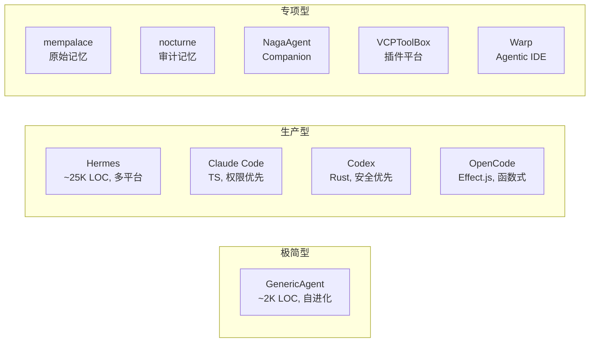
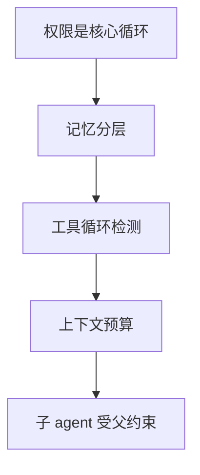
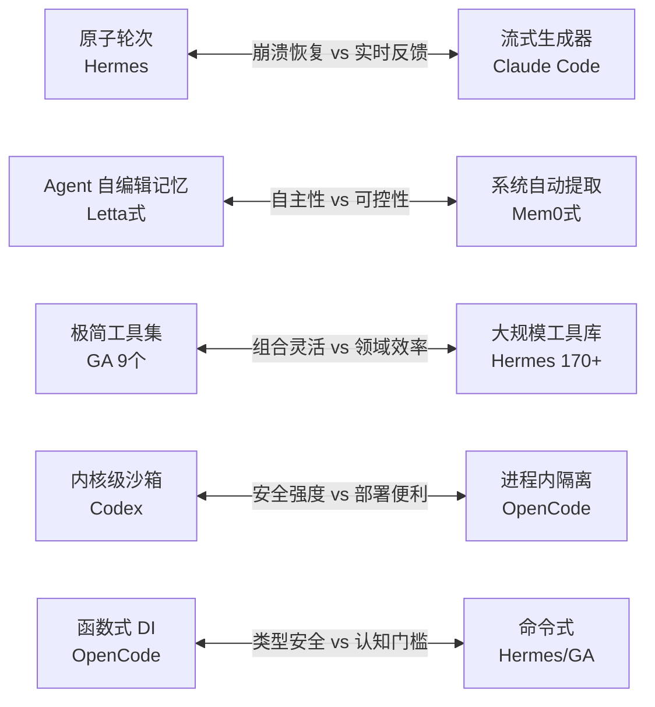

# 跨项目设计模式提炼

> **Evidence Status** — grounded. 从 knode 中 10 个实战项目横向提取的通用模式、分歧与未消化原则。

## A. 项目概览

| 类别 | 项目 | 核心特征 | LOC 量级 |
|---|---|---|---|
| 极简 | GenericAgent | 9 工具、自进化、最小闭环 | ~2K |
| 生产 | Hermes | 170+ 工具、多 backend、网关 | ~25K |
| 生产 | Claude Code | hooks + permission tree、MCP | ~15K |
| 生产 | Codex | 内核沙箱、guardian、审批升级 | ~12K |
| 生产 | OpenCode | Effect.js DI、schema-first | ~10K |
| 专项 | mempalace | 三层原始记忆、自动提取 | ~3K |
| 专项 | nocturne | 审计链、证据快照 | ~4K |
| 专项 | NagaAgent | 人格一致、关系演进 | ~5K |
| 专项 | VCPToolBox | 插件 manifest、多运行时 | ~8K |
| 专项 | Warp | skill 元工具、readiness label | ~20K |

## B. 跨项目共识

> 所有 10 个项目都做了的事，无论规模和品类。

| # | 共识 | 证据 | 实现差异 |
|---|---|---|---|
| 1 | 权限不是事后加的 | 全部 10 项目 | CC: hooks, CX: guardian, HM: 三层审批 |
| 2 | 记忆至少 2 层 | 全部 10 项目 | 2 层(GA) → 5 层(mempalace) |
| 3 | 工具循环检测 | 全部 10 项目 | 计数器(GA) / DAG 检测(HM) / budget(CC) |
| 4 | 上下文有预算约束 | 全部 10 项目 | 硬截断(CX) / 渐进摘要(CC) / 滑窗(OC) |
| 5 | 子 agent 受父约束 | 全部含子 agent 项目 | 权限继承(CC) / 沙箱克隆(CX) / scope 收窄(HM) |

## C. 跨项目分歧

> 项目间做法相反的设计决策，每个分歧都是一个权衡。

| # | 轴 | 方案 A | 方案 B | 选择信号 |
|---|---|---|---|---|
| 1 | 执行粒度 | 原子轮次(HM) | 流式生成器(CC) | 崩溃恢复优先 → A；实时反馈优先 → B |
| 2 | 记忆写入权 | Agent 自编辑 | 系统自动提取 | 开放域 → A；合规/审计 → B |
| 3 | 工具规模 | 极简(GA, 9) | 大规模(HM, 170+) | 通用+可组合 → A；领域深度 → B |
| 4 | 隔离强度 | 内核沙箱(CX) | 进程内隔离(OC) | 多租户/高风险 → A；单用户/开发态 → B |
| 5 | 编程范式 | 函数式 DI(OC) | 命令式(HM/GA) | 团队熟悉 FP → A；快速迭代 → B |

## D. 尚未被框架消化的实战原则

以下模式在项目中反复出现，但主流框架（LangGraph、CrewAI、AutoGen 等）尚未原生支持：

1. **效果验证独立于工具返回** — 工具说"成功"不算数，必须独立回读确认（CC: test pass, CX: sandbox diff, Warp: readiness check）
2. **权限衰减而非继承** — 子 agent 的权限严格小于父 agent，不存在"继承全部权限"（CC, CX, HM 均如此）
3. **记忆写入需要验证门** — 写入长期记忆前需要准确性/相关性检查，不是所有交互都值得记（mempalace, nocturne）
4. **世界状态有 TTL** — 缓存的外部状态必须标注有效期，超期必须刷新（HM: API 状态, CC: git 状态）
5. **恢复路由分级** — 瞬时故障重试、前提失效重规划、语义错误升级人工，不能一刀切（CX, HM, Warp）
6. **skill 作为可组合指令** — 不是 API 调用，而是可版本化的指令文档（Warp readiness label, GA 自进化 prompt）
7. **审计链不可选** — 生产系统必须有完整的决策-执行-效果审计链，不是日志的超集（nocturne, HM, CX）

## E. 六项目核心机制对比

> 聚焦 Claude Code、Codex、GenericAgent、Hermes、OpenCode、Warp 六个主要参考项目的关键机制差异。

### E.1 权限与安全机制

| 项目 | 权限层级 | 核心机制 | 关键特性 |
|---|---|---|---|
| Claude Code | 7 层：policy > user > project > local > session > classifier > hook | 规则匹配 + 分类器 + Hook 干预 + 用户确认 | 25 种 Hook 事件类型；Stop Hook 自验证循环；deny 优先于 allow；熔断（3 次连续失败停止） |
| Codex | Guardian LLM + 三层沙箱 + 用户审批 | LLM 风险评估（0-100 分）替代静态规则 | transcript 只作证据不作指令；Seatbelt/Landlock/Bubblewrap 跨平台；网络与文件策略分离 |
| GenericAgent | SOP 约束 + code_run_header 注入 | tool_before_callback 在 code_run 前注入安全检查 | 高信任个人环境设计，不适用于多租户 |
| Hermes | 三层审批：正则 → 智能评估 → 用户确认 | 子代理工具交集隔离 + DELEGATE_BLOCKED_TOOLS | 威胁扫描检测注入/泄露模式；skip_memory 防记忆污染 |
| OpenCode | deny > ask > allow 三层权限 | Zod schema 验证 + last-match-wins 规则评估 | Doom Loop 检测（连续 3 次同工具触发）；AsyncLocalStorage 权限上下文传播 |
| Warp | readiness-label 准入 + permission profile + action model | 10 种 Provider 兼容的 Skill 权限系统 | Feature Flag 四阶段渐进发布（dogfood → preview → release → GA） |

### E.2 子代理与编排模式

| 项目 | 模式 | 缓存策略 | 隔离机制 |
|---|---|---|---|
| Claude Code | Fork（缓存共享）+ Spawn（独立历史）| Fork 子代理字节相同前缀，最大化 prompt cache 命中 | Worktree / Remote 隔离；权限 bubble 到父终端 |
| Codex | AgentControl 注册表 + spawn/wait/send_input | 无特殊缓存优化 | Weak 引用防循环；深度限制；独立昵称 |
| GenericAgent | Agent BBS + Team Worker 分布式 | 无 | 环境变量握手；冷却机制防重复接单 |
| Hermes | delegate_task + Kanban Worker | 无 | 工具交集；独立 prompt/session；环境变量隔离（HERMES_KANBAN_TASK） |
| OpenCode | Task 工具 + 7 内置代理 | 无 | 三种模式：primary / subagent / all |
| Warp | Oz multi-phase pipeline + 外部 agent 托管 | AgentDriver 统一托管 | ResumePayload 持久化；HarnessRunner 可恢复可观测 |

### E.3 记忆与上下文压缩

| 项目 | 记忆层数 | 压缩策略 | 核心创新 |
|---|---|---|---|
| Claude Code | 3 层（user/project/local MEMORY.md）| 4 阶段：snip → micro → collapse → auto | 缓存微压缩（API 层操作不改本地）；熔断器（3 次失败停止压缩） |
| Codex | 2 阶段（Rollout 提取 + 全局合并）| compact task + history token accounting | Phase 1 水平扩展并行提取；Phase 2 全局锁串行合并；Watermark 防重复 |
| GenericAgent | L0-L4 五层 + 自动归档 | 基于轮次触发（每 10 轮重注入/第 35 轮强制 ask_user）| No Execution No Memory 原则；L4 会话归档（原始→压缩→月度 ZIP） |
| Hermes | FTS5 全文搜索 + 冻快照注入 | 两阶段：轻量剪枝 + LLM 总结（50% 阈值触发）| 冻快照保持前缀缓存热度；增量更新而非重新总结 |
| OpenCode | DB messages + continue/session/fork | 三层渐进：prune → compact → truncate | 50KB/2000 行限制；压缩失败自动重放 |
| Warp | repo skills + spec + input_context | skill-driven context injection | 三层渐进加载（metadata → body → references） |

### E.4 恢复与容错

| 项目 | 恢复策略 | 循环检测 | 预算控制 |
|---|---|---|---|
| Claude Code | 413 三阶段恢复（fold → compact → abort）；max_output_tokens 升级重试 | Hook + Stop Hook 自验证 | 自动压缩阈值 = 有效窗口 - 13K 缓冲 |
| Codex | 沙箱拒绝 → 用户确认 → 无沙箱重试 | 无显式机制 | 无独立预算（依赖沙箱限制） |
| GenericAgent | 第 7 轮策略转变 → 第 35 轮强制人工介入 → 第 40 轮退出 | 轮次计数器 | context_win×3 触发压缩 |
| Hermes | IterationBudget consume/refund 模型 + 70%/90% 压力警告注入 | 迭代预算线程安全计数器 | 预算警告注入工具结果 JSON（保护消息交替不变性） |
| OpenCode | 分级重试（retry-after-ms > 指数退避，最多 30s）| Doom Loop（连续 3 次同工具）| maxSteps 限制 |
| Warp | spec invariants → CI → Oz review → SME review 多重门控 | 无显式机制（依赖 spec 验收） | readiness-label 准入控制 |

## H. 未消化洞见清单

> 从 projects/ 中提炼的实战洞见回流追踪。"已回流"表示已产出独立 pattern 文件；"待回流"/"待创建"/"待评估"表示已识别但尚未落地。

| 洞见 | 来源 | 已回流到 | 状态 |
|------|------|---------|------|
| Action-Verified Memory | GenericAgent | design-space/patterns/action-verified-memory.md | 已回流 |
| 工具并发分区 | Claude Code | design-space/patterns/concurrent-tool-partition.md | 已回流 |
| Harness Container 模式 | Warp | design-space/patterns/harness-container.md | 已回流 |
| 审批缓存 | Codex | design-space/patterns/approval-cache.md | 已回流 |
| 压缩后恢复预算 | Claude Code | planes/context/compression-strategies.md (SS15) | 已回流 |
| 错误分类树 | Hermes | planes/recovery/recovery-decision-tree.md (SS4.2) | 已回流 |
| Agent Protocol (ACP/MCP) | OpenCode/Warp | design-space/frontier/agent-protocols.md | 已回流 |
| 流式生成器循环模式 | GenericAgent/Claude Code | architecture/kernel/agent-loop.md (Generator 模式细节) | 已回流 |
| Effect 函数式 DI | OpenCode | 无 | 评估完成——单项目验证，暂不上升为通用 pattern |
| Fork 缓存共享 | Claude Code | synthesis/cross-project-patterns.md (E.2) | 已回流 |
| Doom Loop 熔断 | OpenCode / Claude Code | synthesis/cross-project-patterns.md (E.4) | 已回流 |
| Guardian LLM 审批 | Codex | synthesis/cross-project-patterns.md (E.1) | 已回流 |
| IterationBudget consume/refund | Hermes | synthesis/cross-project-patterns.md (E.4) | 已回流 |
| Rollout 两阶段记忆 | Codex | synthesis/cross-project-patterns.md (E.3) | 已回流 |
| 10 Provider Skill 发现 | Warp | synthesis/cross-project-patterns.md (E.2) | 已回流 |
| Kanban Worker 隔离 | Hermes | synthesis/cross-project-patterns.md (E.2) | 已回流 |
| Context Chip 三层注入 | Warp | 无 | 待评估——skill metadata/body/references 三层加载是否上升为通用 pattern |
