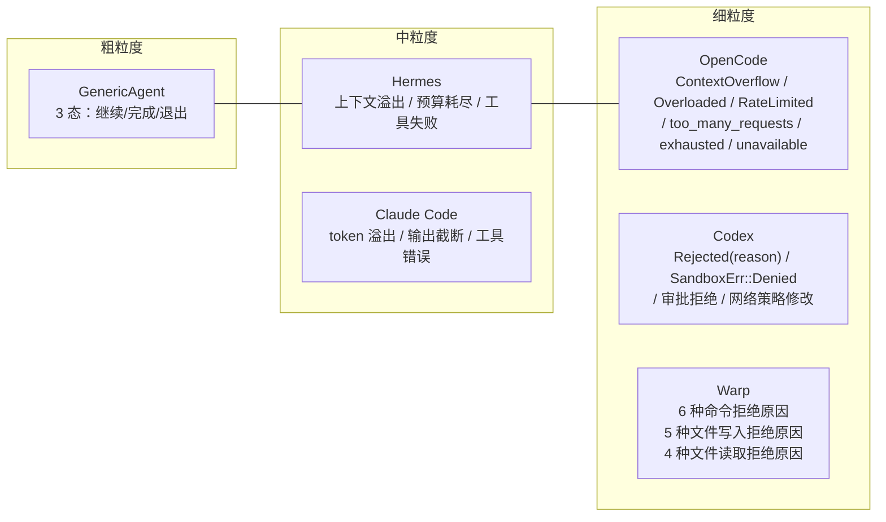
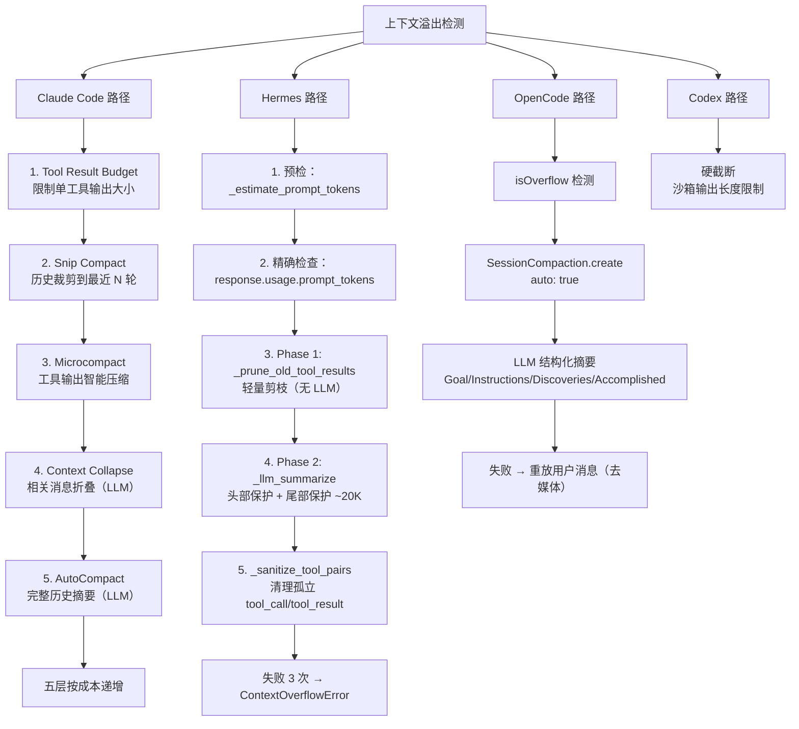
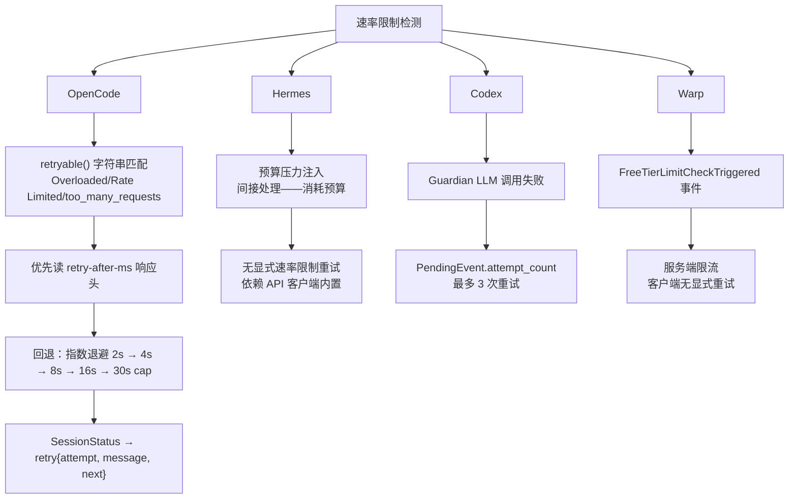

# 错误处理与恢复策略横向对比

> **Evidence Status** — grounded. 基于 Claude Code、Codex、OpenCode、Hermes、GenericAgent、Warp 的错误处理源码分析横向提炼，结合 `architecture/planes/recovery/recovery-decision-tree.md` 的理论框架。

## 1. 概述

错误处理不是"出错 → 重试"。生产级 Agent 系统的错误处理是一条完整的管线：

```text
检测 → 分类 → 评估（可逆性 + 预算） → 选择策略 → 执行恢复 → 验证恢复
```

六个项目对这条管线的每个阶段都做了不同的工程选择。有些项目在分类上投入最多（Hermes 的多维错误判定），有些在恢复策略上最精细（Claude Code 的五层压缩），有些在安全兜底上最严格（Codex 的沙箱提权审批）。

本文不重复 `recovery-decision-tree.md` 的理论框架，而是用项目实证回答：**理论框架中的每个决策点，各项目实际是怎么做的？**

## 2. 错误分类对比

各项目的错误分类粒度和方式差异很大：

| 项目 | 分类方式 | 错误类型 | 粒度 |
|------|---------|---------|------|
| **Claude Code** | 状态字段 + 特性标记 | `maxOutputTokensRecoveryCount`, `hasAttemptedReactiveCompact`, `transition` | 按恢复动作隐式分类——不同的恢复计数器对应不同错误 |
| **Codex** | 类型系统 | `ToolError::Rejected(reason)`, `SandboxErr::Denied { output }` | 按来源显式分类——审批拒绝 vs 沙箱拒绝 vs 一般错误 |
| **OpenCode** | 字符串匹配 + 类型检查 | `ContextOverflowError`, `Overloaded`, `Rate Limited`, `too_many_requests`, `exhausted`, `unavailable` | 按可重试性分类——先判断"能不能重试"，再决定怎么重试 |
| **Hermes** | 阈值检测 + 压缩重试计数 | `ContextOverflowError`（压缩失败 3 次）、预算耗尽（`budget_ratio >= 0.9`） | 按资源维度分类——上下文溢出 vs 预算耗尽 vs 工具失败 |
| **GenericAgent** | 协变出口 | `StepOutcome(data, next_prompt, should_exit)` | 最粗粒度——只区分"继续/完成/退出" |
| **Warp** | 枚举 + 原因 | `CommandExecutionPermissionDeniedReason`（6 种）、`FileWritePermissionDeniedReason`（5 种） | 按操作类型 x 拒绝原因矩阵分类 |

### 分类粒度对比



**观察**：错误分类粒度与项目复杂度正相关，但不是线性的。GenericAgent 只有 ~2K LOC，三态分类足够；Warp ~20K LOC，需要按操作类型 x 原因的矩阵分类来支持审计和遥测。

## 3. 恢复策略对比

### 3.1 上下文溢出恢复

上下文溢出是所有 Agent 系统必须面对的问题。六个项目给出了三种根本不同的策略：



| 项目 | 策略层数 | 最轻层 | 最重层 | 熔断条件 |
|------|---------|--------|--------|---------|
| Claude Code | 5 层 | Tool Result Budget（零成本裁剪） | AutoCompact（LLM 全量摘要） | 连续失败后 `hasAttemptedReactiveCompact` 标记 |
| Hermes | 2 层 | `_prune_old_tool_results`（规则剪枝） | `_llm_summarize`（LLM 摘要） | `compression_retries > 3` 抛异常终止 |
| OpenCode | 1 层（带降级） | `SessionCompaction`（LLM 结构化摘要） | 同 | 失败后重放用户消息作为兜底 |
| Codex | 1 层 | 硬截断 | 同 | 沙箱级隔离，问题不传播 |
| GenericAgent | 0 层 | 无——依赖 `max_turns` 提前终止 | 无 | 轮次上限 |

### 3.2 工具失败恢复

| 项目 | 策略 | 实现细节 |
|------|------|---------|
| **Codex** | 提权重试 | `SandboxErr::Denied` → 检查 `escalate_on_failure()` → 请求用户确认 → 无沙箱重试 |
| **Claude Code** | 重试 + 压缩 | 工具失败后通过 `transition` 字段记录原因，下一轮 LLM 看到失败信息自行调整 |
| **OpenCode** | Doom Loop 检测 | 连续 3 次相同工具调用 → `detectDoomLoop()` → 触发权限检查强制用户干预 |
| **Hermes** | 预算压力 | 工具失败消耗预算 → `budget_ratio >= 0.7` 注入 CAUTION → `>= 0.9` 注入 CRITICAL |
| **GenericAgent** | 协变出口 | 工具返回 `StepOutcome(data=None, next_prompt="未知工具 {name}")` → LLM 看到错误消息 |
| **Warp** | 权限分级拒绝 | `ProtectedPath` 硬拒绝不可覆盖；`Inconclusive` 转人工；`AgentDecided` 允许 Agent 自主判断 |

### 3.3 权限拒绝恢复

| 项目 | 拒绝后行为 | 升级路径 | 安全硬限制 |
|------|-----------|---------|-----------|
| **Codex** | `ToolError::Rejected(reason)` 返回给模型 | 沙箱拒绝 → 用户确认 → 无沙箱重试 | Guardian LLM 风险评分 80-100 直接拒绝 |
| **Claude Code** | hooks `beforeToolUse` 可阻止执行 | 无显式升级——被拒绝的操作返回错误给模型 | feature flags 控制哪些能力可用 |
| **OpenCode** | `Permission.Ruleset` 按工具分级（allow/ask/deny） | `ask` 级别的操作暂停等待用户确认 | `plan` agent 默认 `"*": "deny"` 只允许读操作 |
| **Hermes** | 三层审批：正则 → 智能评估 → 用户确认 | 超时默认拒绝（`return "deny"`） | `DELEGATE_BLOCKED_TOOLS` 冻结集合不可绕过 |
| **Warp** | `CommandExecutionPermission::Denied(reason)` 带原因返回 | `AutonomyForceDisabled` 不可覆盖；其他原因可由用户设置覆盖 | `ProtectedPath` 即使用户设置允许也不可写 |

### 3.4 速率限制恢复



| 项目 | 检测方式 | 退避策略 | 上限 |
|------|---------|---------|------|
| OpenCode | 字符串匹配（`Overloaded`, `Rate Limited`） | `retry-after-ms` 响应头优先；回退指数退避 2^n 秒 | 30 秒 cap |
| Hermes | 无显式检测 | 依赖 API 客户端内置重试 | N/A |
| Codex | 事件重试计数 | `PendingEvent.attempt_count` | 最多 3 次 |
| Warp | `FreeTierLimitCheckTriggered` 事件 | 服务端处理 | N/A |
| Claude Code | 隐式（通过 API 层） | 未在主循环层显式处理 | N/A |
| GenericAgent | 无 | 无 | 无 |

## 4. 跨项目共识

以下做法在所有（或绝大多数）项目中一致：

| # | 共识 | 证据 |
|---|------|------|
| 1 | **上下文溢出不能用重试解决** | Claude Code: 五层压缩；Hermes: 两阶段压缩；OpenCode: `ContextOverflowError.isInstance(error)` 时 `return false`（明确不重试）；Codex: 硬截断 |
| 2 | **权限拒绝反馈给模型而非静默忽略** | Codex: `ToolError::Rejected(reason)` 返回；GenericAgent: `StepOutcome(next_prompt="未知工具")` 让模型看到；Warp: `Denied(reason)` 带原因 |
| 3 | **恢复有预算限制** | Hermes: `compression_retries > 3` 抛异常；OpenCode: `maxSteps` 限制总轮次；Claude Code: `maxOutputTokensRecoveryCount` 计数；Codex: `PendingEvent.attempt_count` 最多 3 次 |
| 4 | **安全相关错误不可自动恢复** | Codex: `ProtectedPath` 不可覆盖；Warp: `AutonomyForceDisabled` 硬拒绝；Hermes: `DELEGATE_BLOCKED_TOOLS` 冻结集合 |
| 5 | **错误信息是模型的输入** | 所有项目都把错误信息以某种方式（工具结果、系统消息、`transition` 字段）传递给模型，让模型参与恢复决策 |

## 5. 跨项目分歧

以下是项目间做法相反或显著不同的设计决策：

| # | 分歧维度 | 方案 A | 方案 B | 选择信号 |
|---|---------|--------|--------|---------|
| 1 | **压缩层数** | Claude Code: 5 层按成本递增 | GenericAgent: 0 层（不压缩） | 任务持续时间长 → 多层；短任务/原型 → 可以不压缩 |
| 2 | **谁决定恢复策略** | Codex/Warp: 系统显式分类后按规则决定 | Claude Code/GenericAgent: 把错误返回给模型，让模型自己决定 | 安全敏感 → 系统决定；开放域 → 模型决定 |
| 3 | **超时默认行为** | Hermes: 超时默认拒绝（`return "deny"`） | 无项目选择超时默认通过 | 所有项目都是 fail-closed，但 Hermes 是唯一显式写出超时处理的 |
| 4 | **沙箱拒绝是否可提权** | Codex: 可以（用户确认后无沙箱重试） | 其他项目: 没有沙箱提权概念 | 有沙箱环境 → Codex 模式合理；无沙箱 → 不适用 |
| 5 | **Doom Loop 是错误还是权限** | OpenCode: 当作权限问题处理（触发权限检查） | Hermes: 当作预算问题处理（消耗预算） | 需要用户干预 → 权限模式；自动限制 → 预算模式 |
| 6 | **速率限制处理层** | OpenCode: 主循环层显式处理（`SessionRetry`） | Hermes/Claude Code: 依赖 API 客户端内置 | 需要细粒度控制（多 provider 切换） → 主循环层；单 provider → 客户端层足够 |

## 6. 未消化的观察

1. **"让模型决定恢复策略"的有效性边界**：Claude Code 和 GenericAgent 都把错误信息扔回给模型，让模型自己选择下一步。这在简单工具错误时工作良好，但当错误涉及系统级问题（如速率限制、沙箱权限）时，模型的决策质量存疑。是否存在一个明确的边界——哪些错误应该由系统处理，哪些可以委托给模型？

2. **压缩失败的恢复**：Hermes 在压缩失败 3 次后直接抛 `ContextOverflowError` 终止。OpenCode 在压缩失败后重放用户消息（去除媒体）作为兜底。Claude Code 有 `hasAttemptedReactiveCompact` 标记但没有看到最终的兜底策略。压缩本身失败时，最佳的恢复策略是什么？目前没有项目给出令人满意的答案。

3. **Silent Failure 的检测**：`recovery-decision-tree.md` 明确指出 Silent Failure 是最危险的失败模式，但六个项目中没有一个在主循环层实现了 readback 验证。Codex 通过沙箱 diff 间接实现了部分效果验证，Claude Code 通过 hooks `afterToolUse` 提供了扩展点，但都不是系统性的 readback。这可能是当前 Agent 系统中最大的可靠性盲区。

4. **恢复动作本身的验证**：`recovery-decision-tree.md` 的评审清单包含"恢复动作本身是否被验证"，但没有项目在恢复后做二次验证。例如，Hermes 压缩后没有检查摘要质量；OpenCode 重放用户消息后没有检查上下文是否仍然连贯。恢复-验证循环是否值得增加的复杂度？

5. **Warp 的带原因枚举是否应该成为标准**：Warp 的 `Allowed(reason)` / `Denied(reason)` 设计让每个权限决策都可审计。其他项目使用 bool 或简单字符串。如果把这个模式推广到错误恢复（`Recovered(reason)` / `Failed(reason)`），是否能显著改善可观测性？

## 交叉引用

| 关联文件 | 关系 |
|---------|------|
| `architecture/planes/recovery/recovery-decision-tree.md` | 理论框架——五层防御、决策矩阵、失败模式分类 |
| `design-space/patterns/compaction.md` | 压缩策略详解（Claude Code 五层 + OpenCode 三层） |
| `design-space/patterns/loop-detection.md` | Doom Loop 检测模式 |
| `synthesis/cross-project-patterns.md` | 跨项目共识/分歧总览 |
| `synthesis/agent-loop-patterns.md` | 主循环模式对比（本文的姊妹篇） |
| `projects/coding-agents/claude-code/query-loop.md` | Claude Code 错误恢复实现 |
| `projects/coding-agents/codex/orchestrator.md` | Codex 沙箱提权实现 |
| `projects/coding-agents/codex/guardian-policy.md` | Codex Guardian LLM 风险评估 |
| `projects/coding-agents/opencode/orchestration.md` | OpenCode 重试策略和 Doom Loop 检测 |
| `projects/general-agents/hermes-agent/agent-loop.md` | Hermes 预算压力注入和压缩触发 |
| `projects/coding-agents/warp/agent-controller.md` | Warp 带原因权限枚举 |
