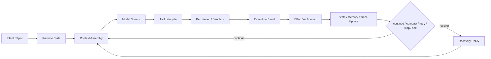

# Local Agent Runtime Practices

> **Evidence Status** — grounded. 基于本地参考项目 `GenericAgent`、`hermes-agent`、`warp`、`claude code`、`codex`、`opencode` 的只读对照；只沉淀运行时义务，不复制实现。

## 目的

本页不再扩展项目故事，只回答一个问题：这些已落地 Agent 产品共同证明了哪些运行时契约？

结论：成熟 Agent 的差异不在模型和 prompt，而在 runtime contract。计划、工具、权限、上下文、状态、恢复、UI 和回放都必须成为显式对象。



## Local Runtime Obligations

| 运行时义务 | Claude Code | Codex | OpenCode | Warp | GenericAgent | Hermes | 稳定规则 |
|---|---|---|---|---|---|---|---|
| Runtime loop | query loop 驱动压缩、工具、hooks | task / orchestrator 分阶段执行 | session processor + Service graph | AgentDriver 托管外部 harness | 极简 generator loop | atomic turn loop + registry dispatch | loop 是状态机，不是 API wrapper |
| Context / compaction | snip / micro / collapse / auto | history token accounting、compact task | prune / compact / truncate | repo skills + input context | 轮次触发记忆注入 | context compressor + tool result spill | 压缩必须保留任务、证据、失败和下一步 |
| Tool lifecycle | 工具并发与安全标记 | approval → sandbox → retry | schema + permission + retry | action queue / external harness | 9 原子工具 + code_run | registry / toolsets / MCP / gateway tools | 工具不是函数列表，必须有 schema、风险、权限、审计、恢复 |
| Permission / sandbox | permission mode + hooks | filesystem/network sandbox 分离 | deny > ask > allow | permission profile + action model | SOP 约束为主 | approval、blocklist、backend isolation | prompt 约束不能替代 hard policy |
| State / resume | transcript、compact boundary、resume | SessionState、previous turn settings | DB messages、continue/session/fork | ResumePayload、periodic save | working checkpoint | session DB、agent cache、checkpoint | 长任务状态必须外置，可恢复、可回放 |
| UI / event stream | SDK stream、tool progress | TUI stream chunks | SSE / reducer 落 message parts | ResponseStream 区分 retry/resume | generator yield 多前端 | TUI/gateway events | UI 是 runtime event 的投影，不是事后说明 |
| Eval / verification | diff/test/readback | trace + sandbox outcome | trace + permission outcome | spec → CI → Oz/SME review | No Execution No Memory | trajectory / diagnostics | eval 要看 trace，不只看最终回答 |
| Skill / memory governance | skill loading | AGENTS.md scope、memory pipeline | agent registry / config | `.agents/skills` + specs | 成功 trace → SOP/脚本 | skills frontmatter、threat scan、progressive disclosure | skill 是受治理的程序性记忆 |
| Recovery / circuit breaker | 熔断（3 次失败停止）+ 413 三阶段恢复 | 沙箱拒绝 → 用户确认 → 无沙箱重试 | Doom Loop（3 次同工具）+ 分级重试 | spec → CI → Oz → SME 多重门控 | 第 7/35/40 轮梯级降级 | IterationBudget + 70%/90% 压力注入 | 恢复策略必须分级：瞬时重试 → 降级 → 人工升级 |

## 新发现的共识模式

> 以下模式在最新项目分析中被确认为跨项目共识，补充到运行时义务表中。

| 共识模式 | 证据项目 | 稳定规则 |
|---|---|---|
| 循环熔断是基础设施 | CC（3 次连续失败停止压缩）、OC（Doom Loop 连续 3 次同工具）、HM（IterationBudget 耗尽终止）、GA（第 40 轮强制退出） | 循环检测不能依赖 prompt 提醒，必须是 runtime 级硬断路器 |
| 子代理权限只减不增 | CC（fork/spawn 均受限）、CX（工具交集+深度限制）、HM（DELEGATE_BLOCKED_TOOLS + skip_memory）、WP（permission profile） | 子代理工具集 ⊆ 父代理工具集，无例外 |
| 预算压力前馈 | HM（70%/90% 阈值警告注入工具结果）、CC（warning 93% / error 93% / blocking 99.7%）、GA（第 7 轮策略转变提示） | 预算耗尽前必须向模型发出渐进信号，而非直接截断 |
| 记忆写入脱敏 | CX（Phase 1 redact_secrets）、HM（威胁扫描检测注入/泄露）、GA（禁止存储易变状态） | 长期记忆写入前必须过滤秘密和可注入内容 |
| 工具 schema 单一真实源 | HM（registry 统一查询 schema/handler/check_fn）、OC（Zod schema 定义验证一体）、CC（工具定义含 concurrency 标记）| 工具描述不能在 prompt、配置和代码三处各写一份 |
| 压缩保留不变量 | CC（adjustIndexToPreserveAPIInvariants 保护 tool_use/result 对）、HM（_sanitize_tool_pairs 清理孤立对）| 压缩后消息必须保持 API 协议不变量（tool_use/result 配对、消息交替） |

## 项目给出的核心修正

| 旧倾向 | 修正后规则 |
|---|---|
| 先讲所有模块 | 先问 User Job、risk、required depth，再选最小模块 |
| 把 ReAct 当主循环 | 主循环必须包含 context、permission、state、verify、recover |
| 工具调用成功即可推进 | 写动作进入 effect ledger，并有 readback / test / external ack |
| 把记忆当长上下文 | 记忆是带 provenance、trigger、version、expiry 的 representation |
| 把 skill 当 prompt 文件 | skill 是可治理资产：scope、eval、activation、retirement 缺一不可 |
| 把安全当拒绝策略 | 安全是 identity + capability + audit + recovery 的运行时对象 |
| 把 Agent 当聊天层外挂 | 真实产品里的 Agent 是 workflow participant，需要 operations gate |

## 轻量评审清单

```text
[ ] 复杂任务是否有外部计划、验收条件和验证者？
[ ] 模型路由是否区分 plan / act / verify / browser / computer-use？
[ ] 工具权限来自 hard policy / profile，而不是 prompt 自觉？
[ ] 写命令是否有 denylist / allowlist / approval / sandbox？
[ ] mutation 前是否有 checkpoint 或可恢复快照？
[ ] Shell / Browser 是否有 session、profile、snapshot 和动作后验证？
[ ] Task state 是否包含 active turn、pending approval、resume handle？
[ ] Tool call 是否可回放，是否有 effect record？
[ ] UI/日志是否来自事件流，而不是模型事后解释？
[ ] skill 固化是否经过 replay / second-use / eval，而不是一次成功即激活？
```

## 应落回哪些章节

| 经验 | 落点 |
|---|---|
| coding agent loop state machine | `../categories/coding-agent/closed-loop.md`、`../architecture/kernel/agent-loop.md` |
| 工具权限和沙箱生命周期 | `../architecture/planes/tools/overview.md`、`../architecture/planes/control/overview.md`、`../architecture/planes/identity-capability/overview.md` |
| 分层上下文预算 | `../architecture/planes/context/overview.md` |
| active turn / pending approval / resume handle | `../architecture/planes/state/overview.md`、`../architecture/runtime-data-model.md` |
| provider / context / permission / sandbox / stale file 恢复分类 | `../architecture/planes/recovery/overview.md` |
| UI as runtime projection | `../architecture/planes/interface/overview.md`、`../architecture/planes/observability/overview.md` |
| skill crystallization governance | `../architecture/learning/overview.md`、`../architecture/learning/skill-governance.md` |

## 不要吸收什么

- 不要复制项目代码。
- 不要把某个项目的目录结构当通用标准。
- 不要把 prompt 约束替代 hard policy。
- 不要把合成 trace 说成真实 Agent 能力证明。
