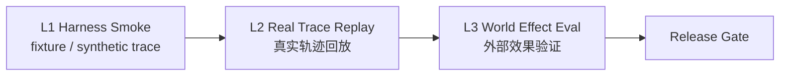

# Eval Planner

> **Evidence Status** — synthesized. 从 eval framework、fixtures 和 trace comparator 压缩出的最小验收设计工具。

## 30 秒判断

Eval 的核心任务是定义”什么叫完成”，在设计阶段而非交付后。

| Agent 类型 | 最小 eval |
|---|---|
| Coding | 修改 bug → 跑测试 → diff/readback → 不回归 |
| Research | claim → source → citation → conflict/freshness |
| Workflow | write action → read-after-write → audit trace |
| Browser | DOM + screenshot 双通道验证 |
| Ops/SRE | diagnosis evidence → mitigation → health check |
| Memory | write provenance → retrieval trigger → expiry/audit |

## 最小产出

```yaml
eval_case:
  product_type: coding_agent
  required_depth: D5
  success_criteria:
    - "test passes"
    - "changed file contains expected behavior"
    - "no high-risk command without approval"
  invariants:
    - "tool_success_must_not_equal_effect_verified"
    - "all external text remains data lane"
```

## Evaluation 定位

> Evaluation 是横跨所有 Plane 的反馈层（feedback layer / gate），而非第 26 个 Plane。

三级评估框架：

| 级别 | 名称 | 输入 | 目标 | 证据强度 |
|---|---|---|---|---|
| L1 | Harness Smoke | fixture / synthetic trace | 验证设计不变量，快速冒烟 | 中，适合原型和 CI |
| L2 | Real Trace Replay | 真实 Agent 轨迹 | 回放真实行为，检测回归 | 高，需要生产 trace |
| L3 | World Effect Eval | 外部系统状态 | 验证对外部世界的实际效果 | 最高，成本也最高 |



每个级别向上兼容：L2 依赖 L1 通过，L3 依赖 L2 通过。不要跳级——没有 fixture 冒烟就直接做 effect eval 会浪费大量调试时间。

## 三种验收层级（旧分级，已被 L1/L2/L3 替代）

| 层级 | 用途 | 证据强度 |
|---|---|---|
| checklist | 架构 review | 低，但成本最低 |
| fixture / synthetic trace | 验证设计不变量 | 中，适合原型 |
| real candidate trace | 验证真实 Agent 行为 | 高，但成本更高 |

## 不苛刻的证据策略

没有生产实战也可以先做：

```text
conceptual rule → fixture → synthetic trace → prototype trace → production feedback
```

不要等生产验证才开始沉淀知识；但也不要把 synthetic trace 说成真实能力证明。

## 下一步

1. `review-checklist.md`
2. `../evaluation/eval-framework.md`
3. `../evaluation/fixtures/README.md`
